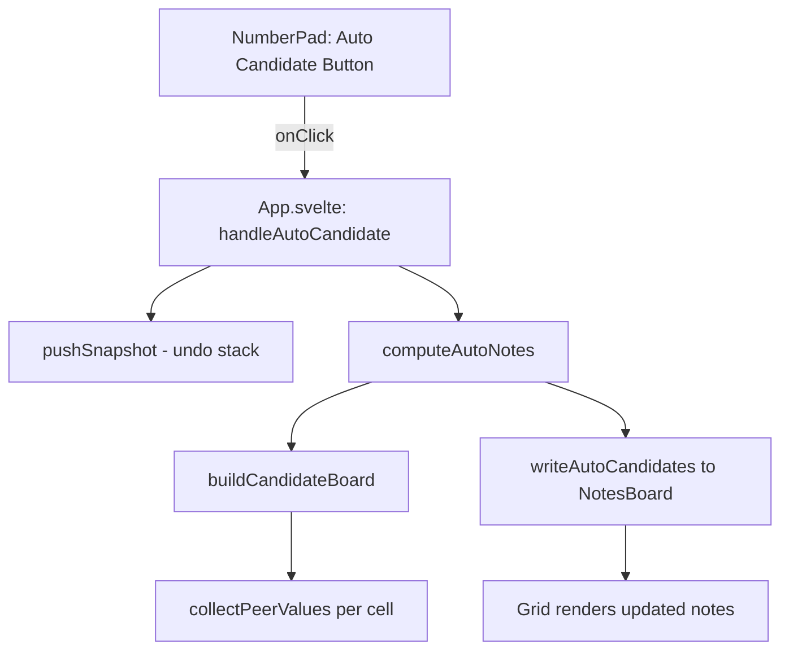
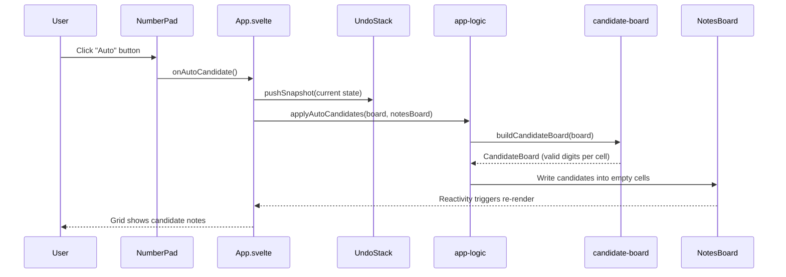

# Design Document: Auto Candidate Notes

## Overview

Add an "Auto Candidate" button to the Sudoku number pad that, when clicked, computes all valid candidate digits for every empty cell on the board and populates the notes board accordingly. Valid candidates are digits 1–9 not already present in the cell's row, column, or 3×3 box. The operation is a one-shot action (not a persistent mode) that snapshots the current state onto the undo stack so the user can revert with a single undo.

The feature leverages the existing `buildCandidateBoard` utility from `candidate-board.ts` which already computes valid candidates per cell. The new logic writes those computed candidates into the `NotesBoard`, replacing any existing notes on empty cells while leaving given cells and user-entered values untouched.

## Architecture



The feature is entirely client-side. No server interaction is needed since all constraint checking uses the in-memory board state.

## Sequence Diagram



## Components and Interfaces

### Component: NumberPad (modified)

Receives a new `onAutoCandidate` callback prop. Renders an "Auto" icon button in the action column.

**Responsibilities:**
- Render the Auto Candidate button with appropriate icon and label
- Call `onAutoCandidate` when clicked
- Disable the button when the game is not in "playing" state

### Component: App.svelte (modified)

Orchestrates the auto-candidate action: snapshots undo state, delegates to `applyAutoCandidates`, and lets Svelte reactivity update the grid.

**Responsibilities:**
- Wire `handleAutoCandidate` handler
- Push undo snapshot before applying
- Pass `onAutoCandidate` prop to NumberPad

### Module: app-logic.ts (modified)

New pure function `applyAutoCandidates` that computes and writes candidates.

**Interface:**
```typescript
const applyAutoCandidates = (
    board: CellState[][],
    notesBoard: NotesBoard,
): void
```

**Responsibilities:**
- Compute valid candidates using `buildCandidateBoard(board)` (without existing notes, so pure constraint-based)
- For each empty, non-given cell: clear existing notes, then add all computed candidates
- Given cells and cells with user-entered values are untouched

## Data Models

No new types are introduced. The feature operates on existing types:

- `CellState[][]` — the board grid
- `NotesBoard` (`SvelteSet<number>[][]`) — mutable notes per cell
- `CandidateBoard` (`ReadonlyArray<ReadonlyArray<ReadonlySet<number>>>`) — computed candidates from `buildCandidateBoard`

## Key Functions with Formal Specifications

### Function: applyAutoCandidates

```typescript
const applyAutoCandidates = (
    board: CellState[][],
    notesBoard: NotesBoard,
): void
```

**Preconditions:**
- `board` is a valid 9×9 `CellState[][]` grid
- `notesBoard` is a valid 9×9 `NotesBoard` (SvelteSet per cell)

**Postconditions:**
- For every cell where `cell.value === 0 && !cell.isGiven`: `notesBoard[r][c]` contains exactly the set of digits not present in the cell's row, column, or box
- For every cell where `cell.value !== 0 || cell.isGiven`: `notesBoard[r][c]` is unchanged
- `board` is not mutated

**Loop Invariants:**
- All previously processed cells satisfy the postcondition

### Function: buildCandidateBoard (existing, no notes param)

```typescript
const buildCandidateBoard = (board: CellState[][]): CandidateBoard
```

**Preconditions:**
- `board` is a valid 9×9 grid

**Postconditions:**
- For filled cells (`value !== 0`): returns empty set
- For empty cells: returns set of digits 1–9 not appearing in the cell's row, column, or box
- Input board is not mutated

## Algorithmic Pseudocode

### Auto Candidate Application

```typescript
// In app-logic.ts
const applyAutoCandidates = (
    board: CellState[][],
    notesBoard: NotesBoard,
): void => {
    // Compute pure constraint-based candidates (ignore existing notes)
    const candidates = buildCandidateBoard(board)

    for (let r = 0; r < 9; r++) {
        for (let c = 0; c < 9; c++) {
            const cell = board[r]?.[c]
            if (!cell || cell.isGiven || cell.value !== 0) continue

            // Replace existing notes with computed candidates
            const cellNotes = notesBoard[r]?.[c]
            if (!cellNotes) continue

            cellNotes.clear()
            for (const digit of candidates[r]![c]!) {
                cellNotes.add(digit)
            }
        }
    }
}
```

### Handler in App.svelte

```typescript
const handleAutoCandidate = (): void => {
    if (screen !== 'playing') return
    undoStack = pushSnapshot(undoStack, captureSnapshot(board, notesBoard, hintsUsed))
    applyAutoCandidates(board, notesBoard)
}
```

## Example Usage

```typescript
// User clicks "Auto" button on a partially filled board:
//
// Board state (row 0): [5, 3, 0, 0, 7, 0, 0, 0, 0]
// Row 0 has: {5, 3, 7}
// Cell (0,2) column has: {4} and box has: {5, 3, 6}
// → Candidates for (0,2): {1, 2, 8, 9} (digits not in row ∪ col ∪ box)
//
// After applyAutoCandidates:
// notesBoard[0][2] = SvelteSet {1, 2, 8, 9}
// notesBoard[0][0] = unchanged (cell has value 5)

// Undo reverts all notes to pre-auto state:
// handleUndo() → restores previous notesBoard snapshot
```

## Correctness Properties

*A property is a characteristic or behavior that should hold true across all valid executions of a system — essentially, a formal statement about what the system should do. Properties serve as the bridge between human-readable specifications and machine-verifiable correctness guarantees.*

### Property 1: Candidate correctness

*For any* valid 9×9 Sudoku board and any empty non-given cell, after applying `applyAutoCandidates`, the cell's notes should contain exactly the set of digits from 1–9 that do not appear in the cell's row, column, or 3×3 box — regardless of any pre-existing notes on that cell.

**Validates: Requirements 1.1, 1.2, 1.3**

### Property 2: Non-empty cells unchanged

*For any* valid 9×9 Sudoku board, after applying `applyAutoCandidates`, the notes for every given cell and every filled cell (value ≠ 0) should be identical to their state before the operation.

**Validates: Requirements 2.1, 2.2**

### Property 3: Board immutability

*For any* valid 9×9 Sudoku board, after applying `applyAutoCandidates`, every cell's `value`, `isGiven`, and `hasConflict` fields should be identical to their state before the operation.

**Validates: Requirement 1.4**

### Property 4: Undo round-trip

*For any* valid board and notes state, capturing a snapshot, applying `applyAutoCandidates`, then restoring the snapshot should produce a notes board identical to the original state before the operation.

**Validates: Requirement 3.2**

### Property 5: Idempotency

*For any* valid 9×9 Sudoku board, applying `applyAutoCandidates` twice in succession (without board changes) should produce the same notes board state as applying the operation once.

**Validates: Requirement 5.1**

## Error Handling

### Edge Case: Fully Solved Board

**Condition**: All cells have values (no empty cells)
**Response**: `applyAutoCandidates` iterates but skips all cells (all have `value !== 0`). No-op. Undo snapshot is still pushed (consistent with other actions).

### Edge Case: Board with Conflicts

**Condition**: User has placed conflicting values
**Response**: Candidates are computed based on current board state including conflicting values. A conflicting digit will appear in peer constraints and be excluded from candidates. This is correct behavior — candidates reflect the actual board state.

### Edge Case: Empty Board

**Condition**: No given cells, no user entries
**Response**: Every cell gets candidates based on an empty board. Since no constraints exist, every cell would get {1..9}. This is mathematically correct.

## Testing Strategy

### Unit Testing Approach

- Test `applyAutoCandidates` with known board states and verify resulting notes match expected candidates
- Test that given cells and filled cells are not modified
- Test empty board edge case
- Test fully solved board edge case
- Test board with conflicts

### Property-Based Testing Approach

**Property Test Library**: fast-check

- Property: For any valid board, after `applyAutoCandidates`, every note digit in an empty cell does not conflict with any peer
- Property: For any valid board, `applyAutoCandidates` is idempotent
- Property: Board values are never mutated by `applyAutoCandidates`

### Integration Testing Approach

- Verify the full flow: click Auto → notes appear → undo → notes revert
- Verify interaction with existing notes mode toggle (auto-candidate works regardless of notesMode state)

## Performance Considerations

The operation iterates the 9×9 grid twice (once in `buildCandidateBoard`, once to write notes) — 162 cell visits total. This is O(1) with respect to board size (fixed 81 cells) and completes in microseconds. No performance concerns.

## Security Considerations

No security implications. The feature is entirely client-side, operates on in-memory state, and makes no network requests.

## Dependencies

No new dependencies. The feature uses:
- Existing `buildCandidateBoard` from `src/client/lib/technique-hints/candidate-board.ts`
- Existing `NotesBoard` / `SvelteSet` types
- Existing undo stack utilities
