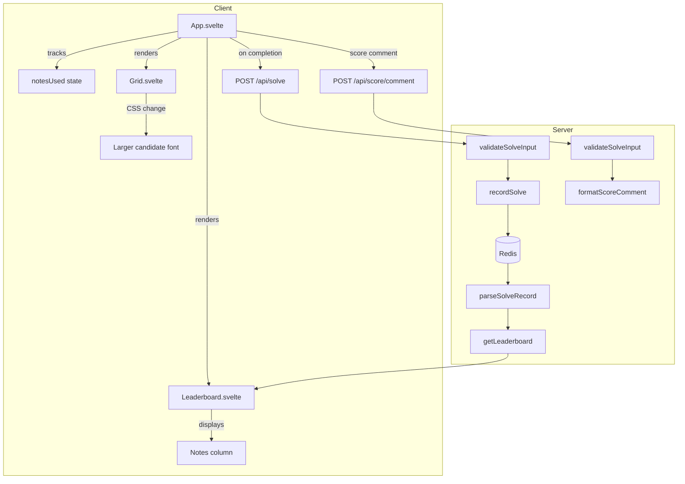
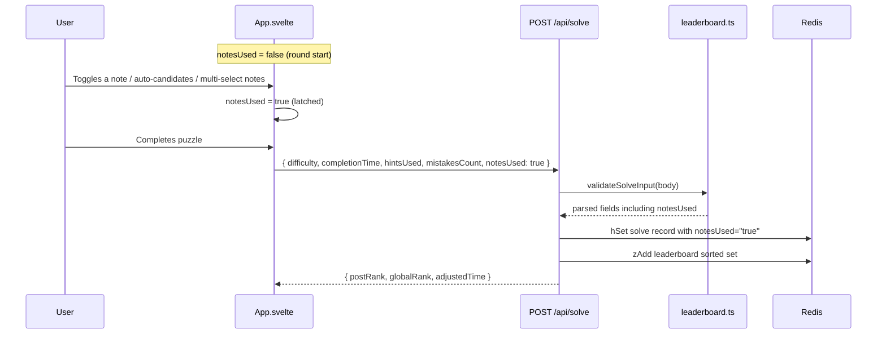
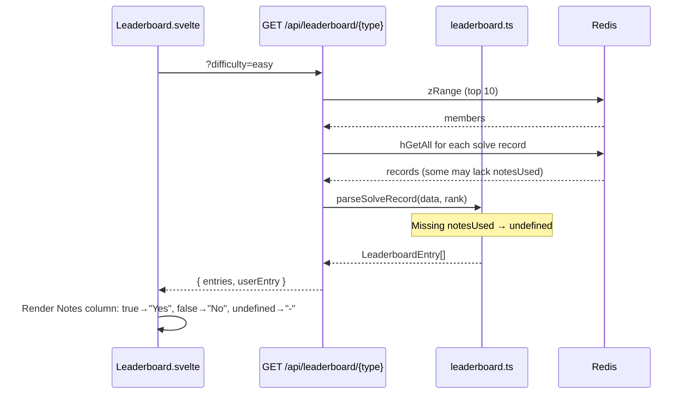

# Design Document: Candidate Size and Notes Leaderboard

## Overview

This feature delivers two related improvements to the Sudoku application:

1. **Candidate Font Size Increase** — A CSS-only change in `Grid.svelte` that bumps pencil mark (candidate digit) font sizes from `text-[0.5rem]`/`sm:text-[0.6rem]` to `text-[0.65rem]`/`sm:text-[0.75rem]` for better readability across screen sizes. No logic, data model, or API changes are needed.

2. **"Notes Used" Leaderboard Column** — A full-stack addition that tracks whether a player used any notes during their solve, persists the flag through the solve pipeline, displays it in the leaderboard, and includes it in the Reddit score comment. This touches client state tracking, server validation/persistence, the `LeaderboardEntry` type, the leaderboard UI, and the score comment formatter.

The `notesUsed` flag is a one-way latch: once set to `true` during a round, it stays `true` regardless of subsequent actions. It is set by any note-related action: manual `toggleNote`, auto-candidates, or multi-selection notes.

Backward compatibility is maintained for legacy Redis solve records that lack the `notesUsed` field — these are parsed as `undefined` and displayed as "-" in the leaderboard.

## Architecture



### Data Flow: Notes Tracking



### Data Flow: Leaderboard Display



## Components and Interfaces

### Grid.svelte (CSS change only)

The candidate digit `<span>` elements inside the 3×3 inner grid change their Tailwind font-size classes:

| Breakpoint | Before | After |
|---|---|---|
| Base (mobile) | `text-[0.5rem]` | `text-[0.65rem]` |
| `sm` and above | `sm:text-[0.6rem]` | `sm:text-[0.75rem]` |

No changes to padding (`p-px`), line-height (`leading-none`), or any other styling.

### App.svelte (client-side tracking)

**New state:**
```typescript
let notesUsed: boolean = $state(false);
```

**Reset:** `resetRoundState()` sets `notesUsed = false`.

**Latch points** (set `notesUsed = true`):
- Inside `handleNumber` when `notesMode` is true and `toggleNote` is called (cell-first mode)
- Inside `handleCellSelect` when `notesMode` is true and `toggleNote` is called (digit-first mode)
- Inside `handleAutoCandidate` (both enable and disable auto-candidates)
- Inside `handleNumber` when `isMultiSelection(selection)` and `applyAutoNotes` is called
- Inside `handleShiftCellSelect` when `notesMode` is true and `applyAutoNotes` is called
- Inside `handleKeyDown` for Shift+digit note toggle

**Payload changes:** Both `checkCompletion` (POST `/api/solve`) and `handleScoreComment` (POST `/api/score/comment`) include `notesUsed` in the JSON body.

### leaderboard.ts (server-side)

**`validateSolveInput`** — Extended return type:
```typescript
export const validateSolveInput = (
    body: unknown
): {
    difficulty: ValidDifficulty
    completionTime: number
    hintsUsed: number
    mistakesCount: number
    notesUsed: boolean
} | string
```

Validation: `notesUsed` must be `typeof value === 'boolean'`. If not, returns `'Invalid notesUsed: must be a boolean'`.

**`recordSolve`** — Extended params:
```typescript
export const recordSolve = async (params: {
    redis: RedisClient
    postId: string
    userId: string
    username: string
    difficulty: ValidDifficulty
    completionTime: number
    hintsUsed: number
    mistakesCount: number
    notesUsed: boolean
}): Promise<{ postRank: number; globalRank: number; adjustedTime: number } | string>
```

Stores `notesUsed: String(notesUsed)` (i.e. `"true"` or `"false"`) in both post-level and global-level Redis hashes.

**`parseSolveRecord`** — Extended to read `notesUsed`:
```typescript
const parseSolveRecord = (
    data: Record<string, string>,
    rank: number
): LeaderboardEntry | null => {
    // ... existing field parsing ...
    const notesUsedRaw = data['notesUsed']
    const notesUsed = notesUsedRaw === 'true' ? true
        : notesUsedRaw === 'false' ? false
        : undefined
    return { rank, username, completionTime, hintsUsed, mistakesCount, adjustedTime, notesUsed }
}
```

**`LeaderboardEntry`** type:
```typescript
export type LeaderboardEntry = {
    rank: number
    username: string
    completionTime: number
    hintsUsed: number
    mistakesCount: number
    adjustedTime: number
    notesUsed: boolean | undefined
}
```

### score-comment.ts

**`ScoreCommentData`** — Extended:
```typescript
export type ScoreCommentData = {
    difficulty: string
    completionTime: number
    hintsUsed: number
    mistakesCount: number
    notesUsed: boolean
}
```

**`formatScoreComment`** — Adds a "📝 Notes" row to the markdown stats table:
```typescript
const table = [
    `| Stat | Value |`,
    `|------|-------|`,
    `| ⏱️ Time | ${formattedTime} |`,
    `| 💡 Hints | ${hintsUsed} |`,
    `| ❌ Mistakes | ${mistakesCount} |`,
    `| 📝 Notes | ${notesUsed ? 'Yes' : 'No'} |`,
].join('\n')
```

### Leaderboard.svelte (UI)

**Local type** mirrors server `LeaderboardEntry`:
```typescript
type LeaderboardEntry = {
    rank: number
    username: string
    completionTime: number
    hintsUsed: number
    mistakesCount: number
    adjustedTime: number
    notesUsed: boolean | undefined
}
```

**Column order:** `#`, `Player`, `Time`, `Hints`, `Err`, `Notes`, `Score`

**Notes column rendering:**
- `notesUsed === true` → "Yes"
- `notesUsed === false` → "No"
- `notesUsed === undefined` → "-"

Applied to both the top-N entries `<tbody>` rows and the user entry row below the dashed divider.

### API Contract Changes

**POST `/api/solve`** request body:
```json
{
    "difficulty": "easy",
    "completionTime": 245,
    "hintsUsed": 2,
    "mistakesCount": 3,
    "notesUsed": true
}
```

Response unchanged: `{ "status": "success", "data": { "postRank": 5, "globalRank": 12, "adjustedTime": 305 } }`

**POST `/api/score/comment`** request body:
```json
{
    "difficulty": "easy",
    "completionTime": 245,
    "hintsUsed": 2,
    "mistakesCount": 3,
    "notesUsed": true
}
```

Response unchanged.

**GET `/api/leaderboard/post`** and **GET `/api/leaderboard/global`** response entries now include `notesUsed`:
```json
{
    "rank": 1,
    "username": "alice",
    "completionTime": 120,
    "hintsUsed": 0,
    "mistakesCount": 0,
    "adjustedTime": 120,
    "notesUsed": false
}
```

Legacy entries will have `notesUsed` absent from the JSON (serialized as `undefined`, omitted by `JSON.stringify`).

## Data Models

### Redis Schema Changes

The existing solve record hash gains one new field:

| Key Pattern | New Field | Type (stored) | Description |
|---|---|---|---|
| `solve:{postId}:{difficulty}:{userId}` | `notesUsed` | `"true"` or `"false"` | Whether player used notes |
| `solve:global:{difficulty}:{userId}` | `notesUsed` | `"true"` or `"false"` | Whether player used notes (best solve) |

Legacy records without `notesUsed` are handled gracefully — `parseSolveRecord` returns `undefined` for the field.

### TypeScript Type Changes

**Server (`leaderboard.ts`):**
```typescript
export type LeaderboardEntry = {
    rank: number
    username: string
    completionTime: number
    hintsUsed: number
    mistakesCount: number
    adjustedTime: number
    notesUsed: boolean | undefined  // NEW — undefined for legacy records
}
```

**Server (`score-comment.ts`):**
```typescript
export type ScoreCommentData = {
    difficulty: string
    completionTime: number
    hintsUsed: number
    mistakesCount: number
    notesUsed: boolean  // NEW
}
```

**Client (`Leaderboard.svelte` local type):**
```typescript
type LeaderboardEntry = {
    rank: number
    username: string
    completionTime: number
    hintsUsed: number
    mistakesCount: number
    adjustedTime: number
    notesUsed: boolean | undefined  // NEW — mirrors server type
}
```


## Correctness Properties

*A property is a characteristic or behavior that should hold true across all valid executions of a system — essentially, a formal statement about what the system should do. Properties serve as the bridge between human-readable specifications and machine-verifiable correctness guarantees.*

### Property 1: Solve input validation accepts notesUsed if and only if it is a boolean

*For any* solve submission payload where `difficulty`, `completionTime`, `hintsUsed`, and `mistakesCount` are valid, `validateSolveInput` SHALL return a parsed object (not an error string) if and only if `notesUsed` is a boolean (`true` or `false`). For any non-boolean value of `notesUsed` (number, string, null, undefined, object, array), the validator SHALL return an error string.

**Validates: Requirements 3.2, 3.3**

### Property 2: Notes-used round-trip through Redis

*For any* valid solve submission with a boolean `notesUsed` value, after recording the solve via `recordSolve`, reading back the Redis hash and parsing it via `parseSolveRecord` SHALL produce a `LeaderboardEntry` whose `notesUsed` field equals the original boolean value. The stored Redis value SHALL be the string `"true"` or `"false"`.

**Validates: Requirements 4.1, 4.2**

### Property 3: Score comment includes notes indicator

*For any* valid `ScoreCommentData` with a boolean `notesUsed` field, the output of `formatScoreComment` SHALL contain `"📝 Notes | Yes |"` when `notesUsed` is `true`, and `"📝 Notes | No |"` when `notesUsed` is `false`. The presence of "Yes" in the notes row SHALL correspond exactly to `notesUsed === true`.

**Validates: Requirements 6.2**

## Error Handling

### Solve Submission Errors (notesUsed-specific)

| Condition | HTTP Status | Error Message | Recovery |
|---|---|---|---|
| `notesUsed` is not a boolean | 400 | "Invalid notesUsed: must be a boolean" | Client always sends boolean — should not occur in normal flow |
| `notesUsed` is missing from body | 400 | "Invalid notesUsed: must be a boolean" | Client always includes field — should not occur in normal flow |

All existing error conditions from the leaderboard spec remain unchanged. The `notesUsed` validation is added after the existing numeric field validations in `validateSolveInput`.

### Backward Compatibility

| Condition | Behavior |
|---|---|
| Legacy Redis hash missing `notesUsed` key | `parseSolveRecord` returns `notesUsed: undefined` |
| `undefined` in LeaderboardEntry | Leaderboard UI displays "-" in Notes column |
| `undefined` serialized via `JSON.stringify` | Field is omitted from JSON response (client handles missing field as `undefined`) |

No migration of existing Redis data is needed. Legacy records are handled transparently.

## Testing Strategy

### Unit Tests (Example-Based)

**Server (`src/server/lib/__tests__/leaderboard.test.ts`):**
- `validateSolveInput` — accepts payload with `notesUsed: true`
- `validateSolveInput` — accepts payload with `notesUsed: false`
- `validateSolveInput` — rejects payload with `notesUsed: "true"` (string)
- `validateSolveInput` — rejects payload with `notesUsed: 1` (number)
- `validateSolveInput` — rejects payload with `notesUsed: null`
- `validateSolveInput` — rejects payload with missing `notesUsed`
- `parseSolveRecord` — parses `notesUsed: "true"` to `true`
- `parseSolveRecord` — parses `notesUsed: "false"` to `false`
- `parseSolveRecord` — parses missing `notesUsed` to `undefined`

**Server (`src/server/lib/__tests__/score-comment.test.ts`):**
- `formatScoreComment` — includes "📝 Notes | Yes |" when `notesUsed: true`
- `formatScoreComment` — includes "📝 Notes | No |" when `notesUsed: false`

**Server (`src/server/__tests__/api.test.ts` or route tests):**
- `POST /api/solve` — includes `notesUsed` in successful solve flow
- `POST /api/solve` — rejects non-boolean `notesUsed`
- `POST /api/score/comment` — includes `notesUsed` in comment text
- `GET /api/leaderboard/post` — response entries include `notesUsed` field

**Client (`src/client/lib/__tests__/`):**
- No new client lib tests needed — the `notesUsed` tracking is Svelte component state (simple boolean latch), not extracted logic

### Property-Based Tests

**Library:** fast-check (already in devDependencies)
**Minimum iterations:** 100 per property

| Property | Test File | Tag |
|---|---|---|
| Property 1: Solve input validation accepts notesUsed iff boolean | `src/server/lib/__tests__/leaderboard.property.test.ts` | Feature: candidate-size-and-notes-leaderboard, Property 1 |
| Property 2: Notes-used round-trip through Redis | `src/server/lib/__tests__/leaderboard.property.test.ts` | Feature: candidate-size-and-notes-leaderboard, Property 2 |
| Property 3: Score comment includes notes indicator | `src/server/lib/__tests__/score-comment.property.test.ts` | Feature: candidate-size-and-notes-leaderboard, Property 3 |

### Edge Case Tests

- Legacy Redis record without `notesUsed` field → `parseSolveRecord` returns `undefined`
- `notesUsed` field with unexpected string values (e.g. `"yes"`, `"1"`) → `parseSolveRecord` returns `undefined`

### What Is NOT Tested

- **Grid.svelte CSS changes** — Verified by visual inspection. The font size change is a static Tailwind class swap with no logic.
- **Leaderboard.svelte UI rendering** — Svelte components are not unit tested per project conventions. Column order and display values are verified visually.
- **App.svelte notesUsed latch** — The latch is a trivial `notesUsed = true` assignment in event handlers. No code path resets it during a round except `resetRoundState()`.
