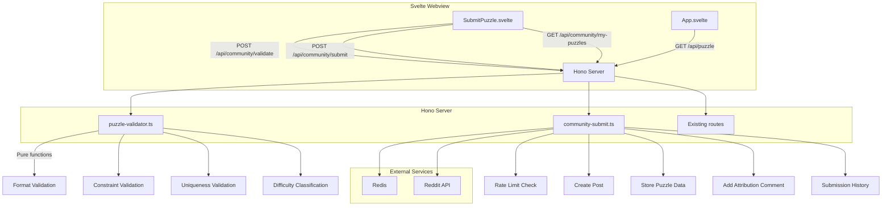
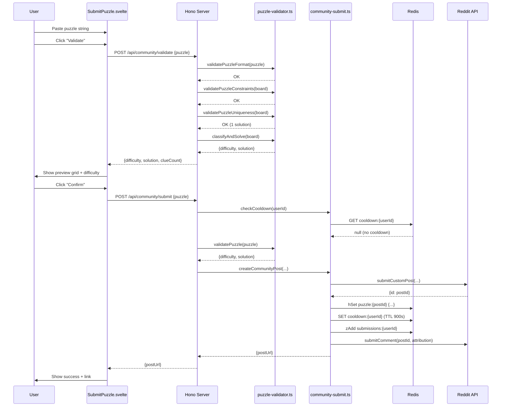

# Design Document: Community Puzzle Submit

## Overview

Community Puzzle Submit extends the sudoku app from a consume-only experience into a community-driven platform where users can contribute their own puzzles. The feature adds a server-side validation pipeline (format → constraints → uniqueness → difficulty classification), a submission flow that creates Reddit custom posts with creator attribution, and client-side UI for puzzle input, preview, and community puzzle display.

The design reuses the existing sudoku solver (`createSolverState`, `solve`, `getDifficulty`, `countSolutions`) for validation and classification, and follows the established Hono + Redis + Reddit API patterns. Community puzzles are stored in the same `puzzle:{postId}` hash structure as auto-generated puzzles, extended with metadata fields for type, creator, and solve count.

### Key Design Decisions

1. **Two-step flow (validate → submit)**: Validation is a separate API call from submission, enabling the preview screen without committing. This keeps the validation endpoint idempotent and side-effect-free.
2. **Single difficulty per community puzzle**: Unlike auto-generated posts that store all 4 difficulties, community puzzles have exactly one difficulty determined by the solver. The client adapts by hiding the difficulty selector.
3. **Rate limiting via TTL keys**: A Redis key with 15-minute TTL per user provides simple, self-cleaning cooldown enforcement.
4. **Solve count on puzzle hash**: Adding `solveCount` directly to the `puzzle:{postId}` hash avoids extra keys. Deduplication leverages the existing `solve:{postId}:{difficulty}:{userId}` key pattern.
5. **Pure validation functions**: All validation logic is extracted into pure functions in `src/server/lib/puzzle-validator.ts`, making them independently testable with property-based tests.

## Architecture



### Submission Flow



## Components and Interfaces

### Server Components

#### 1. `src/server/lib/puzzle-validator.ts` — Pure Validation Functions

```typescript
import type { Difficulty } from './sudoku'

type FormatValidationResult =
  | { valid: true; board: number[] }
  | { valid: false; error: string }

type ConstraintValidationResult =
  | { valid: true }
  | { valid: false; error: string }

type UniquenessValidationResult =
  | { valid: true }
  | { valid: false; error: string }

type ClassificationResult = {
  difficulty: Difficulty
  solution: number[]
}

type ValidationResult =
  | { valid: true; difficulty: Difficulty; solution: number[]; clueCount: number }
  | { valid: false; error: string }

/** Validate puzzle string format: length, characters, minimum givens */
const validatePuzzleFormat = (input: string): FormatValidationResult

/** Check for constraint violations in rows, columns, and boxes */
const validatePuzzleConstraints = (board: number[]): ConstraintValidationResult

/** Verify puzzle has exactly one solution using countSolutions */
const validatePuzzleUniqueness = (board: number[]): UniquenessValidationResult

/** Solve with history recording and classify difficulty */
const classifyAndSolve = (board: number[]): ClassificationResult

/** Full validation pipeline: format → constraints → uniqueness → classify */
const validatePuzzle = (input: string): ValidationResult
```

All functions are pure and synchronous. `countSolutions` and `solve` are CPU-bound but complete well within the 30-second request timeout for valid 9×9 puzzles.

#### 2. `src/server/lib/community-submit.ts` — Submission Operations

```typescript
import type { RedisClient } from '@devvit/redis'
import type { Difficulty } from './sudoku'

type CooldownResult =
  | { allowed: true }
  | { allowed: false; remainingSeconds: number }

type SubmissionHistoryEntry = {
  postId: string
  difficulty: Difficulty
  createdAt: number
  solveCount: number
}

const COOLDOWN_SECONDS = 900 // 15 minutes

/** Check if user is within submission cooldown */
const checkCooldown = async (
  redis: RedisClient,
  userId: string
): Promise<CooldownResult>

/** Record submission timestamp for cooldown tracking */
const setCooldown = async (
  redis: RedisClient,
  userId: string
): Promise<void>

/** Add post to user's submission history sorted set */
const addToSubmissionHistory = async (
  redis: RedisClient,
  userId: string,
  postId: string,
  timestamp: number
): Promise<void>

/** Get user's submission history with puzzle metadata */
const getSubmissionHistory = async (
  redis: RedisClient,
  userId: string
): Promise<SubmissionHistoryEntry[]>

/** Increment solve count for a community puzzle (dedup handled by caller) */
const incrementSolveCount = async (
  redis: RedisClient,
  postId: string
): Promise<number>
```

#### 3. API Routes

| Method | Path | Purpose | Auth |
|--------|------|---------|------|
| `POST` | `/api/community/validate` | Validate puzzle string, return difficulty + clue count | None (read-only) |
| `POST` | `/api/community/submit` | Create post, store data, add comment | Logged in |
| `GET` | `/api/community/my-puzzles` | Get user's submission history | Logged in |

**Modified existing routes:**
- `GET /api/puzzle` — extended response includes `type`, `creatorUsername`, `difficulty` (single) for community puzzles
- `POST /api/solve` — after recording solve, increments `solveCount` on community puzzles

#### Route: `POST /api/community/validate`

Request:
```json
{ "puzzle": "003020600900305001001806400008102900700000008006708200002609500800203009005010300" }
```

Success response:
```json
{
  "status": "success",
  "data": {
    "difficulty": "intermediate",
    "clueCount": 28,
    "preview": "003020600900305001001806400008102900700000008006708200002609500800203009005010300"
  }
}
```

Error response:
```json
{ "status": "error", "message": "Puzzle has multiple solutions" }
```

#### Route: `POST /api/community/submit`

Request:
```json
{ "puzzle": "003020600900305001001806400008102900700000008006708200002609500800203009005010300" }
```

Success response:
```json
{
  "status": "success",
  "data": {
    "postUrl": "https://reddit.com/r/sudoku/comments/t3_abc123"
  }
}
```

#### Route: `GET /api/community/my-puzzles`

Response:
```json
{
  "status": "success",
  "data": {
    "puzzles": [
      {
        "postId": "t3_abc123",
        "difficulty": "intermediate",
        "createdAt": 1700000000000,
        "solveCount": 42
      }
    ]
  }
}
```

#### Modified: `GET /api/puzzle`

Extended response for community puzzles:
```json
{
  "status": "success",
  "data": {
    "type": "community",
    "creatorUsername": "puzzlemaster99",
    "puzzles": { "intermediate": "003020600..." },
    "solutions": { "intermediate": "483921657..." },
    "solveCount": 42
  }
}
```

For auto-generated puzzles, `type` is `"generated"` and `creatorUsername` / `solveCount` are omitted.

### Client Components

#### 1. `src/client/components/SubmitPuzzle.svelte`

New component managing the submission flow with these states:

| State | UI | Transitions |
|-------|-----|-------------|
| `input` | Text field + "Validate" button | → `validating` on submit |
| `validating` | Loading spinner, disabled button | → `preview` on success, → `input` on error |
| `preview` | Grid + difficulty + clue count + "Confirm" / "Cancel" | → `submitting` on confirm, → `input` on cancel |
| `submitting` | Loading spinner | → `success` on success, → `preview` on error |
| `success` | Success message + link to post | → `input` on "Submit Another" |

Props:
```typescript
type SubmitPuzzleProps = {
  onClose: () => void
}
```

#### 2. `src/client/App.svelte` Modifications

- New `GameScreen` value: `'submit'` — shows `SubmitPuzzle.svelte`
- "Submit a Puzzle" button added to the playing screen controls
- Community puzzle detection: when `type === 'community'` in puzzle response:
  - Display "Submitted by u/{creatorUsername}" label
  - Hide difficulty selector, show single difficulty badge
  - Display solve count
- New state variables: `puzzleType`, `creatorUsername`, `solveCount`

## Data Models

### Redis Schema

#### `puzzle:{postId}` Hash (Extended)

Existing fields for auto-generated puzzles remain unchanged. Community puzzles add:

| Field | Type | Description |
|-------|------|-------------|
| `type` | `string` | `"community"` for user-submitted, absent for auto-generated |
| `creatorId` | `string` | Reddit user ID of the creator |
| `creatorUsername` | `string` | Reddit username of the creator |
| `difficulty` | `string` | Single difficulty level for community puzzles |
| `{difficulty}:puzzle` | `string` | 81-char puzzle string (only one difficulty) |
| `{difficulty}:solution` | `string` | 81-char solution string (only one difficulty) |
| `createdAt` | `string` | Unix timestamp in milliseconds |
| `solveCount` | `string` | Number of unique solvers (stringified integer) |

#### `cooldown:{userId}` String

| Field | Type | Description |
|-------|------|-------------|
| value | `string` | Submission timestamp |
| TTL | `900` seconds | Auto-expires after 15 minutes |

#### `submissions:{userId}` Sorted Set

| Member | Score | Description |
|--------|-------|-------------|
| `{postId}` | Unix timestamp (ms) | When the puzzle was submitted |

#### Solve Count Deduplication

The existing `solve:{postId}:{difficulty}:{userId}` key already prevents duplicate solve recordings. When a solve is recorded for a community puzzle, the server increments `solveCount` in the `puzzle:{postId}` hash using `redis.incrBy`. Since `recordSolve` already checks for duplicates via `redis.exists(solveKey)`, the increment only happens on first solve per user.

### TypeScript Types

```typescript
// Shared types for community puzzle feature

type PuzzleType = 'community' | 'generated'

type CommunityPuzzleResponse = {
  type: 'community'
  creatorUsername: string
  puzzles: Record<string, string>    // single difficulty key
  solutions: Record<string, string>  // single difficulty key
  solveCount: number
}

type GeneratedPuzzleResponse = {
  type: 'generated'
  puzzles: Record<string, string>    // all 4 difficulties
  solutions: Record<string, string>  // all 4 difficulties
}

type PuzzleResponse = CommunityPuzzleResponse | GeneratedPuzzleResponse

type SubmissionHistoryEntry = {
  postId: string
  difficulty: Difficulty
  createdAt: number
  solveCount: number
}

type SubmitScreenState = 'input' | 'validating' | 'preview' | 'submitting' | 'success'
```
