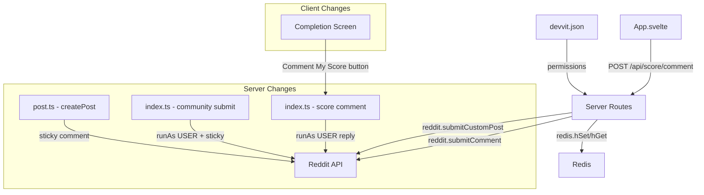

# Design Document: Devvit Review Compliance

## Overview

This design addresses two Devvit app review compliance issues for the Sudoku app:

1. **User-Generated Content (UGC):** Community puzzle posts are currently submitted as the app account. They must be submitted as the user with proper `runAs: 'USER'` and `userGeneratedContent` fields so content is reportable and traceable.

2. **Game Scoring:** Users need the ability to share their solve scores as Reddit comments. Each game post gets a stickied "score thread" comment from the app, and users can reply to it via a "Comment My Score" button on the completion screen.

The changes span configuration (`devvit.json`), server routes (`post.ts`, `index.ts`), a new pure formatting helper, and a client UI addition (`App.svelte`).

## Architecture

The feature touches three layers of the existing architecture:



**Data flow for score commenting:**
1. Post creation (daily or community) → app creates sticky comment → stores `stickyCommentId` in `puzzle:{postId}` Redis hash
2. User solves puzzle → completion screen shows "Comment My Score" button
3. User clicks button → `POST /api/score/comment` → server reads `stickyCommentId` from Redis → submits comment as user replying to sticky

**Data flow for community UGC fix:**
1. User submits puzzle → `POST /api/community/submit` → server calls `reddit.submitCustomPost({ runAs: 'USER', userGeneratedContent: { text: puzzle } })` → post appears under user's account

## Components and Interfaces

### 1. Configuration: `devvit.json`

Add `permissions.reddit.asUser` to declare the app needs to act on behalf of users:

```json
{
  "permissions": {
    "reddit": {
      "asUser": ["SUBMIT_POST", "SUBMIT_COMMENT"]
    }
  }
}
```

### 2. Server: Sticky Comment Helper

A new helper function extracted into `src/server/lib/sticky-comment.ts` to avoid duplicating sticky comment logic between `createPost` and the community submit route.

```typescript
// src/server/lib/sticky-comment.ts

type StickyCommentDeps = {
  reddit: { submitComment: (opts: SubmitCommentOpts) => Promise<Comment> }
  redis: RedisClient
}

type StickyCommentResult =
  | { success: true; commentId: string }
  | { success: false }

const createStickyComment = async (
  deps: StickyCommentDeps,
  postId: string,
  text: string
): Promise<StickyCommentResult>
```

This function:
1. Submits a comment as the app account on the given post
2. Calls `comment.distinguish('yes')` and `comment.sticky()` on the returned comment
3. Stores the comment ID in `puzzle:{postId}` → `stickyCommentId`
4. On any failure, logs the error and returns `{ success: false }` — never throws

### 3. Server: Modified `createPost` in `src/server/post.ts`

After creating the post and storing puzzle data in Redis, call `createStickyComment` with score thread text. The sticky comment text will be something like:

> 🏆 **Score Thread** — Share your solve time! Use the "Comment My Score" button after completing the puzzle.

Failure is non-blocking — the post is still created and usable.

### 4. Server: Modified Community Submit Route

Two changes to `POST /api/community/submit` in `src/server/index.ts`:

**a) UGC fix:** Change `reddit.submitCustomPost()` call to include:
```typescript
reddit.submitCustomPost({
  subredditName: context.subredditName!,
  title: `Sudoku #${formatPostDate(new Date())} by u/${username} (${difficulty})`,
  entry: 'default',
  runAs: 'USER',
  userGeneratedContent: { text: puzzle },
})
```

**b) Sticky comment:** After post creation and Redis storage, call `createStickyComment` (non-blocking on failure). The existing attribution comment stays as the app account (no `runAs: 'USER'`).

### 5. Server: New Score Comment Route

New route `POST /api/score/comment` in `src/server/index.ts`:

```typescript
// Input
type ScoreCommentInput = {
  difficulty: ValidDifficulty
  completionTime: number  // seconds
  hintsUsed: number
  mistakesCount: number
}

// Handler flow:
// 1. Guard: userId required (401)
// 2. Guard: postId required (400)
// 3. Validate input body
// 4. Read stickyCommentId from puzzle:{postId} hash (400 if missing)
// 5. Format comment text via pure function
// 6. Submit comment as user: reddit.submitComment({ id: stickyCommentId, text, runAs: 'USER' })
// 7. Return success or 500 on failure
```

### 6. Server: Score Comment Formatter

A pure function in `src/server/lib/score-comment.ts`:

```typescript
type ScoreCommentData = {
  difficulty: string
  completionTime: number  // seconds
  hintsUsed: number
  mistakesCount: number
}

const formatScoreComment = (data: ScoreCommentData): string
```

Returns a formatted string like:
```
🎯 **Easy** — Solved in **2:34**

| Stat | Value |
|------|-------|
| ⏱️ Time | 2:34 |
| 💡 Hints | 0 |
| ❌ Mistakes | 0 |

🌟 Perfect solve!
```

The "Perfect solve!" line only appears when `hintsUsed === 0 && mistakesCount === 0`.

### 7. Client: "Comment My Score" Button

Added to the completion screen in `App.svelte`. New state variables:

```typescript
type ScoreCommentState = 'idle' | 'posting' | 'success' | 'error'
```

- `idle`: Button visible and clickable
- `posting`: Button disabled, loading indicator shown
- `success`: Button replaced with "✓ Score posted!" confirmation
- `error`: Error message shown, button re-enabled for retry

The button sends a POST to `/api/score/comment` with the same data already available in the completion screen (`difficulty`, `elapsedSeconds`, `hintsUsed`, `mistakesCount`).

## Data Models

### Redis: `puzzle:{postId}` Hash (Modified)

New field added to the existing hash:

| Field | Type | Description |
|-------|------|-------------|
| `stickyCommentId` | `string` | Reddit comment ID (e.g., `t1_abc123`) of the stickied score thread |

All existing fields remain unchanged. The `stickyCommentId` field is optional — it may be absent if sticky comment creation failed (graceful degradation).

### No New Redis Keys

All data is stored in the existing `puzzle:{postId}` hash. No new Redis key patterns are introduced.

## Correctness Properties

*A property is a characteristic or behavior that should hold true across all valid executions of a system — essentially, a formal statement about what the system should do. Properties serve as the bridge between human-readable specifications and machine-verifiable correctness guarantees.*

### Property 1: Score comment format completeness

*For any* valid solve data (valid difficulty, non-negative integer completionTime, non-negative integer hintsUsed, non-negative integer mistakesCount), the formatted score comment text SHALL contain the difficulty name, the solve time formatted as minutes:seconds, the hints used count, and the mistakes count.

**Validates: Requirements 5.4, 7.1**

### Property 2: Perfect solve indicator correctness

*For any* valid solve data, the formatted score comment text SHALL contain "Perfect solve!" if and only if hintsUsed equals 0 and mistakesCount equals 0.

**Validates: Requirements 7.2**

### Property 3: Score endpoint input validation

*For any* JSON payload, the score comment endpoint SHALL accept the request (not return a validation error) if and only if the payload contains a valid difficulty string, a non-negative integer completionTime, a non-negative integer hintsUsed, and a non-negative integer mistakesCount.

**Validates: Requirements 5.1**

## Error Handling

| Scenario | Behavior | HTTP Status |
|----------|----------|-------------|
| Sticky comment creation fails (daily post) | Log error, continue — post is still created | N/A (internal) |
| Sticky comment creation fails (community post) | Log error, continue — post response still returns success | 200 (success) |
| Score comment: user not logged in | Return error message | 401 |
| Score comment: missing postId | Return error message | 400 |
| Score comment: invalid input body | Return validation error | 400 |
| Score comment: stickyCommentId not in Redis | Return "Score thread unavailable" | 400 |
| Score comment: reddit.submitComment throws | Return descriptive error | 500 |
| Score comment: network failure from client | Show error in UI, re-enable button for retry | N/A (client) |

Key design principle: **sticky comment failures are always non-blocking**. The core functionality (post creation, puzzle storage) must succeed even if the score thread cannot be created. Users on posts without a sticky comment will see the "Comment My Score" button but get a clear error message ("Score thread unavailable") if they try to use it.

## Testing Strategy

### Unit Tests (Example-Based)

**Server tests** (`src/server/__tests__/`):

- `post.test.ts`: Verify `createPost` calls sticky comment creation after post, verify graceful degradation on sticky failure
- `community-routes.test.ts`: Verify community submit uses `runAs: 'USER'` and `userGeneratedContent`, verify sticky comment on community posts, verify graceful degradation
- New `score-comment-routes.test.ts`: Verify score comment endpoint — happy path, 401 for no user, 400 for missing sticky comment, 500 for Reddit API failure
- New `score-comment.test.ts` (in `src/server/lib/__tests__/`): Example-based tests for `formatScoreComment` — specific formatting cases, edge cases (0 time, large numbers)
- New `sticky-comment.test.ts` (in `src/server/lib/__tests__/`): Verify sticky comment helper — happy path, distinguish/sticky calls, Redis storage, error handling

**Client tests**: The "Comment My Score" button lives in `App.svelte` — Svelte component testing is skipped per project conventions. The button's behavior is straightforward fetch → state transitions.

### Property-Based Tests

Property-based testing applies to the pure `formatScoreComment` function and the input validation logic. These are pure functions with clear input/output behavior where input variation reveals edge cases.

**Library:** Vitest + `fast-check` (already available in the project's test stack via Vitest)

**Configuration:** Minimum 100 iterations per property test.

**Test file:** `src/server/lib/__tests__/score-comment.property.test.ts`

- **Property 1 test:** Generate random valid `ScoreCommentData`, verify output contains difficulty, formatted time, hints count, and mistakes count.
  - Tag: `Feature: devvit-review-compliance, Property 1: Score comment format completeness`
- **Property 2 test:** Generate random valid `ScoreCommentData` with `hintsUsed=0, mistakesCount=0`, verify "Perfect solve!" present. Generate with non-zero values, verify absent.
  - Tag: `Feature: devvit-review-compliance, Property 2: Perfect solve indicator correctness`
- **Property 3 test:** Generate random payloads (both valid and invalid), pass through the validation function, verify acceptance matches validity criteria.
  - Tag: `Feature: devvit-review-compliance, Property 3: Score endpoint input validation`

### Integration Points

- Reddit API mocking via `@devvit/test` for `submitCustomPost`, `submitComment`, `comment.distinguish`, `comment.sticky`
- In-memory Redis via `@devvit/test` for `puzzle:{postId}` hash operations
