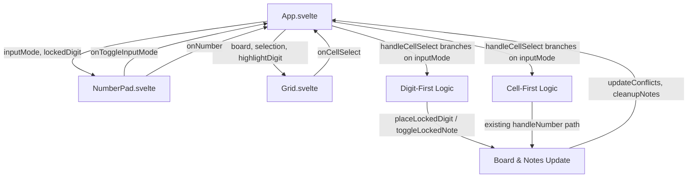
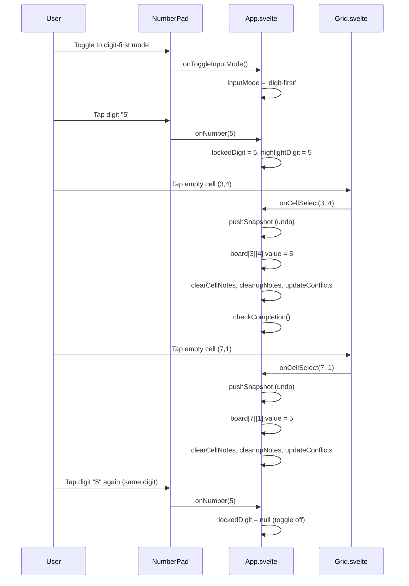
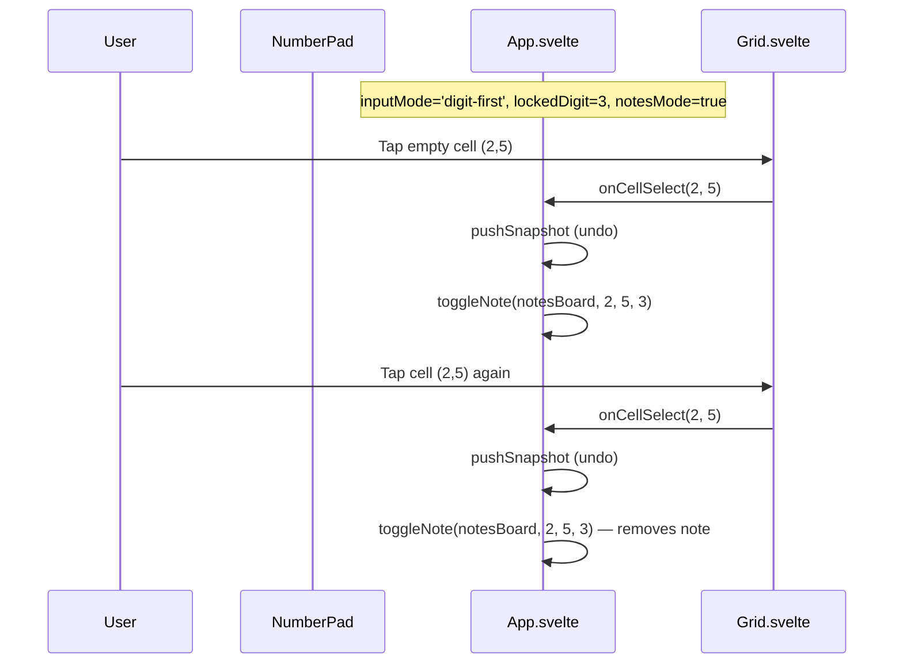

# Design Document: Digit-First Input Mode

## Overview

This feature adds a "digit-first" input mode to the Sudoku game. Currently, the game uses a "cell-first" workflow: tap a cell, then tap a digit. Digit-first inverts this: the player selects a digit on the number pad first (locking it), then taps cells to fill them with that digit. This is a common Sudoku app pattern that speeds up board scanning when placing all instances of a single number.

The implementation adds an `InputMode` type (`cell-first` | `digit-first`), a `lockedDigit` state (1–9 or null), a toggle switch in the NumberPad, and branching logic in the existing handlers (`handleCellSelect`, `handleNumber`, `handleErase`, `handleKeyDown`). The Grid component requires no changes — it already emits pointer events that App.svelte handles. The core placement logic (conflict checking, note cleanup, undo snapshots) is reused from the existing cell-first path.

## Architecture



### State Flow: Digit-First Mode



### State Flow: Digit-First + Notes Mode



## Components and Interfaces

### Component 1: types.ts (Modified)

**New type export:**
```typescript
export type InputMode = 'cell-first' | 'digit-first'
```

### Component 2: App.svelte (Modified)

**Purpose**: Owns `inputMode` and `lockedDigit` state. Branches handler logic based on the active mode.

**New state:**
```typescript
let inputMode: InputMode = $state('cell-first');
let lockedDigit: number | null = $state(null);
```

**Modified handlers:**
- `handleCellSelect` — in digit-first mode with a locked digit, places the digit (or toggles note) instead of just selecting
- `handleNumber` — in digit-first mode, sets/toggles the locked digit instead of placing into the focused cell
- `handleErase` — in digit-first mode, erases the focused cell without clearing the locked digit
- `handleKeyDown` — Escape clears locked digit; digit keys update locked digit; arrow keys move focus and auto-place in digit-first mode
- `resetRoundState` — resets `inputMode` to `cell-first` and `lockedDigit` to null

**New handler:**
```typescript
const handleToggleInputMode = (): void => {
    if (inputMode === 'cell-first') {
        inputMode = 'digit-first';
    } else {
        inputMode = 'cell-first';
        lockedDigit = null;
    }
};
```

**Props passed to NumberPad (additions):**
```typescript
inputMode={inputMode}
{lockedDigit}
onToggleInputMode={handleToggleInputMode}
```

### Component 3: NumberPad.svelte (Modified)

**Purpose**: Renders the input mode toggle and shows locked digit visual feedback.

**New props:**
```typescript
inputMode: InputMode;
lockedDigit: number | null;
onToggleInputMode: () => void;
```

**UI changes:**
- A toggle control (segmented button or switch) for cell-first / digit-first, placed below the existing Normal/Candidate tabs
- When a digit is locked, that digit button gets a distinct active style (e.g., `ring-2 ring-blue-500 bg-blue-100`) differentiated from the solved-digit fading
- The locked digit style takes visual precedence over the solved-digit fading

### Component 4: Grid.svelte (No Changes)

The Grid already emits `onCellSelect`, `onCellExtend`, and `onCellToggle` pointer events. The digit-first placement logic lives entirely in App.svelte's `handleCellSelect`. No Grid modifications needed.

### Component 5: app-logic.ts (Modified)

**New pure function for digit-first cell placement:**
```typescript
export const placeLockedDigit = (
    board: CellState[][],
    notesBoard: NotesBoard,
    row: number,
    col: number,
    digit: number,
): boolean
```

**Responsibilities:**
- Guard: skip if cell is given or row/col out of bounds
- Set `board[row][col].value = digit`
- Clear cell notes, cleanup peer notes for the placed digit
- Return `true` if placement occurred, `false` if skipped

This extracts the placement logic from `handleNumber` into a reusable function that both cell-first and digit-first paths can call.

## Data Models

### InputMode Type

```typescript
export type InputMode = 'cell-first' | 'digit-first'
```

- `'cell-first'`: Default. Existing behavior — select cell, then enter digit.
- `'digit-first'`: New. Select digit on number pad, then tap cells to place.

### lockedDigit State

```typescript
let lockedDigit: number | null = $state(null);
```

- `null`: No digit locked. Cell taps behave as selection only.
- `1–9`: A digit is locked. Cell taps place this digit (or toggle as note).
- Set when user taps a digit button in digit-first mode.
- Cleared when: user taps the same digit again, presses Escape, switches to cell-first mode, or game resets.

### State Interaction Matrix

| inputMode | lockedDigit | notesMode | Cell tap behavior |
|-----------|-------------|-----------|-------------------|
| cell-first | (ignored) | false | Select cell (existing) |
| cell-first | (ignored) | true | Select cell (existing) |
| digit-first | null | false | Select cell only |
| digit-first | null | true | Select cell only |
| digit-first | 1–9 | false | Place locked digit into cell |
| digit-first | 1–9 | true | Toggle locked digit as note |

### Handler Behavior Matrix

| Handler | cell-first mode | digit-first mode |
|---------|----------------|-----------------|
| `handleCellSelect` | Set selection, update highlight | Set selection + place locked digit (if any) |
| `handleNumber(n)` | Place digit in focused cell | Set/toggle locked digit to n |
| `handleErase` | Erase focused cell value | Erase focused cell value (keep locked digit) |
| `handleKeyDown(Escape)` | Clear selection + highlight | Clear locked digit (if set), else clear selection |
| `handleKeyDown(digit)` | Place digit in focused cell | Set/toggle locked digit |
| `handleKeyDown(arrow)` | Move focus | Move focus + auto-place locked digit |
| `handleKeyDown(Backspace)` | Erase focused cell | Erase focused cell (keep locked digit) |


## Correctness Properties

*A property is a characteristic or behavior that should hold true across all valid executions of a system — essentially, a formal statement about what the system should do. Properties serve as the bridge between human-readable specifications and machine-verifiable correctness guarantees.*

### Property 1: Input mode toggle is an involution

*For any* InputMode value, toggling the input mode twice should return to the original value.

**Validates: Requirements 1.2**

### Property 2: Switching to cell-first clears locked digit

*For any* locked digit value (1–9), when the input mode changes from `digit-first` to `cell-first`, the locked digit should be null afterward.

**Validates: Requirements 1.4**

### Property 3: Digit locking toggle in digit-first mode

*For any* digit 1–9 and any current locked digit state, calling handleNumber in digit-first mode should set the locked digit to that digit if it differs from the current lock, or clear it to null if it's the same digit.

**Validates: Requirements 2.1, 2.2, 2.4, 7.2**

### Property 4: Escape clears locked digit

*For any* locked digit value (1–9) in digit-first mode, pressing Escape should clear the locked digit to null.

**Validates: Requirements 2.3**

### Property 5: Digit-first placement into empty non-given cells

*For any* valid board, any locked digit 1–9, and any empty non-given cell, calling placeLockedDigit should set that cell's value to the locked digit.

**Validates: Requirements 3.1**

### Property 6: Given and filled cells are immutable under digit-first actions

*For any* board cell that is given or has a non-zero value, digit-first placement (both normal and notes mode) should not modify that cell's value or notes.

**Validates: Requirements 3.2, 4.2, 4.3**

### Property 7: Placement clears cell notes and cleans up peer notes

*For any* digit placed into an empty cell via digit-first mode, after placement the cell's notes should be empty, and no peer cell (same row, column, or box) should contain the placed digit in its notes.

**Validates: Requirements 3.3**

### Property 8: Board conflicts are consistent after placement

*For any* board state after a digit-first placement, every cell's `hasConflict` flag should match the result of recomputing conflicts from scratch via `updateConflicts`.

**Validates: Requirements 3.4**

### Property 9: Digit-first note toggling

*For any* empty non-given cell, any locked digit 1–9, in digit-first mode with notes active, tapping the cell should toggle the locked digit in that cell's notes (add if absent, remove if present).

**Validates: Requirements 4.1**

### Property 10: Locked digit sets highlight digit

*For any* locked digit value (1–9), the highlightDigit state should equal the locked digit value.

**Validates: Requirements 5.2**

### Property 11: Undo round-trip for digit-first actions

*For any* board and notes state, capturing a snapshot, performing a digit-first placement or note toggle, then undoing should restore the board and notes to their original state.

**Validates: Requirements 6.1, 6.2, 6.3**

### Property 12: Erase preserves locked digit

*For any* locked digit value (1–9) in digit-first mode, erasing a cell (via button, Backspace, or Delete) should not change the locked digit.

**Validates: Requirements 7.3, 8.1**

### Property 13: Arrow key movement with auto-placement

*For any* board state in digit-first mode with a locked digit, pressing an arrow key should move the focus cell by one in the corresponding direction (clamped to 0–8), and if the newly focused cell is empty and non-given, the locked digit should be placed there (or toggled as a note if notes mode is active).

**Validates: Requirements 7.1**

## Error Handling

### Error Scenario 1: Locking a Solved Digit

**Condition**: User locks a digit that already has 9 placements on the board.
**Response**: The digit is still lockable (requirement 2.5). The NumberPad shows both the solved fading and the locked highlight. Tapping cells with this digit may create conflicts, which are handled by the existing `updateConflicts` mechanism.
**Recovery**: User can undo placements or switch digits.

### Error Scenario 2: Digit-First Tap on Given Cell

**Condition**: User taps a given (pre-filled) cell while a digit is locked.
**Response**: The cell is selected (focus moves to it) but no value or note modification occurs. The locked digit remains active.
**Recovery**: No recovery needed — this is expected behavior.

### Error Scenario 3: Mode Switch Mid-Placement

**Condition**: User switches from digit-first to cell-first while a digit is locked.
**Response**: The locked digit is cleared to null (requirement 1.4). The selection remains on the last focused cell. The user continues in cell-first mode.
**Recovery**: Automatic — the mode switch handler clears the locked digit.

### Error Scenario 4: Undo Across Mode Boundaries

**Condition**: User makes placements in digit-first mode, switches to cell-first, then presses undo.
**Response**: Undo restores the board/notes snapshot regardless of the current input mode. The undo stack doesn't track input mode — it only tracks board and notes state.
**Recovery**: The board state is correctly restored. The input mode remains as-is (cell-first).

### Error Scenario 5: Arrow Key at Board Edge with Locked Digit

**Condition**: Focus is at row 0 and user presses ArrowUp with a locked digit.
**Response**: `moveFocus` clamps to valid coordinates (0–8). Focus stays at row 0. Since the focus cell didn't change, no placement occurs (the cell already has whatever value it had).
**Recovery**: No recovery needed — clamping is handled by existing `moveFocus`.

## Testing Strategy

### Unit Testing Approach

**placeLockedDigit** (`app-logic.ts`):
- Place digit into empty non-given cell → cell value equals digit
- Place digit into given cell → returns false, cell unchanged
- Place digit into cell with existing value → overwrites value
- Place digit clears cell notes and peer notes

**handleNumber in digit-first mode** (behavior tests):
- Tap digit when no digit locked → lockedDigit set to that digit
- Tap same digit when already locked → lockedDigit cleared to null
- Tap different digit when one is locked → lockedDigit changes

**handleToggleInputMode**:
- Toggle from cell-first → digit-first: inputMode changes
- Toggle from digit-first → cell-first: inputMode changes, lockedDigit cleared

**handleErase in digit-first mode**:
- Erase with locked digit → cell cleared, lockedDigit unchanged
- Erase without locked digit → cell cleared (same as cell-first)

### Property-Based Testing Approach

**Property Test Library**: fast-check (already used in the project)

Each property test should run a minimum of 100 iterations. Each test must reference its design document property with a tag comment.

**Property 1 test**: Generate random InputMode values, toggle twice, assert original value restored.
- Tag: `Feature: digit-first-input-mode, Property 1: Input mode toggle is an involution`

**Property 3 test**: Generate random current lockedDigit (null or 1-9) and random digit (1-9). Apply digit locking logic. Assert lockedDigit equals the new digit if different, or null if same.
- Tag: `Feature: digit-first-input-mode, Property 3: Digit locking toggle in digit-first mode`

**Property 5 test**: Generate random valid boards with empty non-given cells and random digits 1-9. Call placeLockedDigit. Assert cell value equals the digit.
- Tag: `Feature: digit-first-input-mode, Property 5: Digit-first placement into empty non-given cells`

**Property 6 test**: Generate random boards and random given/filled cells. Attempt digit-first placement. Assert cell value and notes are unchanged.
- Tag: `Feature: digit-first-input-mode, Property 6: Given and filled cells are immutable under digit-first actions`

**Property 7 test**: Generate random boards with empty cells and random digits. Place digit. Assert cell notes are empty and no peer has the digit in notes.
- Tag: `Feature: digit-first-input-mode, Property 7: Placement clears cell notes and cleans up peer notes`

**Property 9 test**: Generate random boards with empty non-given cells, random digits, and random initial note states. Toggle note. Assert the digit is present in notes iff it was absent before.
- Tag: `Feature: digit-first-input-mode, Property 9: Digit-first note toggling`

**Property 11 test**: Generate random boards and notes. Capture snapshot, perform placement, undo. Assert board and notes match original.
- Tag: `Feature: digit-first-input-mode, Property 11: Undo round-trip for digit-first actions`

**Property 12 test**: Generate random locked digits and perform erase. Assert lockedDigit is unchanged.
- Tag: `Feature: digit-first-input-mode, Property 12: Erase preserves locked digit`

### Integration Testing

Svelte component tests are skipped per project rules. Behavioral correctness is verified through:
1. Unit tests on `placeLockedDigit` and digit-locking logic in `app-logic.ts`
2. Property tests on the pure functions
3. Manual testing of the UI interactions
4. `bun run test && bun run type-check` before committing
