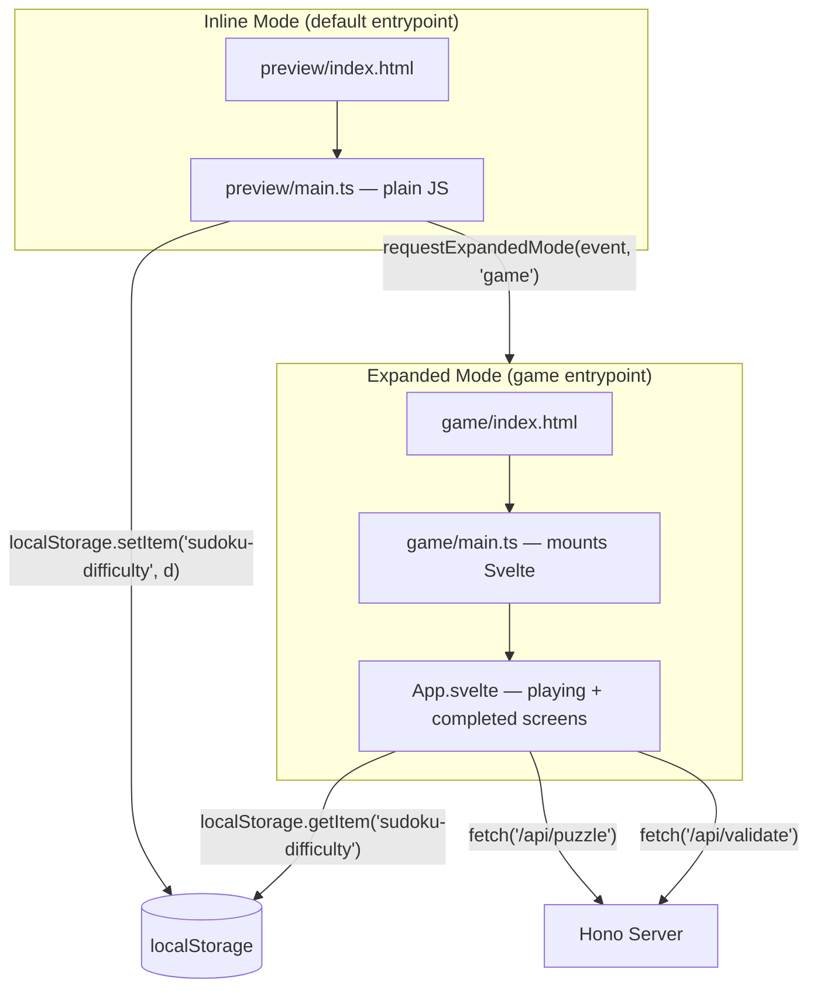

# Design Document: Expanded Game Mode

## Overview

This feature splits the single-entrypoint Sudoku app into two Devvit entrypoints:

1. A lightweight **preview screen** (inline mode) that shows difficulty buttons inside the Reddit post.
2. A full **game screen** (expanded mode) that loads the Sudoku game after the user picks a difficulty.

The preview screen is a minimal HTML/CSS/JS page with no framework dependencies. The game screen is the existing Svelte app, modified to skip the difficulty picker and instead read the selected difficulty from `localStorage`. The Devvit Vite plugin auto-discovers entrypoints from `devvit.json`, so the build configuration change is minimal — add a second entrypoint and a second HTML file.

Difficulty is passed between entrypoints via `localStorage` using a well-known key. The preview writes it before calling `requestExpandedMode(event, 'game')`, and the game reads it on mount.

## Architecture



### Key decisions

- **No Svelte for the preview.** The preview is four buttons and a title. Plain HTML + inline JS + Tailwind keeps the bundle near-zero and load instant. Tailwind is included via the Vite plugin which processes CSS for all entrypoints.
- **Reuse existing Svelte app for the game.** The game entrypoint mounts the same `App.svelte` but initializes it in "playing" mode by reading difficulty from localStorage and fetching the puzzle immediately.
- **localStorage for difficulty passing.** Devvit entrypoints share the same origin, so localStorage is the simplest reliable transport. No server round-trip needed.
- **Separate source directories per entrypoint.** `src/client/preview/` and `src/client/game/` each contain their own `index.html` and `main.ts`. Shared code stays in `src/client/lib/` and `src/client/components/`.

## Components and Interfaces

### New files

| File | Purpose |
|------|---------|
| `src/client/preview/index.html` | Preview entrypoint HTML — contains `<div id="app">` and loads `main.ts` |
| `src/client/preview/main.ts` | Plain JS: renders difficulty buttons, handles click → localStorage + requestExpandedMode |
| `src/client/game/index.html` | Game entrypoint HTML — contains `<div id="app">` and loads `main.ts` |
| `src/client/game/main.ts` | Mounts Svelte `App.svelte` with difficulty read from localStorage |

### Modified files

| File | Change |
|------|--------|
| `devvit.json` | Add `"game"` entrypoint alongside `"default"` |
| `src/client/App.svelte` | Remove the `"picking"` screen. Accept `difficulty` as a prop. Start in `"playing"` screen. On "Try another difficulty", clear localStorage and close expanded mode. |
| `src/client/lib/types.ts` | `GameScreen` type drops `'picking'`, becomes `'playing' \| 'completed'` |

### Removed files

| File | Reason |
|------|--------|
| `src/client/main.ts` | Replaced by `src/client/game/main.ts` |
| `src/client/index.html` | Replaced by `src/client/preview/index.html` (default entrypoint) and `src/client/game/index.html` |

### Interfaces

```typescript
// src/client/lib/types.ts
export type Difficulty = 'simple' | 'easy' | 'intermediate' | 'expert'
export type GameScreen = 'playing' | 'completed'

// Shared constants for localStorage key
// src/client/lib/constants.ts
export const DIFFICULTY_STORAGE_KEY = 'sudoku-difficulty' as const
export const VALID_DIFFICULTIES: readonly Difficulty[] = ['simple', 'easy', 'intermediate', 'expert'] as const
```

```typescript
// src/client/preview/main.ts — pseudocode
import { requestExpandedMode } from '@devvit/web/client'
import { DIFFICULTY_STORAGE_KEY, VALID_DIFFICULTIES } from '../lib/constants'

// For each difficulty, create a button
// On click: localStorage.setItem(DIFFICULTY_STORAGE_KEY, difficulty)
//           requestExpandedMode(event, 'game')
```

```typescript
// src/client/game/main.ts
import { mount } from 'svelte'
import '../app.css'
import App from '../App.svelte'
import { DIFFICULTY_STORAGE_KEY, VALID_DIFFICULTIES } from '../lib/constants'
import type { Difficulty } from '../lib/types'

const raw = localStorage.getItem(DIFFICULTY_STORAGE_KEY)
const difficulty: Difficulty = VALID_DIFFICULTIES.includes(raw as Difficulty)
  ? (raw as Difficulty)
  : 'simple'

const appElement = document.getElementById('app')
if (!appElement) throw new Error('App element not found')

mount(App, { target: appElement, props: { difficulty } })
```

```typescript
// App.svelte — updated props
// Accepts: { difficulty: Difficulty }
// Removes: picking screen, fetchPuzzles on mount replaced with fetchPuzzle(difficulty)
// backToPicking becomes returnToPreview: clears localStorage, no expanded-mode close API needed
//   (user just sees inline post again when they dismiss the modal)
```

### devvit.json changes

```json
{
  "post": {
    "dir": "dist/client",
    "entrypoints": {
      "default": {
        "entry": "preview/index.html",
        "height": "tall",
        "inline": true
      },
      "game": {
        "entry": "game/index.html"
      }
    }
  }
}
```

## Data Models

### localStorage schema

| Key | Value | Written by | Read by |
|-----|-------|-----------|---------|
| `sudoku-difficulty` | `'simple' \| 'easy' \| 'intermediate' \| 'expert'` | Preview screen on button click | Game screen on mount |

### Server API (unchanged)

The server API remains identical. The game screen calls the same endpoints:

- `GET /api/puzzle` — returns all four difficulty puzzles (the game screen only uses the one matching the selected difficulty)
- `POST /api/validate` — validates a completed board against the stored solution

No server changes are needed for this feature.

### Build output structure

```
dist/client/
├── preview/
│   └── index.html        (with inlined JS/CSS)
├── game/
│   ├── index.html
│   └── assets/            (Svelte bundle, CSS)
```


## Correctness Properties

*A property is a characteristic or behavior that should hold true across all valid executions of a system — essentially, a formal statement about what the system should do. Properties serve as the bridge between human-readable specifications and machine-verifiable correctness guarantees.*

### Property 1: Difficulty round-trip through localStorage

*For any* valid difficulty value (simple, easy, intermediate, expert), writing it to localStorage with the shared key and then reading it back with the same key should produce the original difficulty value.

**Validates: Requirements 2.4, 4.1, 4.2**

### Property 2: Difficulty validation accepts only valid values

*For any* arbitrary string read from localStorage, the difficulty validation function should return one of the four valid difficulties (simple, easy, intermediate, expert). For valid difficulty strings it should return the input unchanged; for any other string (or null/undefined) it should return "simple".

**Validates: Requirements 4.3, 4.4, 3.3**

### Property 3: Preview button click stores difficulty before requesting expanded mode

*For any* difficulty button in the preview screen, clicking it should result in localStorage containing that difficulty value, and `requestExpandedMode` being called with the arguments `(event, 'game')`.

**Validates: Requirements 2.5, 4.1**

### Property 4: Game screen fetches puzzle for stored difficulty

*For any* valid difficulty stored in localStorage, when the game screen mounts, it should initiate a fetch to `/api/puzzle` and use the stored difficulty to select and display the correct puzzle.

**Validates: Requirements 3.1, 3.2**

## Error Handling

| Scenario | Handling |
|----------|----------|
| localStorage is empty (no difficulty key) | Game screen defaults to "simple" difficulty |
| localStorage contains invalid difficulty value | Validation function returns "simple" as fallback |
| localStorage is unavailable (private browsing edge case) | Wrap reads/writes in try-catch; default to "simple" on read failure |
| Puzzle fetch fails in game screen | Display error message with retry button (existing behavior) |
| `requestExpandedMode` fails or is unavailable | No explicit handling needed — Devvit platform manages this; button click is a no-op if API is missing |

The preview screen has no error states by design — it renders statically with no server calls. All error handling lives in the game screen, which inherits the existing error/retry UI from the current `App.svelte`.

## Testing Strategy

### Unit tests (Vitest)

Unit tests cover specific examples, edge cases, and integration points:

- **Difficulty validation**: test that each of the four valid strings returns itself, that null/undefined/empty/garbage strings return "simple"
- **localStorage helpers**: test read/write/clear operations with the shared key
- **devvit.json structure**: snapshot test confirming both entrypoints exist with correct paths
- **Build output**: verify both HTML files are produced in `dist/client/`
- **Preview DOM**: test that the preview renders four buttons with correct labels and a title
- **Game mount**: test that App.svelte receives the correct difficulty prop based on localStorage

### Property-based tests (fast-check via Vitest)

Property tests verify universal properties across randomized inputs. Each test runs a minimum of 100 iterations.

The project should use `fast-check` as the property-based testing library, integrated with Vitest.

Each property test must be tagged with a comment referencing the design property:

- **Feature: expanded-game-mode, Property 1: Difficulty round-trip through localStorage** — generate random valid difficulties, write to localStorage, read back, assert equality.
- **Feature: expanded-game-mode, Property 2: Difficulty validation accepts only valid values** — generate arbitrary strings (including empty, whitespace, unicode, near-misses like "Simple" or "EASY"), pass through validation, assert result is always one of the four valid difficulties. For the four valid strings, assert identity.
- **Feature: expanded-game-mode, Property 3: Preview button click stores difficulty before requesting expanded mode** — for each valid difficulty, simulate click, assert localStorage contains the value and requestExpandedMode was called with correct args.
- **Feature: expanded-game-mode, Property 4: Game screen fetches puzzle for stored difficulty** — for each valid difficulty, set localStorage, mount game, assert fetch was called and the correct difficulty puzzle is used.

### Test file locations

| Test file | Covers |
|-----------|--------|
| `src/client/lib/__tests__/constants.test.ts` | Difficulty validation, localStorage helpers, round-trip property |
| `src/client/preview/__tests__/main.test.ts` | Preview button behavior, requestExpandedMode calls |
| `src/client/game/__tests__/main.test.ts` | Game mount with difficulty from localStorage |
