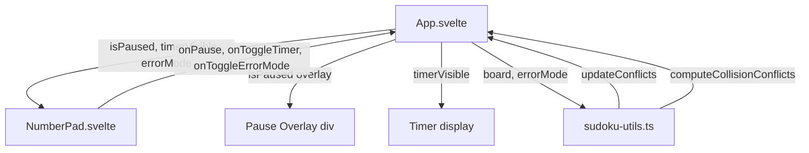
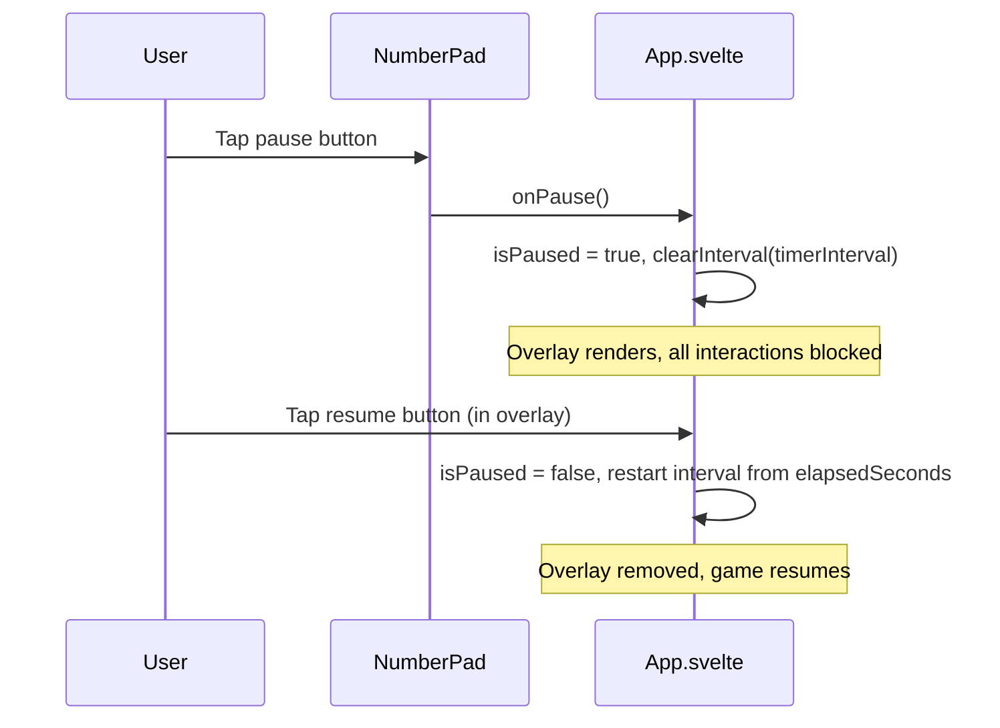
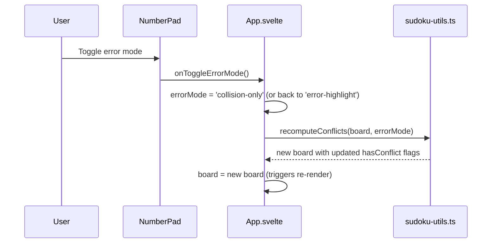

# Design Document: Game Settings Controls

## Overview

This feature adds three player-facing controls to the Sudoku game's playing screen: a pause button, a timer visibility toggle, and an error-highlight mode toggle. All three controls are surfaced inside the existing `NumberPad` component to avoid adding vertical space to the constrained 512 px tall viewport.

The pause button stops the timer and overlays the board with a full-screen cover, blocking all game interactions. The timer toggle replaces the timer display with a same-height placeholder when hidden. The error-highlight toggle switches conflict detection between the existing "always-on" mode (wrong value = conflict) and a new "collision-only" mode (duplicate in row/col/box = conflict). A new pure function `computeCollisionConflicts` is added to `sudoku-utils.ts` to implement collision-only detection.

## Architecture



### State Flow: Pause / Resume



### State Flow: Error Mode Toggle



## Components and Interfaces

### Component 1: sudoku-utils.ts (Extended)

**New pure function:**

```typescript
/**
 * Return a new board with hasConflict set only for cells that share
 * the same digit with another cell in the same row, column, or 3×3 box.
 * Does not compare against the solution. Does not mutate input.
 */
export const computeCollisionConflicts = (board: CellState[][]): CellState[][]
```

**Existing function used for error-highlight mode:** `updateConflicts` (unchanged).

**New routing helper (used in App.svelte, not exported):**

```typescript
// Inline in App.svelte — picks the right conflict function based on mode
const recomputeConflicts = (board: CellState[][], mode: ErrorMode): CellState[][] =>
    mode === 'collision-only' ? computeCollisionConflicts(board) : updateConflicts(board)
```

### Component 2: types.ts (Extended)

**New type exports:**

```typescript
export type ErrorMode = 'error-highlight' | 'collision-only'
```

### Component 3: App.svelte (Modified)

**New state:**

```typescript
let isPaused: boolean = $state(false)
let timerVisible: boolean = $state(true)
let errorMode: ErrorMode = $state('error-highlight')
```

**Modified `resetRoundState`:** clears `isPaused`, resets `timerVisible` to `true`, resets `errorMode` to `'error-highlight'`.

**Modified `startTimer`:** uses `isPaused` guard — only starts interval when not paused.

**New handlers:**

```typescript
const handlePause = (): void => {
    if (screen !== 'playing') return
    isPaused = true
    if (timerInterval) clearInterval(timerInterval)
    timerInterval = null
}

const handleResume = (): void => {
    isPaused = false
    timerInterval = setInterval(() => elapsedSeconds++, 1000)
}

const handleToggleTimer = (): void => {
    timerVisible = !timerVisible
}

const handleToggleErrorMode = (): void => {
    errorMode = errorMode === 'error-highlight' ? 'collision-only' : 'error-highlight'
    board = recomputeConflicts(board, errorMode)
}
```

**Modified `handleKeyDown`:** all game interactions (digit entry, erase, undo, hint, arrow keys) are gated behind `if (isPaused) return` at the top of the handler.

**Modified `checkCompletion`:** if `screen` transitions to `'completed'`, also set `isPaused = false` and clear the timer interval.

**Pause overlay (in template):** rendered as a sibling to the grid/controls area, positioned absolutely to cover the board. Contains only the resume button.

**Props passed to NumberPad (additions):**

```typescript
{isPaused}
{timerVisible}
{errorMode}
onPause={handlePause}
onToggleTimer={handleToggleTimer}
onToggleErrorMode={handleToggleErrorMode}
```

### Component 4: NumberPad.svelte (Modified)

**New props:**

```typescript
isPaused: boolean
timerVisible: boolean
errorMode: ErrorMode
onPause: () => void
onToggleTimer: () => void
onToggleErrorMode: () => void
```

**UI additions (in the checkboxes row):**

- Pause button: icon button (⏸/▶) placed in the top controls row alongside Undo and Hint.
- Timer toggle checkbox: added to the existing checkboxes row.
- Error mode toggle checkbox: added to the existing checkboxes row.

The checkboxes row already has `Auto Candidate` and `Digit First`. The two new toggles join it. The pause button joins the top icon-button row (Undo, Hint).

### Component 5: Grid.svelte (No Changes)

Grid receives no new props. The pause overlay is rendered in `App.svelte` as a positioned element over the grid area, not inside `Grid.svelte`.

## Data Models

### ErrorMode Type

```typescript
export type ErrorMode = 'error-highlight' | 'collision-only'
```

- `'error-highlight'`: default — `updateConflicts` is used; a cell is a conflict when its value doesn't match the solution (existing behaviour via peer-duplicate detection on the full board).
- `'collision-only'`: new — `computeCollisionConflicts` is used; a cell is a conflict only when the same digit appears in a peer cell.

### isPaused State

```typescript
let isPaused: boolean = $state(false)
```

- `true`: timer stopped, board overlaid, all interactions blocked.
- `false`: normal play.
- Cleared on: new puzzle load, difficulty change, game completion.

### timerVisible State

```typescript
let timerVisible: boolean = $state(true)
```

- `true`: formatted elapsed time shown.
- `false`: placeholder `div` of equal height shown instead.
- Defaults to `true` on new puzzle load.
- Survives pause/resume cycles (Requirement 2.5).

### State Interaction Matrix

| isPaused | timerVisible | Timer area shows | Board shows | Interactions |
|----------|-------------|-----------------|-------------|--------------|
| false | true | elapsed time | puzzle | all enabled |
| false | false | placeholder | puzzle | all enabled |
| true | true | elapsed time (frozen) | overlay | blocked |
| true | false | placeholder | overlay | blocked |

### computeCollisionConflicts Algorithm

```
for each cell (r, c) with value v > 0:
    conflict = false
    for each peer in same row, col, box (excluding self):
        if peer.value === v: conflict = true; break
    cell.hasConflict = conflict
for each cell with value 0:
    cell.hasConflict = false
```

This is identical to the existing `hasConflict` helper in `sudoku-utils.ts`. The difference from `updateConflicts` is purely semantic: `updateConflicts` is already collision-based (it checks peers, not the solution). The distinction in the requirements is that `updateConflicts` is the "always-on" mode because the app currently calls it after every placement — meaning a wrong-but-non-colliding value gets no conflict flag. The new `computeCollisionConflicts` function is the same algorithm, making the intent explicit and testable independently.

> **Design note**: After reviewing `sudoku-utils.ts`, `updateConflicts` already implements collision-only logic (it checks peer cells, not the solution string). The "error-highlight" mode described in the requirements is therefore the *current* behaviour where the app calls `updateConflicts` after every move — wrong values that don't collide show no conflict. The "collision-only" mode is the same function, just explicitly named. The `computeCollisionConflicts` export makes the contract testable and the intent clear. No solution-comparison logic exists or needs to be added.

## Correctness Properties

*A property is a characteristic or behavior that should hold true across all valid executions of a system — essentially, a formal statement about what the system should do. Properties serve as the bridge between human-readable specifications and machine-verifiable correctness guarantees.*

### Property 1: Collision-free board has no conflicts

*For any* board where no digit appears more than once in any row, column, or 3×3 box, `computeCollisionConflicts` shall return a board where every cell has `hasConflict: false`.

**Validates: Requirements 3.8**

### Property 2: Collision-only conflicts are symmetric

*For any* board, if cell A is flagged as a conflict by `computeCollisionConflicts` due to cell B, then cell B must also be flagged as a conflict.

**Validates: Requirements 3.3**

### Property 3: computeCollisionConflicts does not mutate input

*For any* board, calling `computeCollisionConflicts` shall not modify any cell in the input board.

**Validates: Requirements 3.7**

### Property 4: computeCollisionConflicts round-trip stability

*For any* board, calling `computeCollisionConflicts` twice in a row shall produce the same result as calling it once (idempotent).

**Validates: Requirements 3.7**

### Property 5: Error mode toggle recomputes conflicts immediately

*For any* board state, toggling `errorMode` shall produce a board where every cell's `hasConflict` flag matches the result of applying the newly active conflict function from scratch.

**Validates: Requirements 3.6**

## Error Handling

### Error Scenario 1: Pause during hint display

**Condition**: Player pauses while an active hint is shown.
**Response**: The hint panel remains visible (it is part of the overlay-covered area). All hint interaction buttons (Apply, Dismiss) are blocked by the pause guard in `handleKeyDown` and the overlay covering the board area. The `hintsDisabled` derived value already gates hint generation.
**Recovery**: On resume, the hint is still active and the player can apply or dismiss it.

### Error Scenario 2: Game completes while paused

**Condition**: This cannot happen via normal play (all interactions are blocked while paused). However, if `checkCompletion` is somehow called while paused, the completion handler clears `isPaused` and stops the timer.
**Recovery**: Automatic — completion always wins over pause state (Requirement 1.7).

### Error Scenario 3: Timer interval leak on difficulty change

**Condition**: Player changes difficulty while paused.
**Response**: `loadDifficultyBoard` calls `resetRoundState` which calls `startTimer`. `startTimer` calls `clearInterval(timerInterval)` before creating a new interval, and `isPaused` is reset to `false` first, so the new interval starts cleanly.
**Recovery**: No leak — existing `clearInterval` guard in `startTimer` handles this.

### Error Scenario 4: timerVisible state across pause/resume

**Condition**: Player hides the timer, then pauses, then resumes.
**Response**: `timerVisible` is independent of `isPaused`. Resume only restarts the interval; it does not touch `timerVisible`. The timer remains hidden after resume (Requirement 2.5).
**Recovery**: No recovery needed — this is the specified behaviour.

## Testing Strategy

### Unit Testing Approach

**`computeCollisionConflicts`** (`sudoku-utils.ts`):
- Empty board → all `hasConflict: false`
- Board with one duplicate in a row → both cells flagged
- Board with one duplicate in a column → both cells flagged
- Board with one duplicate in a box → both cells flagged
- Board with no duplicates → all `hasConflict: false`
- Does not mutate input board

**`handlePause` / `handleResume`** (logic extracted to pure helpers where possible):
- Pause stops the timer (interval cleared)
- Resume restarts the timer from the same `elapsedSeconds`
- Pause while already paused is a no-op

**`handleToggleErrorMode`**:
- Toggles between `'error-highlight'` and `'collision-only'`
- Immediately recomputes board conflicts

### Property-Based Testing Approach

**Property Test Library**: fast-check (already used in the project)

Each property test runs a minimum of 100 iterations.

**Property 1 test**: Generate random 9×9 boards with no duplicate digits in any row, col, or box. Call `computeCollisionConflicts`. Assert every cell has `hasConflict: false`.
- Tag: `Feature: game-settings-controls, Property 1: Collision-free board has no conflicts`

**Property 2 test**: Generate random boards. Call `computeCollisionConflicts`. For every flagged cell, assert its conflicting peer is also flagged.
- Tag: `Feature: game-settings-controls, Property 2: Collision-only conflicts are symmetric`

**Property 3 test**: Generate random boards. Deep-clone before calling `computeCollisionConflicts`. Assert input board is unchanged after the call.
- Tag: `Feature: game-settings-controls, Property 3: computeCollisionConflicts does not mutate input`

**Property 4 test**: Generate random boards. Assert `computeCollisionConflicts(computeCollisionConflicts(board))` deep-equals `computeCollisionConflicts(board)`.
- Tag: `Feature: game-settings-controls, Property 4: computeCollisionConflicts round-trip stability`

**Property 5 test**: Generate random boards and random `errorMode` values. Toggle the mode. Assert every cell's `hasConflict` matches the result of applying the new conflict function from scratch.
- Tag: `Feature: game-settings-controls, Property 5: Error mode toggle recomputes conflicts immediately`

### Integration Testing

Svelte component tests are skipped per project rules. Correctness is verified through:
1. Unit tests on `computeCollisionConflicts` in `sudoku-utils.ts`
2. Property tests on the pure conflict functions
3. Manual testing of pause overlay, timer toggle, and error mode toggle
4. `bun run test && bun run type-check` before committing
