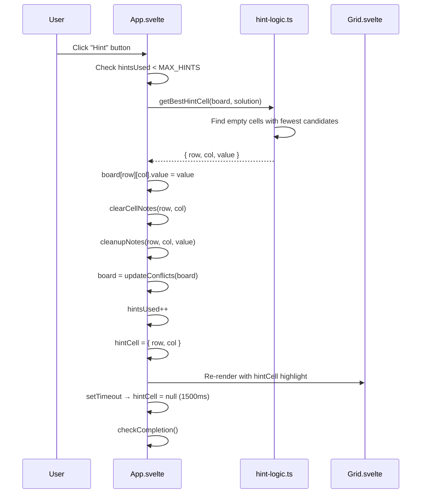
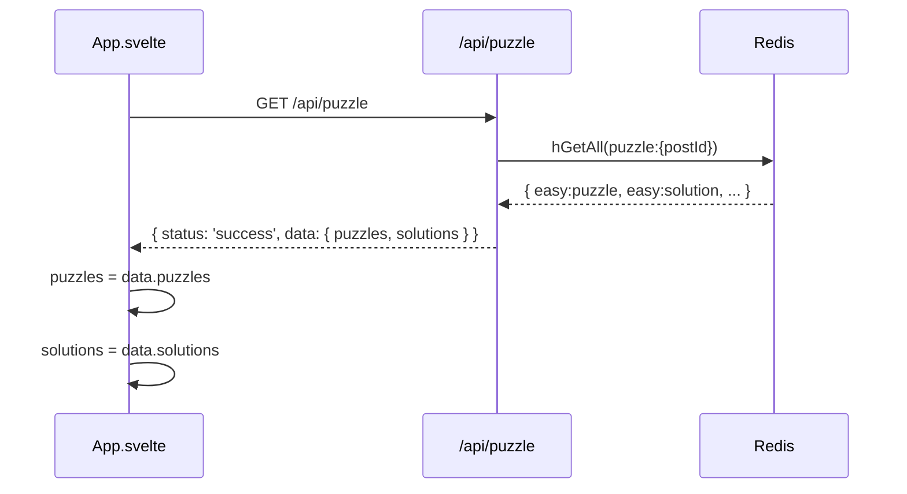

# Design Document: Hint System

## Overview

This feature adds a hint system to the Sudoku puzzle game that helps players who are stuck. When a player requests a hint, the system reveals the correct value for the most strategically useful empty cell — the one with the fewest remaining candidates — and briefly highlights it so the player knows which cell was filled. Hints are tracked per game session (client-side only), capped at a configurable maximum, and displayed with a counter so players know how many hints remain. No server changes are required: the solution is already stored in Redis and returned via the existing `/api/puzzle` response (extended to include the solution), or derived client-side from the stored puzzle string.

The hint system integrates cleanly with the existing board, notes, and conflict-detection layers. Placing a hint value triggers the same note-cleanup and conflict-recalculation paths as a normal digit placement.

## Architecture

```mermaid
graph TD
    subgraph Client["Client (Svelte 5 Webview)"]
        App["App.svelte\nGame state, hint counter,\nhint handler"]
        Grid["Grid.svelte\n9×9 grid rendering,\nhint-highlight class"]
        NP["NumberPad.svelte\n1–9 buttons, erase,\nnotes toggle, hint button"]
        HintLogic["hint-logic.ts\ngetBestHintCell()\napplyHint()"]
        Types["types.ts\nHintState type"]
    end

    subgraph Server["Server (Hono)"]
        API["/api/puzzle\nreturns puzzle + solution"]
        Redis[(Redis\npuzzle:{postId})]
    end

    App --> Grid
    App --> NP
    App --> HintLogic
    HintLogic --> Types
    App --> API
    API --> Redis
```

### Key decisions

- **Solution delivered with puzzle.** The `/api/puzzle` response is extended to include the solution strings alongside the puzzle strings. The solution is already stored in Redis (`{difficulty}:solution`); it was previously omitted from the response. Exposing it client-side is acceptable because Sudoku solutions are not secret — the game's challenge is the solving process, not the answer itself.
- **Best-cell heuristic.** Rather than revealing a random cell, the hint picks the empty non-given cell with the fewest valid candidates (minimum remaining values). This mirrors the "naked single" technique and gives the most pedagogically useful hint.
- **Client-side only.** Hint count and hint-highlighted cell are Svelte reactive state. No server persistence is needed — hints reset when the puzzle reloads.
- **Hint highlight is transient.** The highlighted cell reverts to normal styling after a short timeout (1.5 s) or when the player interacts with the board, so it doesn't permanently alter the visual state.
- **Notes integration.** Placing a hint value calls the same `clearCellNotes` + `cleanupNotes` path as a normal digit placement, keeping notes consistent.

## Sequence Diagrams

### Player Requests a Hint



### Puzzle Load — Solution Included



## Components and Interfaces

### New file: `src/client/lib/hint-logic.ts`

**Purpose**: Pure functions for hint computation. No side effects, no Svelte imports.

```typescript
import type { CellState } from './types'

export type HintCell = { row: number; col: number; value: number }

// Returns the best cell to hint, or null if the board is complete/unsolvable
export const getBestHintCell = (
    board: CellState[][],
    solution: number[]   // flat 81-element array, 1-9
): HintCell | null

// Returns true if the hint can be applied (cell is empty, not given, solution value is valid)
export const isHintApplicable = (
    board: CellState[][],
    row: number,
    col: number,
    solutionValue: number
): boolean
```

**Responsibilities**:
- Scan all 81 cells for empty, non-given cells
- For each candidate cell, count valid placements (digits 1–9 that don't conflict with peers)
- Return the cell with the minimum candidate count (ties broken by lowest cell index)
- Return `null` if no empty non-given cells exist

### Modified: `src/client/components/NumberPad.svelte`

**New props**:
```typescript
{
    onNumber: (num: number) => void
    onErase: () => void
    notesMode: boolean
    onToggleNotes: () => void
    onHint: () => void          // new
    hintsRemaining: number      // new
    hintsDisabled: boolean      // new — true when hintsRemaining === 0 or game complete
}
```

**Responsibilities**:
- Render a "Hint" button showing the remaining hint count (e.g. "Hint (3)")
- Disable the button when `hintsDisabled` is true
- Apply distinct styling when disabled vs. available

### Modified: `src/client/components/Grid.svelte`

**New props**:
```typescript
{
    // ... existing props ...
    hintCell: { row: number; col: number } | null   // new
}
```

**Responsibilities**:
- Apply a distinct hint-highlight class (e.g. amber/orange background) to the hinted cell
- Hint highlight takes visual precedence over selection highlight but not conflict highlight

### Modified: `src/client/App.svelte`

**New state**:
```typescript
let solutions: Record<Difficulty, string> | null = $state(null)
let hintsUsed: number = $state(0)
let hintCell: { row: number; col: number } | null = $state(null)

const MAX_HINTS = 3
const hintsRemaining = $derived(MAX_HINTS - hintsUsed)
const hintsDisabled = $derived(hintsRemaining === 0 || screen !== 'playing')
```

**New handler**:
```typescript
const handleHint = (): void => {
    // guard, getBestHintCell, apply value, update state, set timeout
}
```

**Modified**: `fetchPuzzles` stores `solutions` from the API response.

### Modified: `src/server/index.ts`

**Change**: `/api/puzzle` response includes solution strings.

```typescript
// Before
return c.json({ status: 'success', data: puzzles })

// After
return c.json({ status: 'success', data: { puzzles, solutions } })
```

**Client-side type update** (`src/client/App.svelte`):
```typescript
// fetchPuzzles parses both puzzles and solutions from json.data
puzzles = json.data.puzzles
solutions = json.data.solutions
```

## Data Models

### `HintCell`

```typescript
export type HintCell = {
    row: number    // 0–8
    col: number    // 0–8
    value: number  // 1–9, the correct digit from the solution
}
```

### `HintState` (inline in App.svelte, no separate type needed)

| Field | Type | Description |
|-------|------|-------------|
| `hintsUsed` | `number` | Count of hints consumed this session (0–MAX_HINTS) |
| `hintCell` | `{ row, col } \| null` | Currently highlighted hint cell, cleared after timeout |
| `solutions` | `Record<Difficulty, string> \| null` | Solution strings from API, parallel to `puzzles` |

**Validation rules**:
- `hintsUsed` is always in range `[0, MAX_HINTS]`
- `hintCell` is always `null` when `screen !== 'playing'`
- `solutions[difficulty]` is an 81-char string of digits 1–9 (no zeros — complete solution)

## Algorithmic Pseudocode

### getBestHintCell Algorithm

```pascal
ALGORITHM getBestHintCell(board, solution)
INPUT: board — 9×9 CellState grid
       solution — flat 81-element number array (1–9)
OUTPUT: HintCell | null

BEGIN
  bestCell ← null
  minCandidates ← 10

  FOR row ← 0 TO 8 DO
    FOR col ← 0 TO 8 DO
      cell ← board[row][col]

      IF cell.value ≠ 0 OR cell.isGiven THEN
        CONTINUE
      END IF

      solutionValue ← solution[row * 9 + col]

      IF solutionValue = 0 THEN
        CONTINUE  // malformed solution, skip
      END IF

      candidateCount ← countValidCandidates(board, row, col)

      IF candidateCount < minCandidates THEN
        minCandidates ← candidateCount
        bestCell ← { row, col, value: solutionValue }
      END IF
    END FOR
  END FOR

  RETURN bestCell
END
```

**Preconditions**:
- `board` is a valid 9×9 `CellState` grid
- `solution` is a flat array of length 81 with values 1–9 (no zeros)

**Postconditions**:
- Returns `null` if no empty non-given cells exist
- Returns the empty non-given cell with the fewest valid candidates
- Ties broken by lowest (row * 9 + col) index
- Returned `value` is always the solution digit for that cell

**Loop Invariant**:
- After processing cell index k, `bestCell` holds the minimum-candidate empty cell seen so far among indices 0..k

### countValidCandidates Algorithm

```pascal
ALGORITHM countValidCandidates(board, row, col)
INPUT: board — 9×9 CellState grid, row, col — cell coordinates
OUTPUT: count — number of digits 1–9 that don't conflict at (row, col)

BEGIN
  count ← 0
  FOR digit ← 1 TO 9 DO
    IF NOT conflictsWithPeers(board, row, col, digit) THEN
      count ← count + 1
    END IF
  END FOR
  RETURN count
END
```

**Preconditions**: `board[row][col].value === 0`

**Postconditions**: Returns integer in range [0, 9]

### handleHint Algorithm (App.svelte)

```pascal
ALGORITHM handleHint()
PRECONDITION: hintsUsed < MAX_HINTS AND screen = 'playing'

BEGIN
  IF solutions = null THEN RETURN END IF

  solutionFlat ← stringToFlatArray(solutions[difficulty])
  hint ← getBestHintCell(board, solutionFlat)

  IF hint = null THEN RETURN END IF

  board[hint.row][hint.col] ← { ...board[hint.row][hint.col], value: hint.value }
  clearCellNotes(notesBoard, hint.row, hint.col)
  cleanupNotes(notesBoard, hint.row, hint.col, hint.value)
  board ← updateConflicts(board)
  hintsUsed ← hintsUsed + 1
  hintCell ← { row: hint.row, col: hint.col }

  setTimeout(() → { hintCell ← null }, 1500)

  checkCompletion()
END
```

**Postconditions**:
- `board[hint.row][hint.col].value === hint.value`
- `hintsUsed` incremented by exactly 1
- `hintCell` set then cleared after 1500 ms
- Notes cleaned up for the hinted cell and its peers
- Conflicts recalculated across the board

## Key Functions with Formal Specifications

### `getBestHintCell(board, solution): HintCell | null`

**Preconditions**:
- `board` is a 9×9 array of `CellState` (no null/undefined cells)
- `solution` has length 81, all values in range [1, 9]

**Postconditions**:
- Returns `null` iff no cell satisfies `value === 0 && !isGiven`
- If non-null: `result.value === solution[result.row * 9 + result.col]`
- If non-null: `board[result.row][result.col].value === 0 && !board[result.row][result.col].isGiven`
- If non-null: no other empty non-given cell has fewer valid candidates

### `isHintApplicable(board, row, col, solutionValue): boolean`

**Preconditions**: `0 ≤ row ≤ 8`, `0 ≤ col ≤ 8`, `1 ≤ solutionValue ≤ 9`

**Postconditions**:
- Returns `true` iff `board[row][col].value === 0 && !board[row][col].isGiven`
- Pure function — no mutations

### `handleHint(): void` (App.svelte)

**Preconditions**: `hintsUsed < MAX_HINTS`, `screen === 'playing'`, `solutions !== null`

**Postconditions**:
- `hintsUsed` increased by 1
- The hinted cell has its solution value placed
- Notes cleaned up for hinted cell and peers
- `hintCell` set to `{ row, col }` then cleared after 1500 ms
- `checkCompletion()` called

## Example Usage

```typescript
// --- hint-logic.ts usage ---
import { getBestHintCell } from './lib/hint-logic'

const solution = [5,3,4,6,7,8,9,1,2, /* ... 81 values */]
const hint = getBestHintCell(board, solution)

if (hint) {
    // hint = { row: 2, col: 4, value: 7 }
    board[hint.row]![hint.col] = { ...board[hint.row]![hint.col]!, value: hint.value }
}

// --- App.svelte integration ---
// Hint button in NumberPad triggers handleHint()
// Grid receives hintCell prop for amber highlight
// hintsRemaining shown in button label: "Hint (2)"
```

## Correctness Properties

*A property is a characteristic or behavior that should hold true across all valid executions of a system — essentially, a formal statement about what the system should do. Properties serve as the bridge between human-readable specifications and machine-verifiable correctness guarantees.*

### Property 1: getBestHintCell returns null on a complete board

*For any* board where every cell has a non-zero value, `getBestHintCell` should return `null`.

**Validates: Requirement 2.2**

### Property 2: getBestHintCell result is always an empty non-given cell

*For any* board with at least one empty non-given cell and a valid solution, the result of `getBestHintCell` should point to a cell where `value === 0` and `isGiven === false`.

**Validates: Requirements 2.1, 2.4**

### Property 3: getBestHintCell result value matches the solution

*For any* board and solution, if `getBestHintCell` returns a non-null result `{ row, col, value }`, then `value === solution[row * 9 + col]`.

**Validates: Requirement 2.3**

### Property 4: Hint count is monotonically non-decreasing and bounded

*For any* sequence of hint actions, `hintsUsed` should only increase, and should never exceed `MAX_HINTS`. After `MAX_HINTS` hints, the hint button should be disabled.

**Validates: Requirements 5.1, 5.2, 5.3, 5.4**

### Property 5: Hint placement triggers note cleanup

*For any* board state with notes, after a hint is applied at `(row, col)` with `value`, the notes for `(row, col)` should be empty, and no peer of `(row, col)` should contain `value` in its notes.

**Validates: Requirements 3.3, 3.4**

### Property 6: isHintApplicable is consistent with getBestHintCell

*For any* board and solution, if `getBestHintCell` returns `{ row, col, value }`, then `isHintApplicable(board, row, col, value)` should return `true`.

**Validates: Requirement 7.4**

### Property 7: isHintApplicable rejects given and filled cells

*For any* board, `isHintApplicable` should return `false` for any cell that is either given or already filled (non-zero value), regardless of the solution value provided.

**Validates: Requirements 7.1, 7.2**

### Property 8: handleHint is a no-op when preconditions are not met

*For any* app state where `solutions` is `null` or `getBestHintCell` returns `null`, calling `handleHint` should leave `hintsUsed`, `board`, `hintCell`, and all notes unchanged.

**Validates: Requirements 8.1, 8.2**

### Property 9: API response includes valid solution strings

*For any* `/api/puzzle` response, the `solutions` field should contain one entry per difficulty, each being an 81-character string composed entirely of digits 1–9.

**Validates: Requirements 6.1, 6.2**

## Error Handling

### No solution available

**Condition**: `solutions` is `null` when hint is requested (e.g. API response not yet parsed)
**Response**: `handleHint` returns early — no-op
**Recovery**: Hint button is disabled while `loading === true`

### No empty cells remain

**Condition**: `getBestHintCell` returns `null` (board is fully filled)
**Response**: `handleHint` returns early — no-op
**Recovery**: N/A — board is complete, `checkCompletion` will fire

### Hint cap reached

**Condition**: `hintsUsed >= MAX_HINTS`
**Response**: Hint button is disabled (`hintsDisabled === true`); `handleHint` guard prevents execution
**Recovery**: Player must solve remaining cells without hints

### Solution value conflicts with current board

**Condition**: The solution digit for a cell conflicts with an existing peer value (shouldn't happen with a valid puzzle, but defensive)
**Response**: Hint is still applied — `updateConflicts` will highlight the conflict, making the inconsistency visible
**Recovery**: This indicates a corrupted puzzle; the player can reload

### API response missing solutions

**Condition**: Server returns `data.solutions` as undefined (e.g. old server version)
**Response**: `solutions` remains `null`; hint button is disabled
**Recovery**: Graceful degradation — game is fully playable without hints

## Testing Strategy

### Unit Testing Approach

Test pure functions in `hint-logic.ts` with Vitest:
- `getBestHintCell`: returns null on complete board, returns correct cell on partial board, returns cell with fewest candidates, value matches solution
- `isHintApplicable`: returns false for given cells, false for filled cells, true for valid empty cells
- Server route: `/api/puzzle` response includes `solutions` field with correct 81-char strings

### Property-Based Testing Approach

**Property Test Library**: fast-check (already installed)

Key properties to test with fast-check:
- `getBestHintCell` on a fully-filled board always returns `null`
- `getBestHintCell` result (when non-null) always points to an empty non-given cell
- `getBestHintCell` result value always matches `solution[row * 9 + col]`
- `isHintApplicable` returns `false` for any given cell regardless of solution value
- Hint count never exceeds `MAX_HINTS` regardless of how many times `handleHint` is called

### Integration Testing Approach

- `/api/puzzle` returns `solutions` alongside `puzzles` for all four difficulties
- Placing a hint value clears the cell's notes and removes the value from peer notes
- `hintsRemaining` decrements correctly after each hint
- Hint button is disabled after `MAX_HINTS` hints are used
- `hintCell` is set immediately after hint and cleared after 1500 ms

## Performance Considerations

- `getBestHintCell` scans at most 81 cells × 9 candidates = 729 operations per call. Trivially fast.
- `countValidCandidates` checks 9 digits × 20 peers = 180 comparisons per cell. No memoization needed.
- The hint highlight timeout uses a single `setTimeout` — no interval or animation frame needed.
- Solution strings are stored in memory as `Record<Difficulty, string>` — 4 × 81 chars = negligible.

## Security Considerations

Exposing the solution to the client is an intentional design decision. Sudoku is a single-player puzzle game — there is no competitive integrity concern. The solution is already derivable client-side by running the solver, and it is already stored in Redis without access controls. Sending it in the API response is equivalent to what already happens.

No new attack surface is introduced: the hint endpoint is client-side only, and the server change is additive (returning more data from an existing authenticated endpoint).

## Dependencies

- No new packages required
- `fast-check` — property-based testing (already installed)
- `svelte/reactivity` — `SvelteSet` for notes (already in use)
- All hint logic is pure TypeScript with no external dependencies
