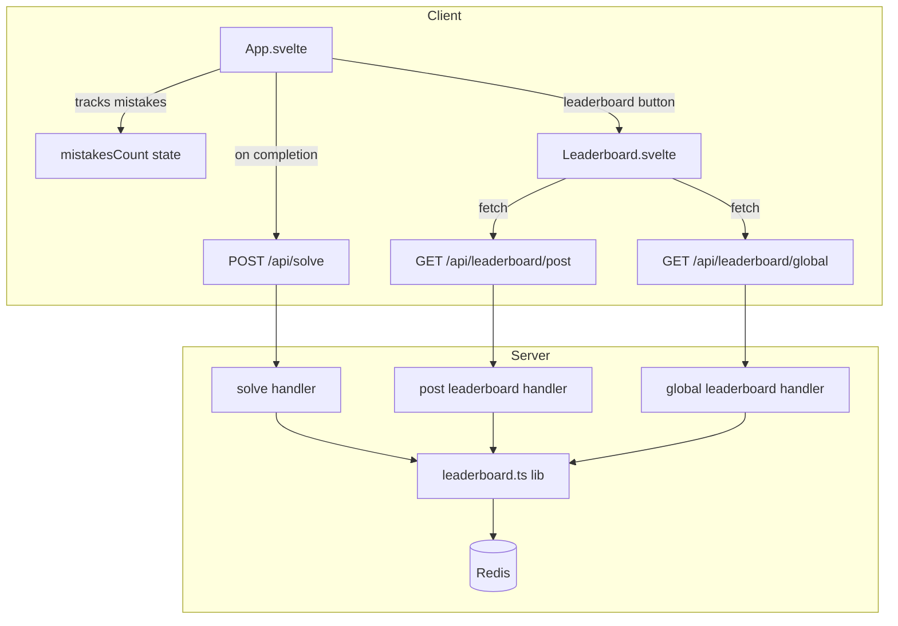
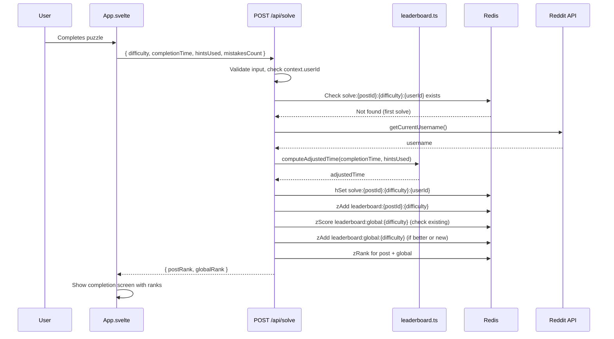
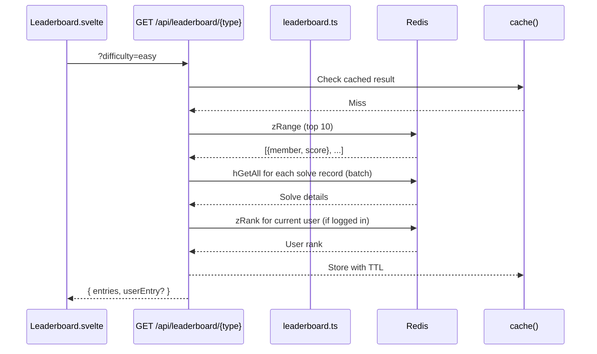

# Design Document: Leaderboards

## Overview

Add per-post and global leaderboards to the Sudoku game. When a player completes a puzzle, their solve is recorded with an adjusted time score (`completion_time + hints_used × 30`). Each post maintains a per-difficulty leaderboard, and a global subreddit-wide leaderboard tracks each user's best adjusted time per difficulty. The leaderboard is viewable during gameplay via a panel and is displayed prominently on the completion screen.

The feature spans server and client:
- **Server**: New `POST /api/solve` endpoint to record solves, `GET /api/leaderboard/post` and `GET /api/leaderboard/global` endpoints to retrieve rankings. A new `src/server/lib/leaderboard.ts` module encapsulates all leaderboard business logic and Redis operations.
- **Client**: A new `Leaderboard.svelte` component renders the leaderboard table. `App.svelte` is modified to track mistakes, show a leaderboard button during play, and display the leaderboard on the completion screen.

Mistakes are tracked client-side by comparing placed digits against the known solution. They are submitted with the solve but do not affect ranking — they are display-only.

## Architecture



### Data Flow: Recording a Solve



### Data Flow: Fetching Leaderboard



## Components and Interfaces

### Module: `src/server/lib/leaderboard.ts`

Pure functions and Redis operations for leaderboard logic.

**Exported Functions:**

```typescript
/** Pure: compute adjusted time score */
export const computeAdjustedTime = (completionTime: number, hintsUsed: number): number =>
    completionTime + hintsUsed * 30

/** Pure: validate solve submission input */
export const validateSolveInput = (
    body: unknown
): { difficulty: ValidDifficulty; completionTime: number; hintsUsed: number; mistakesCount: number } | string

/** Record a solve to Redis (sorted sets + hash). Returns post and global ranks. */
export const recordSolve = async (params: {
    postId: string
    userId: string
    username: string
    difficulty: ValidDifficulty
    completionTime: number
    hintsUsed: number
    mistakesCount: number
}): Promise<{ postRank: number; globalRank: number }>

/** Fetch top-10 leaderboard entries + optional user entry */
export const getLeaderboard = async (params: {
    key: string
    solveKeyPrefix: string
    userId?: string
    limit?: number
}): Promise<{ entries: LeaderboardEntry[]; userEntry: LeaderboardEntry | null }>
```

### Route: `POST /api/solve`

Added to `src/server/index.ts`.

**Request body:**
```json
{ "difficulty": "easy", "completionTime": 245, "hintsUsed": 2, "mistakesCount": 3 }
```

**Success response:**
```json
{ "status": "success", "data": { "postRank": 5, "globalRank": 12, "adjustedTime": 305 } }
```

**Error responses:** 400 for validation errors, duplicate solves, missing auth.

### Route: `GET /api/leaderboard/post?difficulty=easy`

Returns per-post leaderboard for the current post.

**Response:**
```json
{
    "status": "success",
    "data": {
        "entries": [
            { "rank": 1, "username": "alice", "completionTime": 120, "hintsUsed": 0, "mistakesCount": 0, "adjustedTime": 120 }
        ],
        "userEntry": { "rank": 15, "username": "bob", "completionTime": 300, "hintsUsed": 2, "mistakesCount": 5, "adjustedTime": 360 }
    }
}
```

### Route: `GET /api/leaderboard/global?difficulty=easy`

Same response shape as per-post, but draws from the global sorted set.

### Component: `Leaderboard.svelte`

New Svelte 5 component at `src/client/components/Leaderboard.svelte`.

**Props:**
```typescript
type LeaderboardProps = {
    postId: string
    difficulty: Difficulty
    currentUsername?: string
    mode: 'panel' | 'completion'
}
```

**Responsibilities:**
- Fetch leaderboard data on mount and when difficulty/type changes
- Toggle between "This Post" and "Global" views
- Highlight the current user's row
- Show zero-hint badge (star icon) for entries with `hintsUsed === 0`
- Display loading/error/empty states
- In `completion` mode: show user's stats prominently above the table

### Component: `App.svelte` (modified)

**New state:**
- `mistakesCount: number` — incremented when a placed digit doesn't match the solution
- `showLeaderboard: boolean` — toggles the leaderboard panel during play
- `solveResult: { postRank: number; globalRank: number; adjustedTime: number } | null` — set after successful solve submission

**New behavior:**
- On digit placement (non-notes mode): compare against solution, increment `mistakesCount` if mismatch
- On completion: call `POST /api/solve` with `completionTime`, `hintsUsed`, `mistakesCount`, `difficulty`
- Completion screen: render `Leaderboard` component with user's result
- Playing screen: add leaderboard button that toggles `showLeaderboard`

## Data Models

### Redis Schema

| Key Pattern | Type | Fields/Members | Purpose |
|---|---|---|---|
| `solve:{postId}:{difficulty}:{userId}` | Hash | `username`, `completionTime`, `hintsUsed`, `mistakesCount`, `adjustedTime` | Individual solve record |
| `leaderboard:{postId}:{difficulty}` | Sorted Set | member=`userId`, score=`adjustedTime` | Per-post ranking |
| `leaderboard:global:{difficulty}` | Sorted Set | member=`userId`, score=`adjustedTime` | Global best-time ranking |

All hash values are stored as strings (Redis convention). Parsed with `parseInt` on read.

### TypeScript Types

```typescript
// Shared between server and client
type LeaderboardEntry = {
    rank: number
    username: string
    completionTime: number
    hintsUsed: number
    mistakesCount: number
    adjustedTime: number
}

type LeaderboardResponse = {
    entries: LeaderboardEntry[]
    userEntry: LeaderboardEntry | null
}

type SolveResponse = {
    postRank: number
    globalRank: number
    adjustedTime: number
}
```

### Solve Record Hash Fields

| Field | Type (stored) | Description |
|---|---|---|
| `username` | string | Reddit username at time of solve |
| `completionTime` | string (int) | Seconds to complete |
| `hintsUsed` | string (int) | Number of hints used |
| `mistakesCount` | string (int) | Number of incorrect digit placements |
| `adjustedTime` | string (int) | `completionTime + hintsUsed × 30` |


## Correctness Properties

*A property is a characteristic or behavior that should hold true across all valid executions of a system — essentially, a formal statement about what the system should do. Properties serve as the bridge between human-readable specifications and machine-verifiable correctness guarantees.*

### Property 1: Solve record round-trip

*For any* valid solve submission (random non-negative integer completionTime, hintsUsed, mistakesCount, and valid difficulty), after recording the solve via `recordSolve`, reading back the Redis hash at `solve:{postId}:{difficulty}:{userId}` and parsing its fields SHALL produce values equivalent to the original submission — including username, completionTime, hintsUsed, mistakesCount, and adjustedTime.

**Validates: Requirements 1.1, 1.2, 10.3, 10.5**

### Property 2: Adjusted time computation

*For any* non-negative integers `completionTime` and `hintsUsed`, `computeAdjustedTime(completionTime, hintsUsed)` SHALL equal `completionTime + hintsUsed * 30`. The result SHALL NOT depend on any other input (e.g., mistakesCount).

**Validates: Requirements 1.6, 4.4**

### Property 3: Global leaderboard tracks minimum adjusted time

*For any* sequence of solves by the same user across different posts for the same difficulty, the user's score in the global leaderboard sorted set SHALL equal the minimum adjusted time across all their solves for that difficulty.

**Validates: Requirements 1.3, 1.4**

### Property 4: Duplicate solve rejection preserves original

*For any* valid solve submission, if a solve record already exists for the same (postId, difficulty, userId) combination, a second submission SHALL be rejected and the original solve record's fields SHALL remain unchanged.

**Validates: Requirements 1.5, 10.4**

### Property 5: Invalid input rejection

*For any* solve submission where completionTime, hintsUsed, or mistakesCount is not a valid non-negative integer (negative numbers, floats, strings, null, undefined), `validateSolveInput` SHALL return an error string rather than a valid parsed result.

**Validates: Requirements 1.8, 8.4, 8.5**

### Property 6: Leaderboard ordering invariant

*For any* set of recorded solves for a given post and difficulty, the entries returned by `getLeaderboard` SHALL be sorted in ascending order by adjustedTime, and the length SHALL be at most 10.

**Validates: Requirements 2.1, 3.1**

### Property 7: Mistakes increment only on solution mismatch

*For any* cell position and digit placement, the mistakes count SHALL increment by exactly 1 if and only if the placed digit does not match the corresponding cell in the known solution. If the digit matches, the mistakes count SHALL remain unchanged.

**Validates: Requirements 4.1, 4.2**

## Error Handling

### Solve Submission Errors

| Condition | HTTP Status | Error Message | Recovery |
|---|---|---|---|
| User not logged in (`context.userId` undefined) | 400 | "User must be logged in" | Client shows login prompt |
| Invalid difficulty | 400 | "Invalid difficulty" | Client prevents via UI |
| Invalid completionTime/hintsUsed/mistakesCount | 400 | "Invalid {field}: must be a non-negative integer" | Client validates before submit |
| Duplicate solve (already solved this post+difficulty) | 400 | "Already solved" | Client disables submit button |
| Solution not found in Redis | 400 | "Solution not found" | Should not happen in normal flow |
| Board not yet validated server-side | 400 | "Board solution mismatch" | Client shows error |
| Reddit API failure (getCurrentUsername) | 500 | "Failed to get username" | Client shows retry |
| Redis write failure | 500 | "Failed to record solve" | Client shows retry |

### Leaderboard Retrieval Errors

| Condition | HTTP Status | Error Message | Recovery |
|---|---|---|---|
| Invalid difficulty parameter | 400 | "Invalid difficulty" | Client prevents via UI |
| Missing postId (for per-post) | 400 | "Missing postId" | Should not happen in normal flow |
| Redis read failure | 500 | "Failed to load leaderboard" | Client shows retry button |
| Empty leaderboard | 200 | Returns `{ entries: [], userEntry: null }` | Client shows "No solves yet" message |

### Client-Side Error Handling

- Network failures on solve submission: show toast with retry option, do not block completion screen
- Network failures on leaderboard fetch: show error state with retry button inside the leaderboard component
- If solve submission fails but puzzle is validated as correct: still show completion screen, but without leaderboard rank (graceful degradation)

## Testing Strategy

### Unit Tests (Example-Based)

**Server (`src/server/__tests__/`):**
- `POST /api/solve` — valid solve returns 200 with ranks
- `POST /api/solve` — missing auth returns 400
- `POST /api/solve` — duplicate solve returns 400
- `POST /api/solve` — invalid difficulty returns 400
- `POST /api/solve` — server-side board validation (checks solution match)
- `GET /api/leaderboard/post` — returns top 10 sorted entries
- `GET /api/leaderboard/post` — includes user entry when outside top 10
- `GET /api/leaderboard/post` — empty leaderboard returns empty array
- `GET /api/leaderboard/post` — invalid difficulty returns 400
- `GET /api/leaderboard/global` — same cases as per-post
- `computeAdjustedTime` — specific examples (0+0=0, 100+2=160)
- `validateSolveInput` — specific valid and invalid inputs

**Client (`src/client/lib/__tests__/`):**
- Mistakes tracking: increment on wrong digit, no increment on correct digit
- Mistakes reset on new puzzle
- Solve submission payload includes all required fields

### Property-Based Tests

**Library:** fast-check (already in devDependencies)
**Minimum iterations:** 100 per property

| Property | Test File | Tag |
|---|---|---|
| Property 1: Solve record round-trip | `src/server/lib/__tests__/leaderboard.property.test.ts` | Feature: leaderboards, Property 1 |
| Property 2: Adjusted time computation | `src/server/lib/__tests__/leaderboard.property.test.ts` | Feature: leaderboards, Property 2 |
| Property 3: Global leaderboard minimum | `src/server/lib/__tests__/leaderboard.property.test.ts` | Feature: leaderboards, Property 3 |
| Property 4: Duplicate solve rejection | `src/server/lib/__tests__/leaderboard.property.test.ts` | Feature: leaderboards, Property 4 |
| Property 5: Invalid input rejection | `src/server/lib/__tests__/leaderboard.property.test.ts` | Feature: leaderboards, Property 5 |
| Property 6: Leaderboard ordering | `src/server/lib/__tests__/leaderboard.property.test.ts` | Feature: leaderboards, Property 6 |
| Property 7: Mistakes increment | `src/client/lib/__tests__/leaderboard.property.test.ts` | Feature: leaderboards, Property 7 |

### Integration Tests

- Full flow: seed puzzle → record solve → fetch leaderboard → verify user appears
- Cache behavior: verify `cache()` is used for leaderboard reads
- Multiple users: seed 15 solves, verify top 10 + user entry behavior
