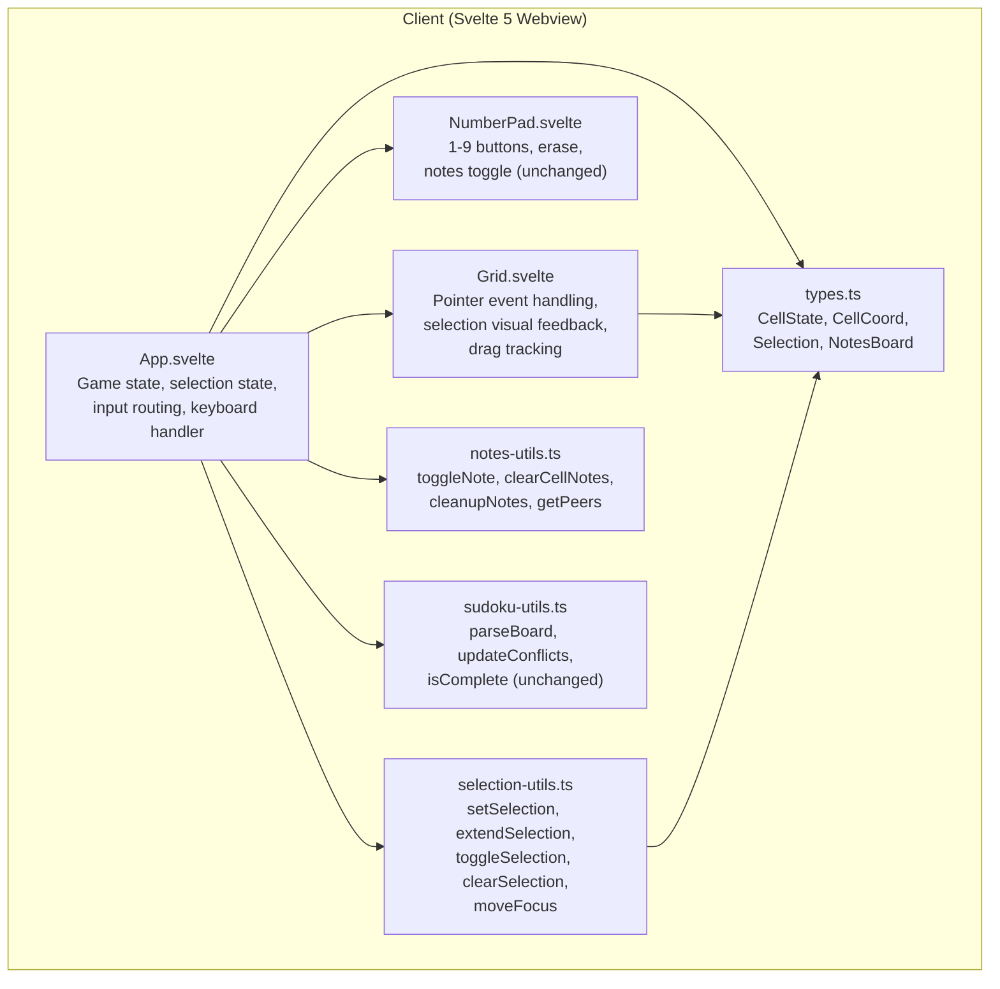
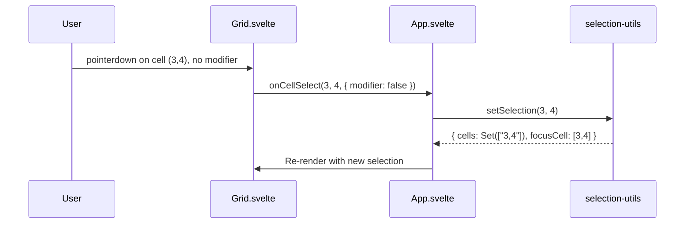
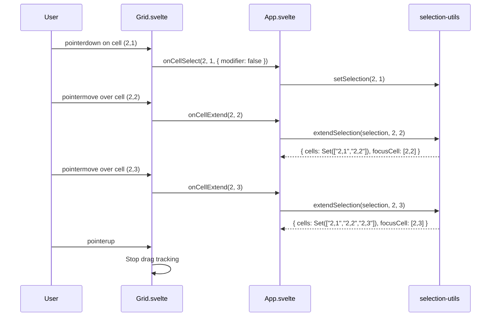
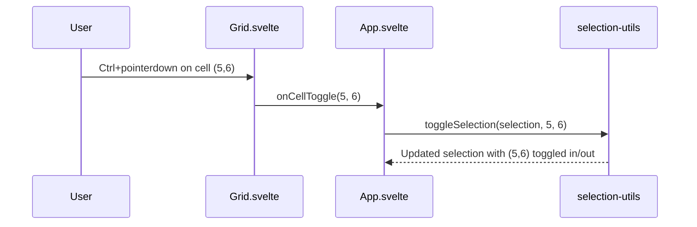
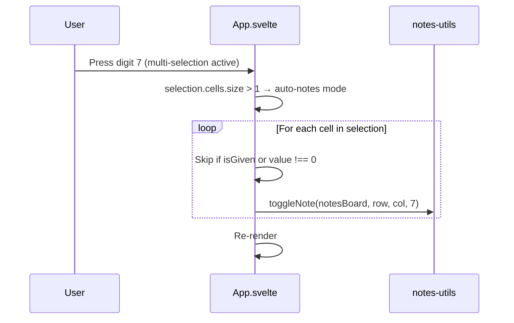
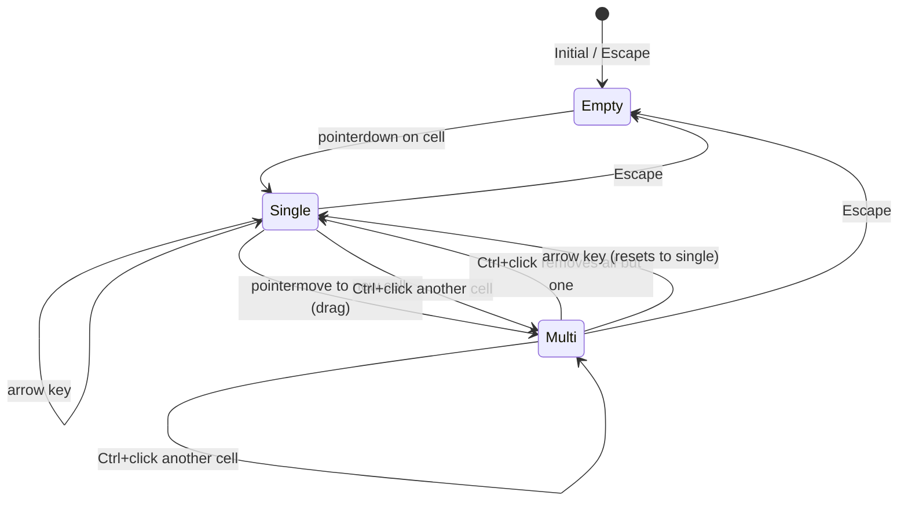

# Design Document: Multi-Cell Selection

## Overview

Multi-cell selection extends the Sudoku grid from single-cell selection (`selectedRow`/`selectedCol`) to a Set-based selection model that supports selecting multiple cells via drag, modifier-click, and touch drag. When multiple cells are selected, digit input automatically enters notes (pencil marks) into all selected empty cells — no manual notes-mode toggle needed. Single-cell selection preserves existing behavior.

The implementation introduces a new `selection-utils.ts` module with pure functions for selection operations, replaces the current `onclick` handler in Grid.svelte with pointer events for drag support, and updates App.svelte's state model and input routing. Touch support uses `pointerdown`/`pointermove`/`pointerup` events with `document.elementFromPoint()` for cross-device compatibility.

All selection logic lives in pure functions that are testable without DOM dependencies. The Svelte components handle event wiring and rendering only.

## Architecture



## Sequence Diagrams

### Single Cell Selection (Pointer Down)



### Drag Selection



### Modifier-Click Toggle



### Auto-Notes on Multi Selection



## Components and Interfaces

### New Module: `selection-utils.ts`

Pure functions for selection state management. No DOM or Svelte dependencies.

```typescript
// src/client/lib/selection-utils.ts

import type { CellCoord } from './notes-utils'

export type Selection = {
    readonly cells: ReadonlySet<string>  // "row,col" encoded strings
    readonly focusCell: CellCoord | null
}

export const EMPTY_SELECTION: Selection = {
    cells: new Set(),
    focusCell: null,
}

/** Encode a cell coordinate as a string key for Set storage. */
export const cellKey = (row: number, col: number): string =>
    `${row},${col}`

/** Decode a cell key back to a coordinate. */
export const parseKey = (key: string): CellCoord => {
    const [r, c] = key.split(',').map(Number)
    return [r!, c!] as const
}

/** Replace selection with a single cell. */
export const setSelection = (row: number, col: number): Selection => ({
    cells: new Set([cellKey(row, col)]),
    focusCell: [row, col],
})

/** Add a cell to the selection (for drag). */
export const extendSelection = (
    selection: Selection,
    row: number,
    col: number,
): Selection => ({
    cells: new Set([...selection.cells, cellKey(row, col)]),
    focusCell: [row, col],
})

/** Toggle a cell in/out of the selection (for Ctrl/Cmd+click). */
export const toggleSelection = (
    selection: Selection,
    row: number,
    col: number,
): Selection => {
    const key = cellKey(row, col)
    const next = new Set(selection.cells)
    if (next.has(key)) {
        next.delete(key)
        // Focus stays on previous focusCell if the toggled cell was not the focus
        return {
            cells: next,
            focusCell: next.size > 0 ? selection.focusCell : null,
        }
    }
    next.add(key)
    return { cells: next, focusCell: [row, col] }
}

/** Clear all selection. */
export const clearSelection = (): Selection => EMPTY_SELECTION

/** Move focus by delta, clamped to grid bounds. Resets to single selection. */
export const moveFocus = (
    focusCell: CellCoord | null,
    dr: number,
    dc: number,
): Selection => {
    if (!focusCell) return EMPTY_SELECTION
    const [row, col] = focusCell
    const newRow = Math.max(0, Math.min(8, row + dr))
    const newCol = Math.max(0, Math.min(8, col + dc))
    return setSelection(newRow, newCol)
}

/** Check if a cell is in the selection. */
export const isSelected = (selection: Selection, row: number, col: number): boolean =>
    selection.cells.has(cellKey(row, col))

/** Check if the selection contains more than one cell. */
export const isMultiSelection = (selection: Selection): boolean =>
    selection.cells.size > 1
```

### Type Changes: `types.ts`

No changes to existing types. The `Selection` type lives in `selection-utils.ts` since it's tightly coupled to the selection functions. `CellCoord` is already exported from `notes-utils.ts`.

### Component: Grid.svelte (modified)

**Changed props**:
```typescript
{
    board: CellState[][]
    notesBoard: NotesBoard
    selection: Selection           // replaces selectedRow/selectedCol
    highlightDigit: number | null
    onCellSelect: (row: number, col: number) => void
    onCellExtend: (row: number, col: number) => void
    onCellToggle: (row: number, col: number) => void
    onDragEnd: () => void
}
```

**Event handling changes**:
- Replace `onclick` with `onpointerdown` for initial selection
- Add `onpointermove` on the grid container for drag tracking
- Add `onpointerup` / `onpointerleave` on the grid container to end drag
- Track `isDragging` local state to distinguish click from drag
- Detect modifier keys (`e.ctrlKey || e.metaKey`) in `onpointerdown` to route to `onCellToggle`
- Use `document.elementFromPoint(e.clientX, e.clientY)` in `onpointermove` to find the cell under the pointer (works for both mouse and touch)
- Call `setPointerCapture` on pointerdown for reliable drag tracking

**Visual changes**:
- Selected cells (in `selection.cells`): `bg-blue-50 dark:bg-blue-900/20` background
- Focus cell (`selection.focusCell`): `ring-2 ring-blue-500 z-10` ring indicator
- These are visually distinct from conflict highlight (`bg-red-50`) and digit highlight (`bg-blue-100`)

### Component: NumberPad.svelte (unchanged)

No changes needed. The NumberPad already delegates all behavior to App.svelte via callbacks.

### Component: App.svelte (modified)

**State changes**:
```typescript
// Remove:
let selectedRow: number | null = $state(null)
let selectedCol: number | null = $state(null)

// Add:
let selection: Selection = $state(EMPTY_SELECTION)
```

**Derived values**:
```typescript
const highlightDigit = $derived(
    selection.focusCell
        ? board[selection.focusCell[0]]?.[selection.focusCell[1]]?.value || null
        : null
)
```

**Input routing changes**:
- `handleNumber(num)`: if `isMultiSelection(selection)` → iterate `selection.cells`, toggle note on each empty non-given cell. If single selection → existing behavior (value or note based on `notesMode`).
- `handleErase()`: if `isMultiSelection(selection)` → clear notes from each empty non-given cell. If single selection → existing behavior.
- `handleKeyDown`: arrow keys call `moveFocus(selection.focusCell, dr, dc)`. Escape calls `clearSelection()`.

**New callbacks for Grid**:
```typescript
const handleCellSelect = (row: number, col: number): void => {
    selection = setSelection(row, col)
}

const handleCellExtend = (row: number, col: number): void => {
    selection = extendSelection(selection, row, col)
}

const handleCellToggle = (row: number, col: number): void => {
    selection = toggleSelection(selection, row, col)
}
```

## Data Models

### Selection State

The selection is modeled as an immutable value object with two fields:

```typescript
type Selection = {
    readonly cells: ReadonlySet<string>  // Set of "row,col" keys
    readonly focusCell: CellCoord | null // [row, col] of last-selected cell
}
```

**Why string keys in a Set?** JavaScript Sets use reference equality for objects, so `Set<CellCoord>` wouldn't deduplicate `[3,4]` and `[3,4]` created separately. String encoding (`"3,4"`) gives value-based equality for free.

**Why immutable?** Each selection operation returns a new `Selection` object. This plays well with Svelte 5's `$state` reactivity — assigning a new object triggers re-renders. It also makes the pure functions trivially testable.

### Cell Identification in Pointer Events

During drag, the grid needs to identify which cell the pointer is over. Each cell `<button>` gets a `data-row` and `data-col` attribute. The `pointermove` handler uses `document.elementFromPoint(e.clientX, e.clientY)` to find the element under the pointer, then reads the data attributes to get the cell coordinates. This approach works identically for mouse and touch pointers.

### State Transitions




## Correctness Properties

*A property is a characteristic or behavior that should hold true across all valid executions of a system — essentially, a formal statement about what the system should do. Properties serve as the bridge between human-readable specifications and machine-verifiable correctness guarantees.*

### Property 1: setSelection produces exclusive single-cell selection

*For any* valid cell position (row, col) where 0 ≤ row ≤ 8 and 0 ≤ col ≤ 8, `setSelection(row, col)` should return a Selection whose `cells` set contains exactly one entry (that cell) and whose `focusCell` equals `[row, col]`.

**Validates: Requirements 1.1, 1.2**

### Property 2: extendSelection adds cell and preserves existing cells

*For any* valid Selection and any valid cell position (row, col), `extendSelection(selection, row, col)` should return a Selection whose `cells` set is a superset of the original `selection.cells` that also contains the new cell, and whose `focusCell` equals `[row, col]`.

**Validates: Requirements 2.1, 2.2**

### Property 3: toggleSelection is self-inverse

*For any* valid Selection and any valid cell position (row, col), calling `toggleSelection` twice with the same cell should restore the Selection's `cells` set to its original state.

**Validates: Requirements 3.1**

### Property 4: focusCell membership invariant

*For any* Selection produced by `setSelection`, `extendSelection`, `toggleSelection`, or `moveFocus`, if `focusCell` is not null then `focusCell` must be a member of `cells`. If `cells` is empty then `focusCell` must be null.

**Validates: Requirements 1.2, 2.2, 3.2, 3.3**

### Property 5: moveFocus produces valid clamped single selection

*For any* valid focusCell `[row, col]` and any direction delta `(dr, dc)` where dr and dc are each in {-1, 0, 1}, `moveFocus(focusCell, dr, dc)` should return a single-cell Selection whose focusCell row is clamped to [0, 8] and col is clamped to [0, 8].

**Validates: Requirements 7.1, 7.2**

### Property 6: Auto-notes targets only empty non-given cells

*For any* board state, any multi-cell Selection (size > 1), and any digit 1–9, applying the auto-notes operation should toggle the note for that digit on every cell in the Selection that is empty (value === 0) and not given, and should leave all other cells' notes unchanged (given cells, cells with placed values, and cells outside the selection).

**Validates: Requirements 5.1, 5.2**

### Property 7: Multi-erase clears notes only on empty non-given cells in selection

*For any* board state, any multi-cell Selection (size > 1), and any notes board, applying the multi-erase operation should clear all notes from every cell in the Selection that is empty and not given, and should leave all other cells' notes unchanged.

**Validates: Requirements 6.1, 6.2**

## Error Handling

### Pointer Events on Non-Cell Elements

**Condition**: `pointermove` fires over a non-cell element (grid border, gap between cells)
**Response**: No-op — `document.elementFromPoint` returns an element without `data-row`/`data-col` attributes, so the handler skips it
**Recovery**: Selection remains unchanged until pointer moves over a valid cell

### Modifier-Click on Empty Selection

**Condition**: Player Ctrl+clicks a cell when no cells are currently selected
**Response**: `toggleSelection` on an empty selection adds the cell — behaves like `setSelection`
**Recovery**: N/A — this is valid behavior

### Arrow Key with No Focus Cell

**Condition**: Player presses an arrow key when `focusCell` is null (no selection)
**Response**: `moveFocus` returns `EMPTY_SELECTION` — no-op
**Recovery**: Player can click a cell to establish focus

### Auto-Notes on Selection Containing Only Given/Filled Cells

**Condition**: Player has a multi-selection where every cell is either given or has a placed value, then inputs a digit
**Response**: No notes are toggled — every cell is skipped. No error shown.
**Recovery**: N/A — silent no-op is the correct behavior

### Erase on Selection Containing Only Given Cells

**Condition**: Player has a multi-selection of only given cells and triggers erase
**Response**: No-op — all cells are skipped
**Recovery**: N/A

### Pointer Capture Loss

**Condition**: Pointer capture is lost mid-drag (e.g., browser focus change, alert dialog)
**Response**: `lostpointercapture` event ends the drag. Current selection is preserved.
**Recovery**: Player can start a new drag or click to reselect

## Testing Strategy

### Unit Testing Approach

Test pure functions in `selection-utils.ts` and the multi-cell logic in App.svelte's handlers with Vitest:

- `setSelection`: returns single-cell selection with correct focusCell
- `extendSelection`: adds cell, preserves existing, updates focusCell
- `toggleSelection`: adds when absent, removes when present, manages focusCell
- `clearSelection`: returns EMPTY_SELECTION
- `moveFocus`: clamps to grid bounds, returns single selection
- `isSelected`: correctly checks membership
- `isMultiSelection`: true when size > 1
- `cellKey` / `parseKey`: round-trip encoding

Edge cases to cover:
- Toggle the only selected cell out (selection becomes empty, focusCell becomes null)
- Extend with a cell already in the selection (idempotent — no duplicate)
- moveFocus at all four grid corners
- moveFocus with null focusCell

### Property-Based Testing Approach

**Property Test Library**: `fast-check` (already installed, v4.5.3)

Each correctness property maps to a single property-based test with minimum 100 iterations. Tests live in `src/client/lib/__tests__/selection-utils.test.ts`.

Each test is tagged with a comment referencing the design property:
- **Feature: multi-cell-selection, Property 1: setSelection produces exclusive single-cell selection**
- **Feature: multi-cell-selection, Property 2: extendSelection adds cell and preserves existing cells**
- **Feature: multi-cell-selection, Property 3: toggleSelection is self-inverse**
- **Feature: multi-cell-selection, Property 4: focusCell membership invariant**
- **Feature: multi-cell-selection, Property 5: moveFocus produces valid clamped single selection**
- **Feature: multi-cell-selection, Property 6: Auto-notes targets only empty non-given cells**
- **Feature: multi-cell-selection, Property 7: Multi-erase clears notes only on empty non-given cells in selection**

Properties 1–5 test `selection-utils.ts` pure functions directly. Properties 6–7 test the multi-cell input routing logic (which will be extracted as pure functions from App.svelte for testability).

### Integration Testing Notes

Component-level behaviors that are verified manually or via Svelte autofixer (not unit tested):
- Pointer event wiring in Grid.svelte (pointerdown/pointermove/pointerup)
- Visual highlight classes applied correctly
- `document.elementFromPoint` cell identification during drag
- Keyboard event routing in App.svelte
