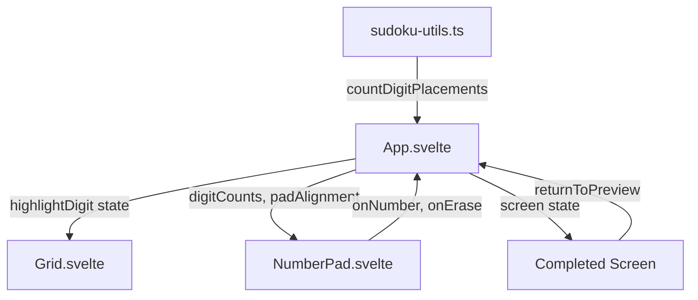
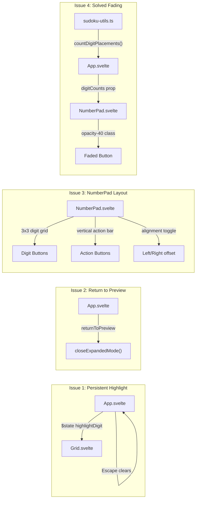
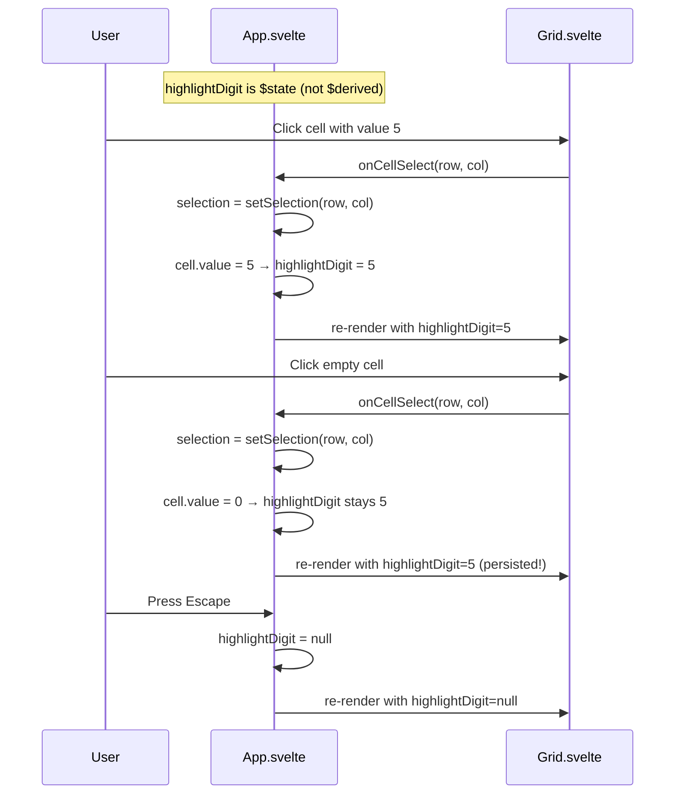
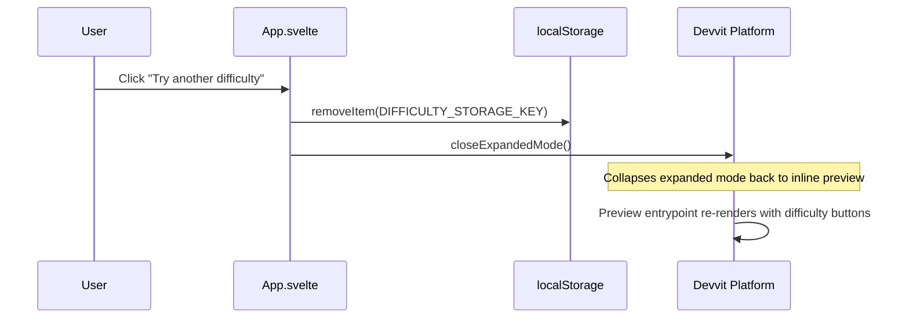
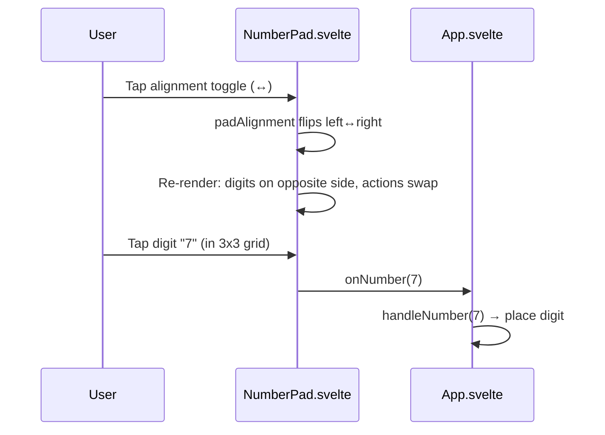
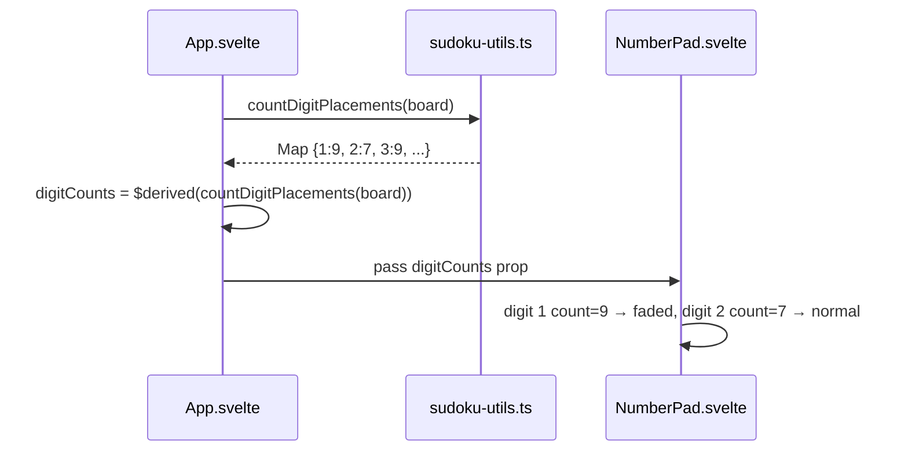

# Design Document: Number Pad UI Overhaul

## Overview

This feature addresses four user-reported issues with the Sudoku game UI: (1) digit highlighting disappears when clicking empty cells, (2) the "Try another difficulty" button does nothing, (3) the number pad layout is awkward for thumb reach on mobile, and (4) there's no visual indicator when all 9 instances of a digit are placed.

The changes span `App.svelte` (persistent highlight state, returnToPreview fix), `NumberPad.svelte` (3×3 grid layout with handedness toggle, solved-digit fading), and `Grid.svelte` (consuming the new highlight behavior). A new pure utility `countDigitPlacements` is extracted to `sudoku-utils.ts` for the solved-digit calculation, keeping components thin.

## Architecture



### Change Impact Map




## Sequence Diagrams

### Issue 1: Persistent Digit Highlighting



### Issue 2: Return to Preview Flow



### Issue 3: NumberPad Interaction



### Issue 4: Solved Digit Detection



## Components and Interfaces

### Component 1: App.svelte (Modified)

**Purpose**: Root game component. Owns highlight state, screen transitions, and digit count derivation.

**Interface Changes**:
```typescript
// BEFORE: highlightDigit was $derived from focused cell value
const highlightDigit = $derived(
    selection.focusCell
        ? board[selection.focusCell[0]]?.[selection.focusCell[1]]?.value || null
        : null,
);

// AFTER: highlightDigit is $state, updated imperatively
let highlightDigit: number | null = $state(null);

// New derived state for solved-digit fading
const digitCounts: ReadonlyMap<number, number> = $derived(
    countDigitPlacements(board)
);

// New state for number pad alignment preference
let padAlignment: 'left' | 'right' = $state('left');
```

**Responsibilities**:
- Update `highlightDigit` when user clicks a cell with a value, enters a digit, or clicks a number pad button
- Clear `highlightDigit` on Escape or when starting a new game
- Keep `highlightDigit` unchanged when clicking empty cells (the key behavioral change)
- Derive `digitCounts` from board state for NumberPad fading
- Navigate to preview URL on `returnToPreview`

### Component 2: NumberPad.svelte (Redesigned)

**Purpose**: Digit entry and action controls with mobile-friendly layout.

**Interface**:
```typescript
// New props
type NumberPadProps = {
    onNumber: (num: number) => void;
    onErase: () => void;
    notesMode: boolean;
    onToggleNotes: () => void;
    onHint: () => void;
    hintsRemaining: number;
    hintsDisabled: boolean;
    onUndo: () => void;
    undoDisabled: boolean;
    // NEW props:
    digitCounts: ReadonlyMap<number, number>;
    padAlignment: 'left' | 'right';
    onToggleAlignment: () => void;
};
```

**Responsibilities**:
- Render digits 1-9 in a 3×3 grid (phone/calculator layout)
- Render action buttons (Undo, Notes, Hint, Erase) in a vertical column
- Position digit grid and action column based on `padAlignment`
- Apply faded styling (`opacity-40`, `cursor-not-allowed`) to digits where `digitCounts.get(d) === 9`
- Provide alignment toggle button

### Component 3: Grid.svelte (Unchanged Interface)

**Purpose**: Renders the 9×9 Sudoku grid with highlighting.

**Interface**: No changes. Already accepts `highlightDigit: number | null` as a prop. The behavioral change is entirely in how App.svelte computes the value.

### Component 4: sudoku-utils.ts (Extended)

**Purpose**: Pure utility functions for board operations.

**New Export**:
```typescript
/** Count how many times each digit 1-9 appears on the board. */
export const countDigitPlacements = (
    board: CellState[][]
): ReadonlyMap<number, number> => {
    const counts = new Map<number, number>();
    for (let d = 1; d <= 9; d++) counts.set(d, 0);
    for (const row of board) {
        for (const cell of row) {
            if (cell.value >= 1 && cell.value <= 9) {
                counts.set(cell.value, (counts.get(cell.value) ?? 0) + 1);
            }
        }
    }
    return counts;
};
```


## Data Models

### HighlightDigit State

```typescript
// Simple nullable number — no new type needed
let highlightDigit: number | null = $state(null);
```

**Validation Rules**:
- Must be `null` or an integer in range `[1, 9]`
- Set to `cell.value` when user clicks a cell with `value > 0`
- Set to `num` when user enters a digit via number pad or keyboard
- Unchanged when user clicks an empty cell (`value === 0`)
- Reset to `null` on Escape, new game, or difficulty change

### PadAlignment State

```typescript
type PadAlignment = 'left' | 'right';
let padAlignment: PadAlignment = $state('left');
```

**Validation Rules**:
- Only two valid values: `'left'` or `'right'`
- `'left'` = digit grid on left, action buttons on right (default, right-thumb friendly)
- `'right'` = digit grid on right, action buttons on left (left-thumb friendly)
- Toggled by user via alignment button
- Persisted in `localStorage` under key `'sudoku-pad-alignment'`

### DigitCounts Derived State

```typescript
const digitCounts: ReadonlyMap<number, number> = $derived(
    countDigitPlacements(board)
);
```

**Validation Rules**:
- Keys are integers 1-9
- Values are integers 0-9
- A digit is "solved" when its count equals 9
- Recomputed on every board change (reactive via `$derived`)

## Key Functions with Formal Specifications

### Function 1: countDigitPlacements()

```typescript
export const countDigitPlacements = (
    board: CellState[][]
): ReadonlyMap<number, number>
```

**Preconditions:**
- `board` is a 9×9 grid of `CellState` objects
- Each `cell.value` is an integer in `[0, 9]`

**Postconditions:**
- Returns a `Map` with exactly 9 entries (keys 1-9)
- For each key `d`, value equals the count of cells where `cell.value === d`
- Sum of all values ≤ 81
- No mutation of input board

**Loop Invariants:**
- After processing row `r`, counts reflect all cells in rows `[0, r]`

### Function 2: updateHighlightOnCellSelect()

```typescript
// Inline logic in handleCellSelect — not a separate function
// Specification of the behavior:
const updateHighlightOnCellSelect = (
    board: CellState[][],
    row: number,
    col: number,
    currentHighlight: number | null
): number | null
```

**Preconditions:**
- `row` and `col` are integers in `[0, 8]`
- `board[row][col]` exists

**Postconditions:**
- If `board[row][col].value > 0`: returns `board[row][col].value`
- If `board[row][col].value === 0`: returns `currentHighlight` (unchanged)
- Never returns a value outside `null | [1, 9]`

**Loop Invariants:** N/A

### Function 3: returnToPreview() (Fixed)

```typescript
const returnToPreview = (): void
```

**Preconditions:**
- Called from completed screen
- `closeExpandedMode` is available from `@devvit/web/client`

**Postconditions:**
- `localStorage` item `DIFFICULTY_STORAGE_KEY` is removed
- Expanded mode is closed, returning user to inline preview
- User sees the difficulty selection / preview screen

**Loop Invariants:** N/A

## Algorithmic Pseudocode

### Persistent Highlight Algorithm

```typescript
// In handleCellSelect:
const handleCellSelect = (row: number, col: number): void => {
    selection = setSelection(row, col);
    const cellValue = board[row]?.[col]?.value;
    // Only update highlight if the clicked cell has a digit
    if (cellValue !== undefined && cellValue > 0) {
        highlightDigit = cellValue;
    }
    // If cell is empty (value 0), highlight stays as-is
};

// In handleNumber:
const handleNumber = (num: number): void => {
    highlightDigit = num;  // Always update on digit entry
    // ... rest of existing logic
};

// In handleKeyDown (Escape):
if (key === 'Escape') {
    selection = clearSelection();
    highlightDigit = null;  // Explicit clear
    return;
}

// In changeDifficulty / fetchPuzzles:
highlightDigit = null;  // Reset on new game
```

### Return to Preview Algorithm

```typescript
import { closeExpandedMode } from '@devvit/web/client';

const returnToPreview = (): void => {
    localStorage.removeItem(DIFFICULTY_STORAGE_KEY);
    // Close the expanded mode webview — returns user to the inline preview
    // The preview entrypoint (default) re-renders with difficulty buttons
    closeExpandedMode();
};
```

The game runs in Devvit's expanded mode (launched via `requestExpandedMode(event, 'game')` from the preview). To return, we call `closeExpandedMode()` from `@devvit/web/client`, which collapses back to the inline preview entrypoint. The preview will re-render its difficulty selection buttons. Since we cleared the localStorage difficulty key, the state is clean for a fresh selection.

**Note**: If `closeExpandedMode` is not available in the installed `@devvit/web` version, the fallback is `window.parent.postMessage({ type: 'devvit-close-expanded' }, '*')` or similar platform message. This should be verified during implementation by checking the `@devvit/web/client` exports.

### NumberPad Layout Algorithm

```typescript
// NumberPad.svelte layout logic
// The component renders a flex row with two children:
// 1. A 3×3 digit grid
// 2. A vertical action column (Undo, Notes, Hint, Erase, Align toggle)
// The order flips based on padAlignment

// Digit grid: standard phone layout
// [1] [2] [3]
// [4] [5] [6]
// [7] [8] [9]

// Action column (vertical):
// [Undo]
// [Notes]
// [Hint]
// [Erase]
// [⇄] (alignment toggle)

// padAlignment='left':  [Digits 3x3] [Actions]
// padAlignment='right': [Actions] [Digits 3x3]
```

### Solved Digit Fading Algorithm

```typescript
// In NumberPad.svelte, for each digit button:
const isSolved = (digit: number): boolean =>
    (digitCounts.get(digit) ?? 0) >= 9;

// Applied as conditional class:
// class={isSolved(num) ? 'opacity-40 cursor-not-allowed' : ''}
// Note: button is NOT disabled — user can still click it
// (they might want to overwrite a wrong answer)
```

## Example Usage

### Persistent Highlighting

```typescript
// User clicks cell [2,3] which contains value 5
handleCellSelect(2, 3);
// → highlightDigit = 5, all 5s on board highlighted

// User clicks empty cell [4,1]
handleCellSelect(4, 1);
// → highlightDigit stays 5, all 5s still highlighted

// User types "7" on keyboard
handleNumber(7);
// → highlightDigit = 7, all 7s now highlighted

// User presses Escape
// → highlightDigit = null, no highlighting
```

### NumberPad Layout Toggle

```typescript
// Default state: padAlignment = 'left'
// Layout: [1 2 3] [Undo  ]
//         [4 5 6] [Notes ]
//         [7 8 9] [Hint  ]
//                 [Erase ]
//                 [  ⇄   ]

// User taps ⇄ toggle
// padAlignment = 'right'
// Layout: [Undo  ] [1 2 3]
//         [Notes ] [4 5 6]
//         [Hint  ] [7 8 9]
//         [Erase ]
//         [  ⇄   ]
```

### Solved Digit Fading

```typescript
// Board has all 9 instances of digit 3 placed
// digitCounts = Map { 1→7, 2→8, 3→9, 4→6, ... }
// NumberPad renders digit 3 button with opacity-40
// All other digits render normally
```


## Correctness Properties

*A property is a characteristic or behavior that should hold true across all valid executions of a system — essentially, a formal statement about what the system should do. Properties serve as the bridge between human-readable specifications and machine-verifiable correctness guarantees.*

### Property 1: Cell select highlight persistence

*For any* board and any current highlight state, clicking a cell with a non-zero value should set the highlight to that cell's value, and clicking a cell with value 0 should leave the highlight unchanged.

**Validates: Requirements 1.1, 1.2**

### Property 2: Digit entry updates highlight

*For any* digit 1-9 entered via the NumberPad or keyboard, the Highlight_Digit should equal the entered digit immediately after entry.

**Validates: Requirement 1.3**

### Property 3: Alignment toggle involution

*For any* Pad_Alignment value, toggling the alignment twice should return to the original value (toggle is its own inverse).

**Validates: Requirement 3.5**

### Property 4: Solved digit fading correctness

*For any* digit 1-9 and any board state, the digit button should have faded appearance if and only if the digit's count on the board equals 9.

**Validates: Requirements 4.2, 4.3**

### Property 5: countDigitPlacements accuracy

*For any* valid 9×9 CellState board, `countDigitPlacements` should return a Map with exactly 9 keys (1-9) where each value equals the number of cells on the board containing that digit (i.e., matches `board.flat().filter(c => c.value === d).length`).

**Validates: Requirements 5.1, 5.2**

### Property 6: countDigitPlacements no mutation

*For any* valid 9×9 CellState board, calling `countDigitPlacements` should not modify any cell in the input board.

**Validates: Requirement 5.3**

## Error Handling

### Error Scenario 1: closeExpandedMode Unavailable

**Condition**: `closeExpandedMode` is not exported by the installed `@devvit/web/client` version
**Response**: During implementation, check the available exports. If not available, use `window.parent.postMessage` as a fallback, or reset the game state in-place (set `screen = 'playing'` and let user pick a new difficulty from the tab bar).
**Recovery**: The localStorage key is still cleared regardless. User can always refresh to get back to preview.

### Error Scenario 2: Board State Inconsistency for digitCounts

**Condition**: Board has more than 9 instances of a digit (shouldn't happen in valid Sudoku, but possible with bugs)
**Response**: `countDigitPlacements` still returns the actual count. A digit with count > 9 will still show as faded (≥ 9 check).
**Recovery**: Conflict detection (`updateConflicts`) already flags these cells with `hasConflict: true`.

### Error Scenario 3: localStorage Unavailable for Pad Alignment

**Condition**: `localStorage` is blocked (private browsing, iframe restrictions in Devvit)
**Response**: Wrap `localStorage.getItem`/`setItem` in try-catch. Default to `'left'` if read fails. Silently skip persistence if write fails.
**Recovery**: Alignment preference resets to default on next session. No user-facing error.

## Testing Strategy

### Unit Testing Approach

**countDigitPlacements** (`sudoku-utils.ts`):
- Empty board → all counts are 0
- Full valid board → all counts are 9
- Partial board → counts match manual count
- Single digit placed → that digit count is 1, others are 0

**Highlight update logic** (if extracted to a pure function):
- Click cell with value → returns that value
- Click empty cell → returns previous highlight
- Escape → returns null

### Property-Based Testing Approach

**Property Test Library**: fast-check (already used in the project)

**countDigitPlacements properties**:
- For any random 9×9 board with values 0-9: sum of counts ≤ 81
- For any board: each count is in [0, 81]
- For any board: count(d) === manual flat-filter count
- Idempotent: calling twice returns same result

**Highlight persistence properties**:
- For any sequence of cell clicks: highlight is always null or in [1,9]
- For any sequence ending with Escape: highlight is null
- For any click on non-empty cell: highlight equals that cell's value

### Integration Testing Approach

Integration testing for Svelte components is skipped per project rules (`.svelte` files use autofixer instead). The behavioral correctness is verified through:
1. Unit tests on extracted pure functions
2. Property tests on `countDigitPlacements`
3. Manual testing of the UI interactions
4. `svelte-autofixer` on all modified `.svelte` files

## Performance Considerations

- `countDigitPlacements` iterates 81 cells on every board change. This is O(81) = O(1) constant time and negligible.
- The `$derived` for `digitCounts` only recomputes when `board` reference changes, which is already the existing pattern.
- Highlight state change from `$derived` to `$state` removes one reactive dependency chain, marginally improving performance.
- The NumberPad layout change is purely CSS (flexbox order), no runtime cost.

## Security Considerations

No security implications. All changes are client-side UI state management. No new API calls, no new data persistence beyond a localStorage key for pad alignment preference.

## Dependencies

No new external dependencies. All changes use existing:
- Svelte 5 runes (`$state`, `$derived`, `$props`)
- Tailwind CSS 4 utility classes
- Existing `sudoku-utils.ts`, `selection-utils.ts`, `constants.ts`
- `localStorage` API (already used for difficulty)
