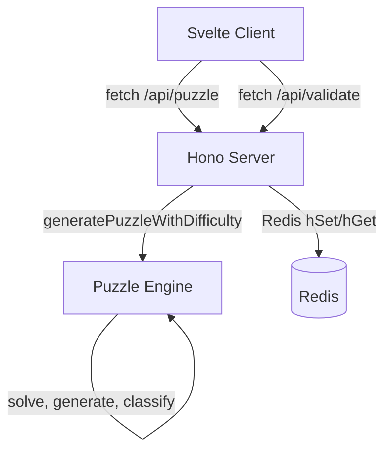
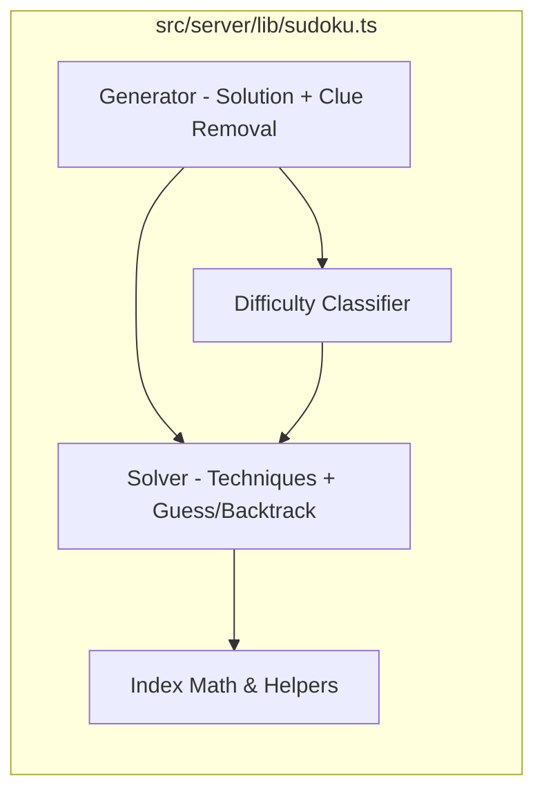

# Design Document: QQWing Puzzle Engine

## Overview

This design replaces the current brute-force Sudoku engine (`src/server/lib/sudoku.ts`) with a QQWing-style candidate-elimination solver. The new engine introduces:

- A flat-array data model (`solution[81]`, `possibilities[729]`) with round-based rollback
- Six technique families applied in fixed priority order for deterministic solving
- Guess-and-backtrack fallback for puzzles beyond the implemented technique set
- Technique-based difficulty classification across four tiers: simple, easy, intermediate, expert
- A structured solve history log (`LogItem[]`) for difficulty grading and future hint support
- Symmetric clue removal (5 modes) for aesthetically pleasing puzzles
- Difficulty-targeted generation with retry loop

The solver is a drop-in replacement — Redis schema shape, API route structure, and Svelte component architecture remain unchanged. Only the `Difficulty` type widens from 3 to 4 levels, requiring minor updates to routes, post creation, and the client difficulty picker.

### Key Design Decisions

1. **Single-file solver**: All solver logic lives in `src/server/lib/sudoku.ts` (full rewrite). No new files. This keeps the module boundary clean and avoids import graph changes.
2. **Flat arrays over nested grids**: `solution[81]` and `possibilities[729]` avoid nested array overhead and enable O(1) index math. The round number stored in `possibilities` enables rollback without copying state.
3. **Fixed technique order**: Techniques are applied in a deterministic priority order matching QQWing's approach. This ensures difficulty classification is reproducible — the same puzzle always gets the same grade.
4. **fast-check for property testing**: Already installed as a dev dependency. Property-based tests validate solver invariants across randomized inputs.

## Architecture

### System Context



### Module Architecture

The puzzle engine is a single module (`src/server/lib/sudoku.ts`) with four logical subsystems:



### Data Flow

**Post Creation (4 puzzles generated):**
```
createPost()
  → for each difficulty in [simple, easy, intermediate, expert]:
      → generatePuzzleWithDifficulty(target, symmetry=ROTATE180)
        → loop:
            → generateSolution() — solve empty grid with randomized ordering
            → removeCluesToCreatePuzzle(solution, symmetry)
              → for each cell (shuffled, symmetric groups):
                  → remove clue(s)
                  → countSolutions(limit=2)
                  → if >1: restore clue(s)
            → solve(puzzle, recordHistory=true)
            → getDifficulty(solveLog)
            → if matches target: return puzzle
      → serialize to 81-char string
      → redis.hSet(puzzle + solution)
```

**Puzzle Fetch:**
```
GET /api/puzzle
  → redis.hGetAll(puzzle:{postId})
  → return { simple, easy, intermediate, expert }
```

**Validation:**
```
POST /api/validate { board, difficulty }
  → validate difficulty ∈ [simple, easy, intermediate, expert]
  → redis.hGet(puzzle:{postId}, {difficulty}:solution)
  → return { valid: board === solution }
```

## Components and Interfaces

### Type Definitions

```typescript
/** Technique types recorded in the solve log */
type LogType =
  | 'given'
  | 'single'
  | 'hiddenSingleRow' | 'hiddenSingleColumn' | 'hiddenSingleSection'
  | 'nakedPairRow' | 'nakedPairColumn' | 'nakedPairSection'
  | 'pointingPairTripleRow' | 'pointingPairTripleColumn'
  | 'rowBox' | 'columnBox'
  | 'hiddenPairRow' | 'hiddenPairColumn' | 'hiddenPairSection'
  | 'guess' | 'rollback'

/** A single entry in the solve history log */
type LogItem = {
  round: number
  type: LogType
  value: number     // digit 1-9, or 0 if not applicable
  position: number  // cell index 0-80, or -1 if not applicable
}

/** Symmetry modes for clue removal */
type Symmetry = 'none' | 'rotate180' | 'rotate90' | 'mirror' | 'flip'

/** Four-tier difficulty classification */
type Difficulty = 'simple' | 'easy' | 'intermediate' | 'expert'

/** Solve statistics derived from the log */
type SolveStats = Record<LogType, number>
```

### Solver State (Internal)

The solver operates on mutable internal state — not exposed as a public type, but critical to the design:

```typescript
// Internal solver state (conceptual — implemented as module-level or closure variables)
solution: number[]          // length 81, value 0 = unsolved
solutionRound: number[]     // length 81, round when each cell was placed
possibilities: number[]     // length 729, 0 = still possible, >0 = round eliminated
solveLog: LogItem[]         // ordered list of log entries
round: number               // current round (even = logic, odd = guess)
recordHistory: boolean       // whether to append to solveLog
```

### Index Math Functions

```typescript
/** Convert (valueIndex, cell) to possibilities array index */
const possibilityIndex = (valueIndex: number, cell: number): number =>
  valueIndex + 9 * cell

/** Cell index to row (0-8) */
const cellToRow = (cell: number): number => Math.floor(cell / 9)

/** Cell index to column (0-8) */
const cellToCol = (cell: number): number => cell % 9

/** Cell index to box (0-8) */
const cellToBox = (cell: number): number => {
  const row = cellToRow(cell)
  const col = cellToCol(cell)
  return Math.floor(row / 3) * 3 + Math.floor(col / 3)
}

/** Row and column to cell index */
const rowColToCell = (row: number, col: number): number => row * 9 + col
```

### Core Operations

```typescript
/** Place a value at a cell, eliminating candidates from peers and self.
 *  Tags all eliminations with the given round number. */
const mark = (position: number, round: number, value: number): void

/** Undo all placements and eliminations from a specific round.
 *  Restores solution[], solutionRound[], possibilities[], and solveLog. */
const rollbackRound = (round: number): void

/** Count remaining candidates for a cell */
const countPossibilities = (cell: number): number

/** Check if a specific candidate is still possible for a cell */
const isPossible = (cell: number, valueIndex: number): boolean

/** Check if the puzzle is fully solved (all 81 cells have values) */
const isSolved = (): boolean

/** Check if the puzzle is impossible (any unsolved cell has 0 candidates) */
const isImpossible = (): boolean
```

### Technique Functions

Each technique function scans for applicable patterns and applies the first one found. Returns `true` if progress was made, `false` otherwise.

```typescript
/** Naked Single: cell with exactly 1 candidate → place it */
const onlyPossibilityForCell = (round: number): boolean

/** Hidden Single in box: candidate in only 1 cell within a box → place it */
const onlyValueInSection = (round: number): boolean

/** Hidden Single in row: candidate in only 1 cell within a row → place it */
const onlyValueInRow = (round: number): boolean

/** Hidden Single in column: candidate in only 1 cell within a column → place it */
const onlyValueInColumn = (round: number): boolean

/** Naked Pairs in row/col/box: two cells sharing exactly 2 candidates → eliminate from peers */
const handleNakedPairs = (round: number): boolean

/** Pointing Pairs/Triples — row: candidate confined to one row in a box → eliminate from rest of row */
const pointingRowReduction = (round: number): boolean

/** Pointing Pairs/Triples — column: candidate confined to one col in a box → eliminate from rest of col */
const pointingColumnReduction = (round: number): boolean

/** Box/Line Reduction — row: candidate confined to one box in a row → eliminate from rest of box */
const rowBoxReduction = (round: number): boolean

/** Box/Line Reduction — column: candidate confined to one box in a col → eliminate from rest of box */
const colBoxReduction = (round: number): boolean

/** Hidden Pairs in row/col/box: two candidates in only the same two cells → eliminate other candidates */
const hiddenPairInRow = (round: number): boolean
const hiddenPairInColumn = (round: number): boolean
const hiddenPairInSection = (round: number): boolean
```

### Solve Loop

```typescript
/** Apply one technique step. Returns true if progress was made. */
const singleSolveMove = (round: number): boolean
// Applies techniques in fixed order:
// 1. onlyPossibilityForCell
// 2. onlyValueInSection, onlyValueInRow, onlyValueInColumn
// 3. handleNakedPairs (row, col, box)
// 4. pointingRowReduction, pointingColumnReduction
// 5. rowBoxReduction, colBoxReduction
// 6. hiddenPairInRow, hiddenPairInColumn, hiddenPairInSection
// Returns after first technique that makes progress.

/** Main solve loop. Applies logic, falls back to guess-and-backtrack. */
const solve = (round: number): boolean
// 1. Loop singleSolveMove until no progress
// 2. If solved → return true
// 3. If impossible → return false
// 4. Pick cell with fewest candidates, try each (randomized order)
// 5. Mark guess (odd round), recurse with round+2
// 6. On contradiction: rollback round+2 and round+1, try next candidate
// 7. All candidates exhausted → return false
```

### Generation Functions

```typescript
/** Generate a random complete 9×9 solution by solving an empty grid */
const generateSolution = (): number[]
// Returns flat 81-element array. Shuffles cell visit order and digit try order.

/** Remove clues from a solution while preserving unique solvability */
const removeCluesToCreatePuzzle = (
  solution: number[],
  symmetry: Symmetry
): number[]
// Iterates cells in shuffled order, removes in symmetric groups,
// restores if countSolutions > 1.

/** Count solutions up to a limit (default 2) */
const countSolutions = (puzzle: number[], limit?: number): number

/** Classify difficulty from a solve log */
const getDifficulty = (log: LogItem[]): Difficulty

/** Compute solve statistics from a log */
const getSolveStats = (log: LogItem[]): SolveStats

/** Generate a puzzle targeting a specific difficulty */
const generatePuzzleWithDifficulty = (
  target: Difficulty,
  symmetry?: Symmetry,
  maxAttempts?: number
): { puzzle: number[]; solution: number[]; difficulty: Difficulty }
```

### Serialization (Public API — backward compatible)

```typescript
/** Serialize a flat 81-element array to an 81-character string */
const boardToString = (board: number[]): string

/** Parse an 81-character string into a flat 81-element array */
const stringToBoard = (str: string): number[]
```

Note: The old `Board` (2D array) type is removed. The new serialization works directly with flat arrays. The 81-character string format is unchanged — full backward compatibility with Redis data.

### Symmetry Helpers

```typescript
/** Get symmetric partner cell indices for a given cell and symmetry mode */
const getSymmetricPartners = (cell: number, symmetry: Symmetry): number[]
// NONE: [cell]
// ROTATE180: [cell, 80 - cell]
// ROTATE90: [cell, rotate90(cell), rotate180(cell), rotate270(cell)]
// MIRROR: [cell, mirrorHorizontal(cell)]
// FLIP: [cell, mirrorVertical(cell)]
```

### Integration Points

**`src/client/lib/types.ts`** — Update `Difficulty` type:
```typescript
// Before: 'easy' | 'medium' | 'hard'
// After:  'simple' | 'easy' | 'intermediate' | 'expert'
export type Difficulty = 'simple' | 'easy' | 'intermediate' | 'expert'
```

**`src/server/post.ts`** — Generate 4 puzzles:
```typescript
const createPost = async (): Promise<{ id: string }> => {
  // ... existing post creation ...
  for (const difficulty of ['simple', 'easy', 'intermediate', 'expert'] as const) {
    const result = generatePuzzleWithDifficulty(difficulty, 'rotate180')
    fields[`${difficulty}:solution`] = boardToString(result.solution)
    fields[`${difficulty}:puzzle`] = boardToString(result.puzzle)
  }
  // ...
}
```

**`src/server/index.ts`** — Update validation:
```typescript
const VALID_DIFFICULTIES = ['simple', 'easy', 'intermediate', 'expert'] as const

// GET /api/puzzle — return 4 difficulties
// POST /api/validate — accept 4 difficulties
```

**`src/client/App.svelte`** — 4-button picker:
```svelte
{#each ["simple", "easy", "intermediate", "expert"] as d (d)}
  <button onclick={() => selectDifficulty(d as Difficulty)}>{d}</button>
{/each}
```

## Data Models

### Solver Internal State

| Array | Size | Index Formula | Value Meaning |
|-------|------|---------------|---------------|
| `solution` | 81 | `cell` (0-80) | Placed digit 1-9, or 0 = unsolved |
| `solutionRound` | 81 | `cell` (0-80) | Round number when cell was placed |
| `possibilities` | 729 | `valueIndex + 9 * cell` | 0 = candidate still possible, >0 = round when eliminated |

### Index Math Reference

| Conversion | Formula |
|-----------|---------|
| Cell → Row | `Math.floor(cell / 9)` |
| Cell → Column | `cell % 9` |
| Cell → Box | `Math.floor(row / 3) * 3 + Math.floor(col / 3)` |
| (Row, Col) → Cell | `row * 9 + col` |
| (ValueIndex, Cell) → Possibility | `valueIndex + 9 * cell` |
| Possibility → Cell | `Math.floor(possIndex / 9)` |
| Possibility → ValueIndex | `possIndex % 9` |
| ValueIndex → Digit | `valueIndex + 1` |

### Peer Relationships

Each cell has exactly 20 peers:
- 8 cells in the same row (excluding self)
- 8 cells in the same column (excluding self)
- 4 additional cells in the same 3×3 box (not already counted in row/col)

Total: 8 + 8 + 4 = 20

### LogItem Schema

```typescript
{
  round: number      // even = logical deduction, odd = guess
  type: LogType      // technique that produced this entry
  value: number      // digit 1-9 placed, or 0 for non-placement entries
  position: number   // cell 0-80, or -1 for non-cell entries (e.g., rollback)
}
```

### Redis Schema (Unchanged Shape)

```
puzzle:{postId} → Hash
  createdAt         → timestamp string
  simple:puzzle     → 81-char string
  simple:solution   → 81-char string
  easy:puzzle       → 81-char string
  easy:solution     → 81-char string
  intermediate:puzzle   → 81-char string
  intermediate:solution → 81-char string
  expert:puzzle     → 81-char string
  expert:solution   → 81-char string
```

### Difficulty Classification Rules

| Difficulty | Condition |
|-----------|-----------|
| `simple` | Solve log contains only `single` (naked single) entries |
| `easy` | Solve log contains `hiddenSingle*` entries but nothing more advanced |
| `intermediate` | Solve log contains `nakedPair*`, `pointingPairTriple*`, `rowBox`, `columnBox`, or `hiddenPair*` entries but no `guess` entries |
| `expert` | Solve log contains `guess` entries |

### Symmetry Transform Formulas

| Symmetry | Partner Formula |
|----------|----------------|
| NONE | `[cell]` |
| ROTATE180 | `[cell, 80 - cell]` |
| ROTATE90 | `[cell, 9*(8 - col) + row, 80 - cell, 9*col + (8 - row)]` where `row = floor(cell/9)`, `col = cell%9` |
| MIRROR | `[cell, 9*row + (8 - col)]` |
| FLIP | `[cell, 9*(8 - row) + col]` |


## Correctness Properties

*A property is a characteristic or behavior that should hold true across all valid executions of a system — essentially, a formal statement about what the system should do. Properties serve as the bridge between human-readable specifications and machine-verifiable correctness guarantees.*

### Property 1: Index math round-trip

*For any* cell index (0–80) and value index (0–8), computing `possibilityIndex(valueIndex, cell)` and then recovering the cell via `Math.floor(idx / 9)` and the value index via `idx % 9` shall return the original cell and value index. Additionally, for any cell, `rowColToCell(cellToRow(cell), cellToCol(cell))` shall return the original cell, and `cellToBox(cell)` shall be in range 0–8.

**Validates: Requirements 1.1, 1.2, 1.4**

### Property 2: Peer count and membership

*For any* cell index (0–80), the computed peer set shall contain exactly 20 distinct cell indices, each of which shares at least one house (row, column, or box) with the original cell, and shall not include the cell itself.

**Validates: Requirements 1.5**

### Property 3: Mark sets solution and eliminates candidates

*For any* empty solver state, valid cell position, valid value (1–9), and round number, after calling `mark(position, round, value)`: (a) `solution[position]` equals the value, (b) for all 20 peers, the candidate for that value is eliminated and tagged with the round number, (c) for the marked cell, all candidates other than the placed value are eliminated and tagged with the round number.

**Validates: Requirements 1.3, 2.1, 2.2**

### Property 4: Mark-then-rollback round-trip

*For any* valid mark operation (position, round, value) applied to a fresh solver state, calling `rollbackRound(round)` after `mark` shall restore the `solution` array, `possibilities` array, and solve log to their state before the mark was applied.

**Validates: Requirements 2.3, 2.4, 2.5, 17.4**

### Property 5: Naked single detection and logging

*For any* solver state where a cell has exactly one remaining candidate, calling the naked single technique shall place that candidate in the cell and append a log entry with type `single`, the correct value, and the correct cell position.

**Validates: Requirements 3.1, 3.2**

### Property 6: Hidden single detection and logging

*For any* solver state where a candidate value appears in exactly one cell within a house (box, row, or column), calling the hidden single technique for that house type shall place the value in that cell and append a log entry with the appropriate type (`hiddenSingleSection`, `hiddenSingleRow`, or `hiddenSingleColumn`).

**Validates: Requirements 4.1, 4.2, 4.3, 4.4**

### Property 7: Naked pair elimination and logging

*For any* solver state where two cells in the same house share exactly the same two candidates and no others, calling the naked pair technique shall eliminate those two candidates from all other cells in that house and append a log entry with the appropriate type (`nakedPairRow`, `nakedPairColumn`, or `nakedPairSection`).

**Validates: Requirements 5.1, 5.2, 5.3, 5.4**

### Property 8: Pointing pair/triple elimination and logging

*For any* solver state where a candidate value within a box appears only in cells sharing the same row (or column), calling the pointing pair/triple technique shall eliminate that candidate from all other cells in that row (or column) outside the box, and append a log entry with type `pointingPairTripleRow` (or `pointingPairTripleColumn`).

**Validates: Requirements 6.1, 6.2, 6.3**

### Property 9: Box/line reduction elimination and logging

*For any* solver state where a candidate value within a row (or column) appears only in cells sharing the same box, calling the box/line reduction technique shall eliminate that candidate from all other cells in that box outside the row (or column), and append a log entry with type `rowBox` (or `columnBox`).

**Validates: Requirements 7.1, 7.2, 7.3**

### Property 10: Hidden pair elimination and logging

*For any* solver state where two candidate values appear in exactly the same two cells within a house and in no other cells in that house, calling the hidden pair technique shall eliminate all other candidates from those two cells and append a log entry with the appropriate type (`hiddenPairRow`, `hiddenPairColumn`, or `hiddenPairSection`).

**Validates: Requirements 8.1, 8.2, 8.3, 8.4**

### Property 11: Solver finds the unique solution

*For any* valid Sudoku puzzle with a unique solution, the solver shall return `true` and produce a solution where every row, column, and 3×3 box contains digits 1–9 exactly once, matching the known solution.

**Validates: Requirements 11.2, 11.5**

### Property 12: Round parity — guesses odd, deductions even

*For any* solve log produced by the solver, all log entries with type `guess` shall have odd round numbers, and all log entries with types other than `guess` and `rollback` shall have even round numbers.

**Validates: Requirements 10.6**

### Property 13: Generated solutions are valid Sudoku

*For any* solution produced by `generateSolution()`, every row, column, and 3×3 box shall contain digits 1–9 exactly once, and the solution array shall have exactly 81 entries all in range 1–9.

**Validates: Requirements 12.1, 12.3**

### Property 14: Generated puzzles have exactly one solution

*For any* puzzle produced by the generator (with any symmetry mode), `countSolutions(puzzle, 2)` shall return exactly 1.

**Validates: Requirements 13.4**

### Property 15: Symmetric clue removal preserves symmetry

*For any* puzzle generated with a symmetry mode S ∈ {rotate180, rotate90, mirror, flip}, if a cell is empty (value 0) then all of its symmetric partners under S are also empty.

**Validates: Requirements 13.5, 14.2, 14.3, 14.4, 14.5**

### Property 16: Difficulty classification from solve log

*For any* solve log, `getDifficulty(log)` shall return: `expert` if the log contains any `guess` entry; `intermediate` if it contains any `nakedPair*`, `pointingPairTriple*`, `rowBox`, `columnBox`, or `hiddenPair*` entry but no `guess`; `easy` if it contains any `hiddenSingle*` entry but nothing more advanced; `simple` if it contains only `single` and `given` entries.

**Validates: Requirements 15.1, 15.2, 15.3, 15.4**

### Property 17: Serialization round-trip

*For any* flat array of 81 digits (each 0–9), `stringToBoard(boardToString(arr))` shall produce an array equal to the original.

**Validates: Requirements 22.1, 22.2, 22.3**

### Property 18: Solve log completeness and structure

*For any* puzzle solved with history recording enabled, the solve log shall contain at least one entry for every cell that was solved (not given), and each log entry shall have a valid round number (≥ 0), a valid type from the LogType union, a value in range 0–9, and a position in range -1 to 80. Furthermore, `getSolveStats(log)` shall return counts matching the actual frequency of each type in the log.

**Validates: Requirements 17.1, 17.2, 17.5**

## Error Handling

### Solver Errors

| Scenario | Handling |
|----------|----------|
| Impossible puzzle (cell with 0 candidates) | `solve()` returns `false`. No exception thrown. Backtrack path rolls back and tries next candidate. |
| Empty input (all zeros, no solution possible) | Not applicable — an empty grid always has solutions. `generateSolution()` solves an empty grid. |
| Invalid puzzle string (not 81 chars, non-digit) | `stringToBoard()` should validate input length and character range. Throw descriptive error on invalid input. |
| Mark on already-solved cell | Guard: if `solution[position] !== 0`, skip or throw. Implementation should check precondition. |

### Generation Errors

| Scenario | Handling |
|----------|----------|
| Difficulty target not achieved within max attempts | Return the closest match found during the retry loop. Never throw — a puzzle of a different difficulty is still valid. |
| `countSolutions` returns 0 during clue removal | Restore the removed clue(s) and continue to the next cell. This is normal operation. |
| Generation exceeds time budget | The `maxAttempts` parameter caps retries. Default should be tuned to stay well within Devvit's 30s limit (e.g., 100 attempts). |

### API Route Errors

| Scenario | Response |
|----------|----------|
| Invalid difficulty in `/api/validate` | 400: `{ status: 'error', message: 'Invalid difficulty' }` |
| Missing `board` or `difficulty` in request body | 400: `{ status: 'error', message: 'Missing board or difficulty' }` |
| Invalid board format (not 81 digits) | 400: `{ status: 'error', message: 'Invalid board' }` |
| Missing puzzle data in Redis | 400: `{ status: 'error', message: 'Puzzle not found' }` |
| Post creation failure | 400: `{ status: 'error', message: error.message }` |

### Client Error Handling

- Fetch failures: Display error message with retry button (existing pattern in `App.svelte`)
- Invalid difficulty from server: Should not occur if client and server share the same `Difficulty` type

## Testing Strategy

### Dual Testing Approach

This feature uses both unit tests and property-based tests:

- **Unit tests** (Vitest): Specific examples, edge cases, integration points, technique ordering verification
- **Property-based tests** (Vitest + fast-check): Universal properties across randomized inputs, minimum 100 iterations per property

Both are complementary — unit tests catch concrete bugs with known puzzles, property tests verify general correctness across the input space.

### Property-Based Testing Configuration

- **Library**: `fast-check` (already installed as devDependency)
- **Runner**: Vitest
- **Iterations**: Minimum 100 per property test (fast-check default is 100, which is sufficient)
- **Tag format**: Each property test must include a comment referencing the design property:
  ```typescript
  // Feature: qqwing-puzzle-engine, Property 1: Index math round-trip
  ```
- **Each correctness property is implemented by a single property-based test**

### Test File Structure

All tests live in `src/server/lib/__tests__/sudoku.test.ts` (full rewrite alongside the implementation).

### What to Test

| Category | Test Type | Properties/Examples |
|----------|-----------|-------------------|
| Index math | Property (P1) | Round-trip for all cell/value indices |
| Peer computation | Property (P2) | 20 peers per cell, correct house membership |
| Mark operation | Property (P3) | Solution set, peer elimination, round tagging |
| Mark/rollback round-trip | Property (P4) | State restoration after rollback |
| Naked single | Property (P5) + unit examples | Detection, placement, logging |
| Hidden single | Property (P6) + unit examples | Detection in box/row/col, logging, ordering (4.5) |
| Naked pair | Property (P7) + unit examples | Elimination in row/col/box, logging, ordering (5.5) |
| Pointing pair/triple | Property (P8) + unit examples | Elimination, logging, ordering (6.4) |
| Box/line reduction | Property (P9) + unit examples | Elimination, logging, ordering (7.4) |
| Hidden pair | Property (P10) + unit examples | Elimination in row/col/box, logging, ordering (8.5) |
| Full solver | Property (P11) + unit examples | Solves known puzzles, handles impossible boards (11.3) |
| Round parity | Property (P12) | Odd/even round numbering in logs |
| Solution generation | Property (P13) | Valid complete Sudoku |
| Puzzle uniqueness | Property (P14) | Exactly one solution |
| Symmetry | Property (P15) + unit examples | Symmetric partner co-removal |
| Difficulty classification | Property (P16) + unit examples | Correct tier from log contents |
| Serialization | Property (P17) | Round-trip for flat arrays |
| Log completeness | Property (P18) | Entry per solved cell, valid fields, stats match |
| Technique ordering | Unit examples | 4.5, 5.5, 6.4, 7.4, 8.5, 9.2, 9.3 |
| Guess/backtrack | Unit examples | 10.3, 10.4, 10.5 |
| API routes | Unit examples (with @devvit/test) | 19.1, 19.2, 19.3, 19.4 |
| Post creation | Unit example (with @devvit/test) | 20.1, 20.2 |
| Non-determinism | Unit example | 12.4 — two generated solutions differ |

### fast-check Generator Strategy

For property tests involving solver state, custom generators will be needed:

```typescript
// Generate a random valid cell index
const arbCell = fc.integer({ min: 0, max: 80 })

// Generate a random value index (0-8)
const arbValueIndex = fc.integer({ min: 0, max: 8 })

// Generate a random digit (1-9)
const arbDigit = fc.integer({ min: 1, max: 9 })

// Generate a random round number (even for deductions)
const arbEvenRound = fc.integer({ min: 2, max: 100 }).map(n => n % 2 === 0 ? n : n + 1)

// Generate a random symmetry mode
const arbSymmetry = fc.constantFrom('none', 'rotate180', 'rotate90', 'mirror', 'flip')

// Generate a random solve log for difficulty classification
const arbSolveLog = fc.array(fc.record({
  round: fc.integer({ min: 0, max: 100 }),
  type: fc.constantFrom(...ALL_LOG_TYPES),
  value: fc.integer({ min: 0, max: 9 }),
  position: fc.integer({ min: -1, max: 80 })
}), { minLength: 1, maxLength: 50 })
```

For technique-specific properties (P5–P10), tests will use known puzzle configurations that trigger specific techniques, then verify the technique's behavior. These are closer to parameterized unit tests than fully random property tests, since constructing arbitrary valid solver states with specific technique patterns is complex.

For solver-level properties (P11, P13, P14), tests will use the generator to produce random puzzles and verify invariants on the output.
