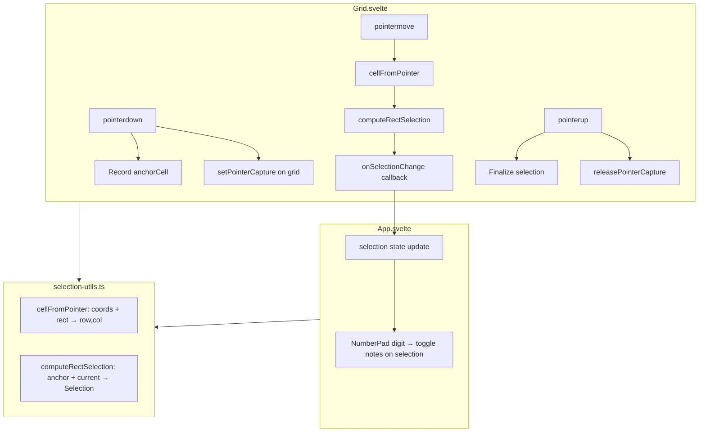
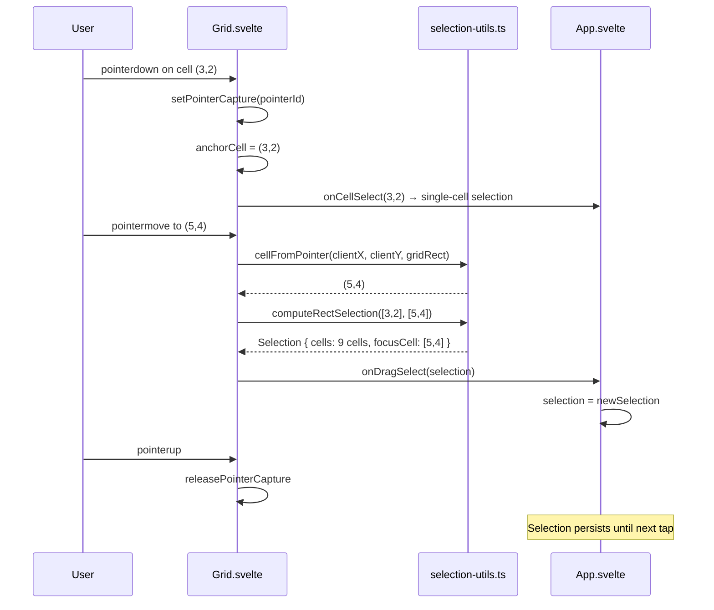

# Design Document: Rectangular Drag Select

## Overview

This feature replaces the freeform drag-to-select model (which accumulates every cell the pointer passes over via `document.elementFromPoint()`) with a rectangular box-select model. A drag from an anchor cell to any other cell selects all cells in the axis-aligned bounding rectangle between them. The implementation uses `setPointerCapture()` and grid-relative coordinate math for reliable pointer tracking at any speed. Shift+click toggle-select is removed. The legacy `extendSelection`, `toggleSelection`, `onCellExtend`, and `onCellToggle` APIs are deleted.

### Key Design Decisions

1. **Grid-relative math over DOM queries**: `cellFromPointer` computes row/col by dividing pointer coordinates against the grid's bounding rect, avoiding `elementFromPoint()` which misses cells at high drag speeds.
2. **`setPointerCapture()` on the grid element**: Ensures all pointer-move/up events route to the grid even when the pointer leaves the element, making drag reliable.
3. **Pure utility functions**: `computeRectSelection` and `cellFromPointer` are pure functions in `selection-utils.ts`, fully testable without DOM.
4. **Anchor + current model**: The grid tracks an anchor cell (pointer-down) and a current cell (latest pointer-move). The selection is always the rectangle between them — no accumulated freeform set.

## Architecture



### Data Flow During Drag



## Components and Interfaces

### selection-utils.ts — New Exports

```typescript
/**
 * Compute the rectangular selection between anchor and current cell.
 * Returns a Selection containing all cells in the bounding rectangle.
 */
export const computeRectSelection = (
    anchor: CellCoord,
    current: CellCoord,
): Selection

/**
 * Convert pointer client coordinates to a grid cell coordinate.
 * Divides the grid bounding rect into a 9×9 grid of equal cells.
 * Clamps result to [0,8] for both row and column.
 */
export const cellFromPointer = (
    clientX: number,
    clientY: number,
    gridRect: { left: number; top: number; width: number; height: number },
): CellCoord
```

### selection-utils.ts — Removed Exports

```typescript
// DELETED:
export const extendSelection = ...
export const toggleSelection = ...
```

### Grid.svelte — Props Change

```typescript
// BEFORE:
{
    onCellSelect: (row: number, col: number) => void
    onCellExtend: (row: number, col: number) => void
    onCellToggle: (row: number, col: number) => void
}

// AFTER:
{
    onCellSelect: (row: number, col: number) => void
    onDragSelect: (selection: Selection) => void
}
```

### Grid.svelte — Internal State

```typescript
let isDragging = $state(false)
let anchorCell: CellCoord | null = $state(null)
```

### App.svelte — Handler Changes

```typescript
// REMOVED:
const handleCellExtend = ...
const handleCellToggle = ...

// ADDED:
const handleDragSelect = (newSelection: Selection): void => {
    selection = newSelection
}
```

## Data Models

### Selection (unchanged structure)

```typescript
export type Selection = {
    readonly cells: ReadonlySet<string>
    readonly focusCell: CellCoord | null
}
```

The `Selection` type itself does not change. What changes is how selections are produced:

| Before | After |
|--------|-------|
| `extendSelection` adds one cell at a time (freeform) | `computeRectSelection` produces the full rectangle at once |
| `toggleSelection` adds/removes individual cells | Removed — no toggle behavior |
| `elementFromPoint` + `data-row`/`data-col` attributes | `cellFromPointer` with grid-relative math |

### GridRect (new, used by cellFromPointer)

```typescript
type GridRect = {
    readonly left: number
    readonly top: number
    readonly width: number
    readonly height: number
}
```

This is the subset of `DOMRect` needed by `cellFromPointer`. Using a plain object type makes the function testable without a real DOM.

### Anchor State (Grid-internal)

The anchor cell is local state within `Grid.svelte`, not exposed to App. It exists only during a drag operation:

- Set on `pointerdown`
- Used on every `pointermove` to recompute the rectangle
- Cleared on `pointerup`


## Correctness Properties

*A property is a characteristic or behavior that should hold true across all valid executions of a system — essentially, a formal statement about what the system should do. Properties serve as the bridge between human-readable specifications and machine-verifiable correctness guarantees.*

### Property 1: setSelection produces exclusive single-cell selection

*For any* valid grid coordinate (row, col) where both are in [0, 8], `setSelection(row, col)` shall return a Selection where `cells.size === 1`, the single cell key matches `cellKey(row, col)`, and `focusCell` equals `[row, col]`.

**Validates: Requirements 1.1, 1.2, 1.3, 5.3**

### Property 2: computeRectSelection exact cell membership

*For any* two valid grid coordinates `anchor` and `current`, `computeRectSelection(anchor, current)` shall return a Selection whose `cells` set contains exactly the keys for every `(r, c)` where `min(anchor.row, current.row) <= r <= max(anchor.row, current.row)` and `min(anchor.col, current.col) <= c <= max(anchor.col, current.col)`, and no other keys.

**Validates: Requirements 2.2, 2.5, 2.6, 7.1, 7.2, 7.3**

### Property 3: computeRectSelection commutativity

*For any* two valid grid coordinates `a` and `b`, `computeRectSelection(a, b)` shall produce a Selection with the same `cells` set as `computeRectSelection(b, a)`.

**Validates: Requirements 7.4**

### Property 4: cellFromPointer in-bounds correctness

*For any* grid bounding rectangle with positive width and height, and *for any* pointer coordinate `(x, y)` that falls within that rectangle, `cellFromPointer(x, y, rect)` shall return `(row, col)` where `row === clamp(Math.floor((y - rect.top) / (rect.height / 9)), 0, 8)` and `col === clamp(Math.floor((x - rect.left) / (rect.width / 9)), 0, 8)`.

**Validates: Requirements 3.2, 6.1, 6.2, 7.6**

### Property 5: cellFromPointer always returns valid coordinates

*For any* grid bounding rectangle with positive width and height, and *for any* pointer coordinate `(x, y)` (including coordinates outside the rectangle), `cellFromPointer(x, y, rect)` shall return `(row, col)` where `0 <= row <= 8` and `0 <= col <= 8`.

**Validates: Requirements 3.4, 7.5**

### Property 6: focusCell membership invariant

*For any* Selection produced by `setSelection`, `computeRectSelection`, `moveFocus`, or `clearSelection`, if `focusCell` is not null then `cells` contains `cellKey(focusCell[0], focusCell[1])`, and if `focusCell` is null then `cells.size === 0`.

**Validates: Requirements 1.3, 2.2**

## Error Handling

### Out-of-Bounds Pointer Coordinates

`cellFromPointer` clamps both row and column to [0, 8]. When the pointer is dragged outside the grid (above, below, left, or right), the nearest edge cell is used. This prevents invalid coordinates from propagating into the selection model.

### Zero-Size Grid Rect

If `gridRect.width` or `gridRect.height` is zero (e.g., grid not yet laid out), `cellFromPointer` would produce `NaN` from division by zero. The Grid component guards against this by only processing pointer-move events when `isDragging` is true, and `isDragging` is only set after a successful `pointerdown` on a rendered cell — which guarantees the grid has non-zero dimensions.

### Pointer Capture Failure

`setPointerCapture()` can throw if the pointer ID is invalid. The Grid wraps the call in a try/catch and falls back to non-captured drag behavior (the selection still works, just less reliably at high speeds).

### Stale Anchor Cell

The anchor cell is cleared on `pointerup`. If a `pointermove` fires after `pointerup` (race condition), the `isDragging` guard prevents processing.

## Testing Strategy

### Unit Tests

Unit tests cover specific examples and edge cases:

- `computeRectSelection` with same anchor and current → single cell
- `computeRectSelection` with a full row (e.g., `(0,0)` to `(0,8)`) → 9 cells
- `computeRectSelection` with a full column → 9 cells
- `computeRectSelection` with a 3×3 box → 9 cells
- `cellFromPointer` at exact grid boundaries (top-left corner, bottom-right corner)
- `cellFromPointer` with pointer outside grid (negative coords, coords beyond grid)
- `cellFromPointer` at cell boundary edges (exactly on the dividing line between two cells)
- Removal verification: `extendSelection` and `toggleSelection` no longer exported

### Property-Based Tests

Property-based tests use `fast-check` (already a project dependency) with minimum 100 iterations per property. Each test references its design document property.

| Property | Test Description |
|----------|-----------------|
| Property 1 | Generate random valid coordinates, verify setSelection output |
| Property 2 | Generate random anchor/current pairs, verify exact cell membership |
| Property 3 | Generate random coordinate pairs, verify commutativity |
| Property 4 | Generate random grid rects and in-bounds pointer coords, verify formula |
| Property 5 | Generate random grid rects and arbitrary pointer coords, verify clamping |
| Property 6 | Generate random sequences of selection operations, verify invariant |

Each property test is tagged with:
```
Feature: rectangular-drag-select, Property {N}: {property title}
```

### Test Configuration

- Library: `fast-check` (existing dependency)
- Runner: Vitest (existing)
- Minimum iterations: 100 per property
- Test files:
  - `src/client/lib/__tests__/selection-utils.test.ts` — unit tests (updated)
  - `src/client/lib/__tests__/selection-utils.property.test.ts` — property tests (updated)
