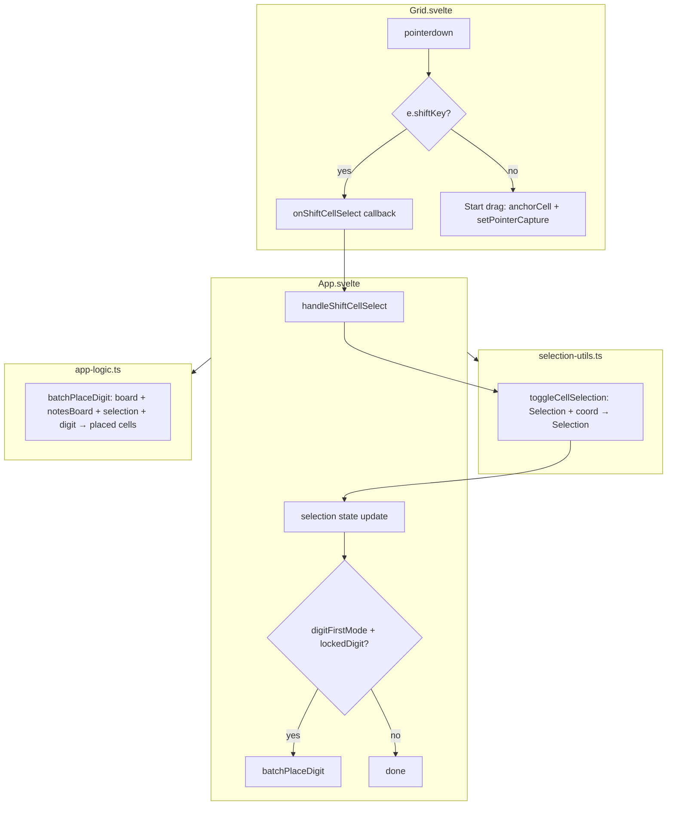
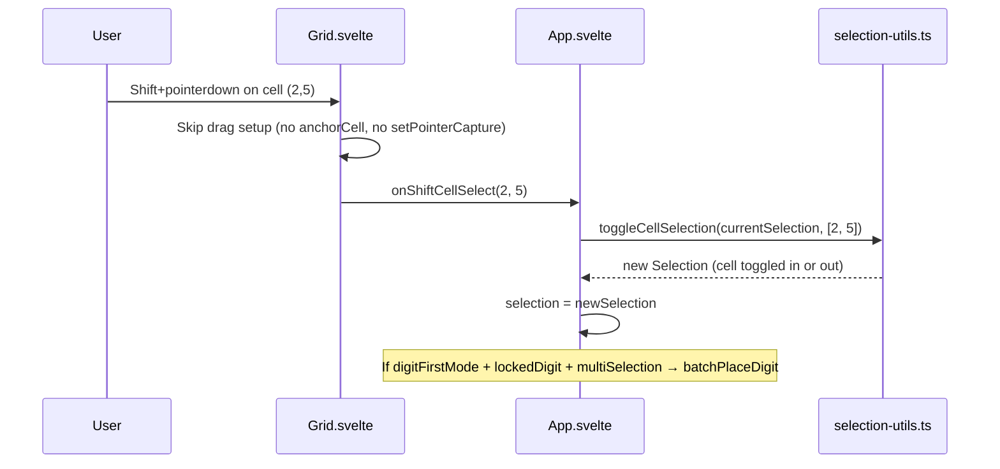

# Design Document: Shift+Click Selection

## Overview

This feature adds Shift+Click as a toggle-based multi-cell selection mechanism to the Sudoku grid. Currently, a single tap selects one cell and drag selects a rectangle. Shift+Click allows players to toggle individual cells in and out of the current selection, enabling non-contiguous multi-cell selections on desktop. The feature composes with existing rectangular drag-select — a player can drag a rectangle, then Shift+Click to add or remove individual cells.

Additionally, when a multi-cell selection is active in digit-first mode, locking a digit batch-places it into all eligible selected cells at once.

### Key Design Decisions

1. **New pure function `toggleCellSelection`**: All toggle logic lives in `selection-utils.ts` as a pure function, keeping it testable without DOM. It accepts a current Selection and a cell coordinate, returns a new Selection with the cell toggled in or out.
2. **Shift detection at Grid.svelte level**: `handlePointerDown` checks `e.shiftKey`. When true, it calls a new `onShiftCellSelect` callback instead of initiating a drag. This keeps the two selection modes cleanly separated.
3. **Single-cell minimum**: `toggleCellSelection` never produces an empty selection — if the toggled cell is the only cell, it stays selected. This prevents the player from accidentally deselecting everything.
4. **Batch placement via `batchPlaceDigit`**: A new pure function in `app-logic.ts` iterates over all selected cells, placing the locked digit into eligible (non-given, non-zero-skippable) cells. It returns placement metadata so the caller can handle undo and conflict updates.
5. **No touch equivalent**: Shift+Click relies on `shiftKey` from pointer events, which is only available with a physical keyboard. No mobile fallback is provided.

## Architecture



### Shift+Click Flow



## Components and Interfaces

### selection-utils.ts — New Export

```typescript
/**
 * Toggle a cell in or out of the current selection.
 * - If the cell is not selected, add it and set focusCell to it.
 * - If the cell is selected and selection has >1 cells, remove it.
 *   If the removed cell was focusCell, set focusCell to an arbitrary remaining cell.
 * - If the cell is the only selected cell, return the selection unchanged.
 * - If the selection is empty, return a single-cell selection for the given cell.
 */
export const toggleCellSelection = (
    current: Selection,
    row: number,
    col: number,
): Selection
```

### Grid.svelte — Props Addition

```typescript
// ADDED prop:
{
    onShiftCellSelect: (row: number, col: number) => void
}
```

### Grid.svelte — handlePointerDown Change

```typescript
const handlePointerDown = (e: PointerEvent, row: number, col: number): void => {
    e.preventDefault()
    if (e.shiftKey) {
        // Shift+Click: toggle cell, no drag
        onShiftCellSelect(row, col)
        return
    }
    // Existing drag behavior unchanged
    onCellSelect(row, col)
    anchorCell = [row, col] as const
    isDragging = true
    try { gridEl.setPointerCapture(e.pointerId) } catch { }
}
```

### App.svelte — New Handler

```typescript
const handleShiftCellSelect = (row: number, col: number): void => {
    selection = toggleCellSelection(selection, row, col)

    // In digit-first mode with a locked digit and multi-selection, batch-place
    if (digitFirstMode && lockedDigit !== null && isMultiSelection(selection)) {
        undoStack = pushSnapshot(undoStack, captureSnapshot(board, notesBoard, hintsUsed))
        if (notesMode) {
            applyAutoNotes(board, notesBoard, selection, lockedDigit)
        } else {
            batchPlaceDigit(board, notesBoard, selection, lockedDigit)
            board = updateConflicts(board)
            checkCompletion()
        }
    }
}
```

### app-logic.ts — New Export

```typescript
/**
 * Place `digit` into every eligible cell in `selection`.
 * Eligible = not a given cell. Overwrites existing values.
 * Clears notes and cleans up peer notes for each placed cell.
 * Mutates `board` and `notesBoard` in place.
 * Returns the list of [row, col] pairs that received the digit.
 */
export const batchPlaceDigit = (
    board: CellState[][],
    notesBoard: NotesBoard,
    selection: Selection,
    digit: number,
): ReadonlyArray<readonly [number, number]>
```

### App.svelte — handleNumber Integration

```typescript
const handleNumber = (num: number): void => {
    if (digitFirstMode) {
        lockedDigit = lockedDigit === num ? null : num
        highlightDigit = lockedDigit

        // Batch-place into multi-selection when locking a digit
        if (lockedDigit !== null && isMultiSelection(selection)) {
            undoStack = pushSnapshot(undoStack, captureSnapshot(board, notesBoard, hintsUsed))
            if (notesMode) {
                applyAutoNotes(board, notesBoard, selection, lockedDigit)
            } else {
                batchPlaceDigit(board, notesBoard, selection, lockedDigit)
                board = updateConflicts(board)
                checkCompletion()
            }
        }
        return
    }
    // ... rest of cell-first mode unchanged
}
```

## Data Models

### Selection (unchanged structure)

```typescript
export type Selection = {
    readonly cells: ReadonlySet<string>
    readonly focusCell: CellCoord | null
}
```

The `Selection` type is unchanged. `toggleCellSelection` produces new `Selection` values by adding/removing cell keys from the `cells` set.

### Toggle Behavior Truth Table

| Current State | Action | Result |
|---|---|---|
| Cell not in selection | Shift+Click cell | Cell added, focusCell = clicked cell |
| Cell in selection, size > 1 | Shift+Click cell | Cell removed, focusCell adjusted if needed |
| Cell is only selected cell | Shift+Click cell | No change (single-cell minimum) |
| Empty selection | Shift+Click cell | Single-cell selection for that cell |

### batchPlaceDigit Behavior

| Cell State | Action |
|---|---|
| Given cell | Skipped |
| Non-given, any value | Value overwritten with digit, notes cleared, peer notes cleaned |


## Correctness Properties

*A property is a characteristic or behavior that should hold true across all valid executions of a system — essentially, a formal statement about what the system should do. Properties serve as the bridge between human-readable specifications and machine-verifiable correctness guarantees.*

### Property 1: Toggle-add preserves existing cells and adds the new cell

*For any* valid Selection and *for any* cell coordinate not currently in the selection, `toggleCellSelection` shall return a Selection whose `cells` set contains every cell from the original selection plus the new cell, and whose `focusCell` equals the newly added cell.

**Validates: Requirements 1.1, 1.4, 1.5, 3.1, 4.2, 4.5**

### Property 2: Toggle-remove removes only the target cell

*For any* valid Selection with more than one cell and *for any* cell coordinate currently in the selection, `toggleCellSelection` shall return a Selection whose `cells` set contains every cell from the original selection except the toggled cell, and whose `focusCell` is a member of the resulting `cells` set.

**Validates: Requirements 1.2, 1.6, 3.2, 4.3**

### Property 3: Single-cell minimum guard

*For any* single-cell Selection, calling `toggleCellSelection` with the only selected cell shall return a Selection identical to the input (same cells set, same focusCell).

**Validates: Requirements 1.3, 4.4**

### Property 4: focusCell membership invariant (extended)

*For any* sequence of selection operations including `setSelection`, `computeRectSelection`, `moveFocus`, `clearSelection`, and `toggleCellSelection`, if the resulting Selection has a non-null `focusCell`, then `cells` contains `cellKey(focusCell[0], focusCell[1])`. If `focusCell` is null, then `cells.size === 0`.

**Validates: Requirements 4.6**

### Property 5: batchPlaceDigit targets exactly non-given cells in selection

*For any* board, notesBoard, multi-cell selection, and digit 1–9, after calling `batchPlaceDigit`, every non-given cell in the selection shall have `value === digit`, every given cell in the selection shall be unchanged, and every cell outside the selection shall be unchanged.

**Validates: Requirements 6.1, 6.2, 6.3**

### Property 6: batchPlaceDigit clears placed cell notes

*For any* board, notesBoard, multi-cell selection, and digit 1–9, after calling `batchPlaceDigit`, every non-given cell in the selection shall have an empty notes set.

**Validates: Requirements 6.4**

## Error Handling

### Empty Selection on Shift+Click

If `toggleCellSelection` is called with `EMPTY_SELECTION`, it produces a single-cell selection for the given coordinate. This is the same behavior as a regular click — no special error path needed.

### Invalid Coordinates

`toggleCellSelection` uses `cellKey` to encode coordinates. If coordinates outside [0,8] are passed, the function still produces a valid Selection (just with an unusual key). However, `cellFromPointer` in Grid.svelte already clamps coordinates to [0,8], so invalid coordinates cannot reach `toggleCellSelection` through normal UI flow.

### Batch Placement on Empty/Single Selection

`batchPlaceDigit` iterates over `selection.cells`. If the selection is empty or single-cell, it simply processes zero or one cell — no special guard needed. The caller in App.svelte gates batch placement behind `isMultiSelection(selection)`.

### Given Cell Protection

`batchPlaceDigit` checks `cell.isGiven` for each cell and skips given cells. This prevents modification of puzzle-provided values even if they end up in a multi-selection.

## Testing Strategy

### Unit Tests

Unit tests cover specific examples and edge cases for the new functions:

- `toggleCellSelection` with empty selection → single-cell result
- `toggleCellSelection` adding a cell to a single-cell selection → two cells
- `toggleCellSelection` removing a cell from a two-cell selection → one cell
- `toggleCellSelection` on the only selected cell → unchanged
- `toggleCellSelection` removing focusCell → focusCell reassigned to remaining cell
- `batchPlaceDigit` with all given cells → no changes, returns empty array
- `batchPlaceDigit` with mixed given/non-given → only non-given cells modified
- `batchPlaceDigit` with cells that already have values → values overwritten

### Property-Based Tests

Property-based tests use `fast-check` (existing project dependency) with minimum 100 iterations per property. Each test references its design document property.

| Property | Test Description |
|----------|-----------------|
| Property 1 | Generate random selections and cells not in them, verify add behavior |
| Property 2 | Generate random multi-cell selections and cells in them, verify remove behavior |
| Property 3 | Generate random single-cell selections, verify no-op on toggle |
| Property 4 | Generate random sequences of all selection operations (including toggle), verify focusCell invariant |
| Property 5 | Generate random boards, noteBoards, multi-selections, and digits, verify placement targets |
| Property 6 | Generate random boards, noteBoards, multi-selections, and digits, verify notes cleared |

Each property test is tagged with:
```
Feature: shift-click-selection, Property {N}: {property title}
```

### Test Configuration

- Library: `fast-check` (existing dependency)
- Runner: Vitest (existing)
- Minimum iterations: 100 per property
- Test files:
  - `src/client/lib/__tests__/selection-utils.test.ts` — unit tests (updated with toggleCellSelection cases)
  - `src/client/lib/__tests__/selection-utils.property.test.ts` — property tests (updated with Properties 1–4)
  - `src/client/lib/__tests__/app-logic.test.ts` — unit tests (updated with batchPlaceDigit cases)
  - `src/client/lib/__tests__/app-logic.property.test.ts` — property tests (updated with Properties 5–6)
