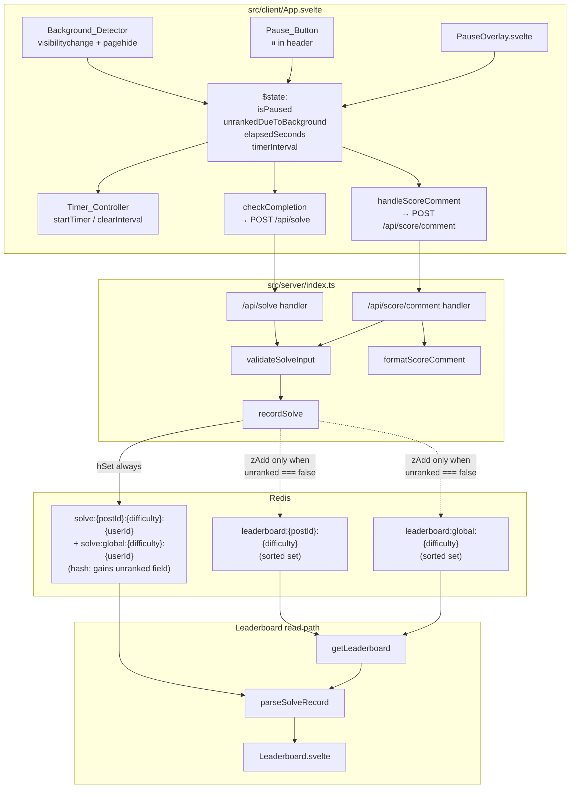
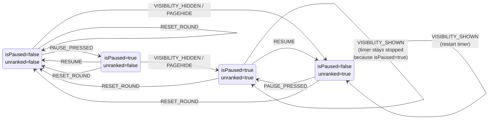
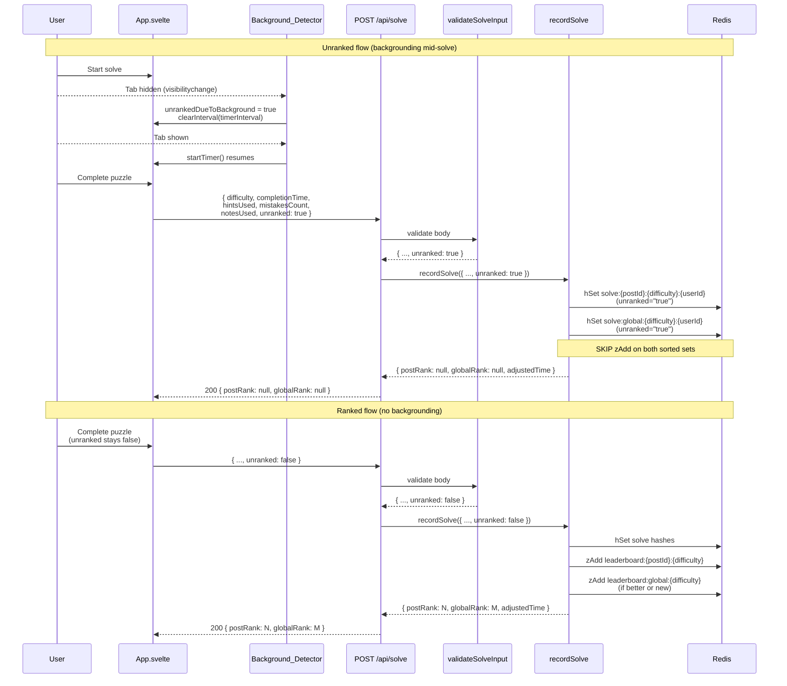

# Design Document: Solve Pause

## Overview

Two unified paths feed a single boolean `unranked` field on the submitted solve record. A user-initiated pause (header Pause button) freezes the timer and overlays the board with a blurred scrim plus a Resume affordance; on resume the timer continues from the preserved `elapsedSeconds` and `unranked` is untouched. Passive backgrounding — `document.visibilitychange` with `document.hidden === true` or `window.pagehide` — during an active solve also freezes the timer but additionally latches `unrankedDueToBackground` to `true` with no grace period, no overlay, and no user-visible notification. Both community and standard puzzles flow through the same state machine. The client sends `unranked` in `POST /api/solve` and `POST /api/score/comment`; the server persists `unranked: "true" | "false"` on the solve hash, gates sorted-set insertion on `unranked === false`, and surfaces `unranked` on every `LeaderboardEntry` so the leaderboard UI can render unranked user entries below the top-N divider with a visible badge and no rank number.

## Architecture

### Top-level flow



### State transitions for `(isPaused, unrankedDueToBackground)`

The two flags are independent. Manual pause/resume never writes `unrankedDueToBackground`. Backgrounding always latches `unrankedDueToBackground = true` but leaves `isPaused` alone. Foregrounding restarts the timer iff `isPaused === false`.



Key invariants encoded in the diagram:

- `PAUSE_PRESSED` and `RESUME` never change the second flag.
- `VISIBILITY_HIDDEN` and `PAGEHIDE` always set `unrankedDueToBackground = true` and stop the timer. They never clear either flag.
- `VISIBILITY_SHOWN` restarts the timer only if `isPaused === false`. It never clears `unrankedDueToBackground`.
- `RESET_ROUND` is the only transition that clears both flags back to `false`.

### Submission pipeline — unranked vs ranked



## Components and Interfaces

### `src/client/App.svelte` — state additions

New reactive values in the existing `<script lang="ts">` block:

```typescript
let isPaused: boolean = $state(false)
let unrankedDueToBackground: boolean = $state(false)
```

Neither flag is persisted across rounds. Both are cleared in `resetRoundState` (see amendments below). `elapsedSeconds`, `timerInterval`, `startTimer`, `screen`, and `notesUsed` already exist; none of their declarations change.

New handlers on `App_Controller`:

```typescript
const handlePause = (): void => {
    if (screen !== 'playing' || isPaused) return
    if (timerInterval !== null) {
        clearInterval(timerInterval)
        timerInterval = null
    }
    isPaused = true
}

const handleResume = (): void => {
    if (!isPaused) return
    isPaused = false
    startTimer()
}

const onVisibilityChange = (): void => {
    if (screen !== 'playing') return
    if (document.hidden) {
        if (timerInterval !== null) {
            clearInterval(timerInterval)
            timerInterval = null
        }
        unrankedDueToBackground = true
        return
    }
    if (!isPaused && timerInterval === null) startTimer()
}

const onPageHide = (): void => {
    if (screen !== 'playing') return
    if (timerInterval !== null) {
        clearInterval(timerInterval)
        timerInterval = null
    }
    unrankedDueToBackground = true
}
```

Lifecycle wiring (added alongside the existing `onMount` block that already registers keyboard listeners):

```typescript
onMount(() => {
    document.addEventListener('visibilitychange', onVisibilityChange)
    window.addEventListener('pagehide', onPageHide)
    return () => {
        document.removeEventListener('visibilitychange', onVisibilityChange)
        window.removeEventListener('pagehide', onPageHide)
    }
})
```

Amendment to `resetRoundState` (starts at ~line 142 in the current file). The two new lines live next to the existing resets for `notesUsed`, `hintsUsed`, etc.:

```typescript
const resetRoundState = (): void => {
    // ...existing resets (selection, notesBoard, hintsUsed, mistakesCount,
    // notesUsed, solveResult, solveError, screen='playing', etc.)
    isPaused = false
    unrankedDueToBackground = false
    startTimer()
}
```

The existing `startTimer` already clears the previous interval before creating a new one, so `resetRoundState` does not need to touch `timerInterval` explicitly.

Submission wiring (in the existing `checkCompletion` and `handleScoreComment` paths — only the body of the POST changes):

```typescript
await fetch('/api/solve', {
    method: 'POST',
    headers: { 'Content-Type': 'application/json' },
    body: JSON.stringify({
        difficulty,
        completionTime: elapsedSeconds,
        hintsUsed,
        mistakesCount,
        notesUsed,
        unranked: unrankedDueToBackground,
    }),
})
```

The same `unranked: unrankedDueToBackground` field is added to the `/api/score/comment` body.

### New component: `src/client/components/PauseOverlay.svelte`

Dedicated Svelte 5 component so `App.svelte` stays focused on game logic. Props:

```typescript
type PauseOverlayProps = {
    onResume: () => void
}
```

Responsibilities and contract:

- Render a single `<div role="dialog" aria-modal="true" aria-label="Solve paused">` that covers the full board bounding box (`absolute inset-0` positioned over the grid container).
- Apply Tailwind classes `backdrop-blur-md bg-neutral-900/70` to produce the blurred scrim. Effective scrim opacity is 70%, inside the 60–95% band required by Requirement 3.2.
- Host a centered `<button>` with the text `Resume`, which receives focus on mount. Clicking anywhere on the overlay invokes `onResume()` — the centered button is an interactive affordance inside the same click-to-resume surface.
- Register a keydown listener for `Escape` on mount (attached to `window` so it fires regardless of focus inside the dialog) and invoke `onResume()` on key up. Tear the listener down on unmount.
- Pointer and keyboard input never reach the grid beneath the overlay because the overlay sits at a higher z-index and calls `event.stopPropagation()` on pointer events. Activation-equivalent keyboard handlers outside the overlay are additionally gated in `App.svelte` by `isPaused === false`.
- Focus trap: while mounted, a single focusable element (the Resume button) is inside the dialog. Tab from the Resume button loops back to itself via a `tabindex="0"` sentinel wrapper, keeping focus inside the dialog for screen reader users.
- Mount/unmount is driven by `{#if isPaused}` in `App.svelte`. `App.svelte` captures the element that had focus before `handlePause` ran and restores it after `handleResume` (the existing Pause button element).

The component renders nothing when `isPaused === false` because the parent gates its existence with `{#if}`. It does not observe `unrankedDueToBackground` — backgrounding never mounts this component.

### `src/client/components/NumberPad.svelte` — prop addition

To keep the diff minimal and avoid lifting every disabled binding into `App.svelte`, add a single boolean prop:

```typescript
isPaused: boolean // default false
```

Every action button inside `NumberPad.svelte` ORs its existing disabled expression with `isPaused`:

| Button | Existing `disabled` | After change |
|---|---|---|
| Normal/Candidate toggle (`onToggleNotes`) | _none_ | `disabled={isPaused}` |
| Undo (`onUndo`) | `disabled={undoDisabled}` | `disabled={undoDisabled || isPaused}` |
| Hint (`onHint`) | `disabled={hintsDisabled}` | `disabled={hintsDisabled || isPaused}` |
| Leaderboard (`onLeaderboard`) | _none_ | `disabled={isPaused}` |
| Digit buttons 1–9 | _none_ | `disabled={isPaused}` |
| Erase (✕) | _none_ | `disabled={isPaused}` |
| Auto Candidate checkbox | _none_ | `disabled={isPaused}` |
| Digit First checkbox | _none_ | `disabled={isPaused}` |
| Submit Puzzle (community path) | _none_ | `disabled={isPaused}` |

The disabled visual style (`cursor-not-allowed opacity-40 ...`) already exists for undo and hint. The new paused buttons reuse the same Tailwind classes via a derived expression `const anyDisabled = (existing) || isPaused`.

`NumberPad.svelte` keeps its current props; the only new prop is `isPaused`. `App.svelte` passes `isPaused={isPaused}`.

### Pause button placement in `src/client/App.svelte`

Rendered as a sibling button to the timer block in the header (near lines 718–727 of the current file, immediately after the `{puzzleTitle}` element and the elapsed-seconds display). Svelte 5 snippet signature:

```svelte
{#if screen === 'playing'}
    <button
        class="flex items-center justify-center rounded-md min-h-11 min-w-11 bg-neutral-100 text-neutral-700 transition-all active:scale-95 hover:bg-neutral-200 focus:outline-none focus:ring-2 focus:ring-blue-500 disabled:cursor-not-allowed disabled:opacity-40 dark:bg-neutral-700 dark:text-neutral-300 dark:hover:bg-neutral-600"
        onclick={handlePause}
        disabled={loading || error !== null || isPaused}
        aria-label="Pause solve"
        bind:this={pauseButtonEl}
    >
        <span class="text-lg leading-none" aria-hidden="true">⏸</span>
    </button>
{/if}
```

`pauseButtonEl` is a new `let pauseButtonEl: HTMLButtonElement | null = $state(null)` used so `handleResume` can call `pauseButtonEl?.focus()` when unmounting the overlay. The outer `{#if screen === 'playing'}` matches Requirement 1.1 and 1.2; the `disabled` conditions satisfy Requirement 1.3 (disabled while loading or errored) and make re-pressing a no-op while already paused.

### `src/server/lib/leaderboard.ts` — type and function changes

`LeaderboardEntry` gains an `unranked` field and a nullable `rank`:

```typescript
export type LeaderboardEntry = {
    rank: number | null
    username: string
    completionTime: number
    hintsUsed: number
    mistakesCount: number
    adjustedTime: number
    notesUsed: boolean | undefined
    unranked: boolean
}
```

`rank` becomes `number | null` because an unranked user entry has no position in the sorted set.

`validateSolveInput` return type widens. New rules: absent → default to `false`; present and not `boolean` → error string (consistent with the existing shape of type-mismatch messages).

```typescript
export const validateSolveInput = (
    body: unknown,
):
    | {
          difficulty: ValidDifficulty
          completionTime: number
          hintsUsed: number
          mistakesCount: number
          notesUsed: boolean
          unranked: boolean
      }
    | string => {
    // ...existing guards...
    const { unranked } = obj
    let resolvedUnranked: boolean
    if (unranked === undefined) {
        resolvedUnranked = false
    } else if (typeof unranked === 'boolean') {
        resolvedUnranked = unranked
    } else {
        return 'Invalid unranked: must be a boolean'
    }
    return { difficulty, completionTime, hintsUsed, mistakesCount, notesUsed, unranked: resolvedUnranked }
}
```

`recordSolve` params gain `unranked: boolean`. Inside the function:

1. Serialize `unranked` to the string literal `"true"` or `"false"` using `String(unranked)` and include it in the `hSet` payload for the post-level hash and the global-level hash. The global-level hash is written unconditionally on first solve or when the solve is better than the existing global best so the player can always read their own time back, independent of ranked membership.
2. Gate both `zAdd` calls (`leaderboard:{postId}:{difficulty}` and `leaderboard:global:{difficulty}`) on `unranked === false`. When `unranked === true`, the function still performs the two `hSet` writes but skips both `zAdd` calls entirely (not even a score-less placeholder).
3. The return type widens. `postRank` and `globalRank` become `number | null`. When `unranked === true`, both are `null` because the user is not a member of either sorted set and no `zRank` lookup is performed. When `unranked === false`, the existing `(zRank ?? 0) + 1` logic produces a non-null rank as before.

```typescript
export const recordSolve = async (params: {
    redis: RedisClient
    postId: string
    userId: string
    username: string
    difficulty: ValidDifficulty
    completionTime: number
    hintsUsed: number
    mistakesCount: number
    notesUsed: boolean
    unranked: boolean
}): Promise<{ postRank: number | null; globalRank: number | null; adjustedTime: number } | string>
```

Why `number | null` instead of keeping `0`: `0` is a legitimate pre-increment `zRank` value, and overloading it for "not ranked" creates silent UI ambiguity. `null` forces every consumer (the completion screen, the score comment, the leaderboard UI) to branch explicitly.

`parseSolveRecord` widens to return `unranked: boolean` with a strict rule: `"true" → true`, everything else → `false` (covers `"false"`, missing, empty string, unknown strings). This deliberately deviates from how `notesUsed` currently parses missing as `undefined`. For `unranked` we want a strict boolean to keep downstream UI gating simple (`if (entry.unranked) ...`), and to satisfy Requirement 12.1 which mandates `false` for legacy records.

```typescript
const parseUnranked = (raw: string | undefined): boolean => raw === 'true'
// ...
const notesUsed = notesUsedRaw === 'true' ? true : notesUsedRaw === 'false' ? false : undefined
const unranked = parseUnranked(unrankedRaw)
return { ..., notesUsed, unranked }
```

`getLeaderboard` gets one new branch. After the existing path (top-N plus any in-top-N user) executes, if `userId` is provided and the user is not in the sorted set (`zRank` returns `undefined`), fall back to reading the solve hash directly at `${solveKeyPrefix}:${userId}`. If the hash exists and `parseSolveRecord` parses `unranked === true`, build a `userEntry` with `rank: null`. If the hash does not exist, return `userEntry: null`. If the hash exists but `unranked === false`, that represents an inconsistent state (hash written without sorted-set membership); treat it as absent and return `userEntry: null` rather than fabricating a rank.

```typescript
const userRankRaw = await redis.zRank(key, userId)
if (userRankRaw !== undefined) {
    // existing top-N fallback with rank = userRankRaw + 1
    return { entries, userEntry }
}
const userSolveKey = `${solveKeyPrefix}:${userId}`
const userData = await redis.hGetAll(userSolveKey)
const unrankedEntry = parseSolveRecord(userData, null)
if (unrankedEntry && unrankedEntry.unranked) {
    return { entries, userEntry: unrankedEntry }
}
return { entries, userEntry: null }
```

The `parseSolveRecord` helper accepts `rank: number | null` to support building unranked entries.

### `src/server/lib/score-comment.ts`

`ScoreCommentData` gains an `unranked` field:

```typescript
export type ScoreCommentData = {
    difficulty: string
    completionTime: number
    hintsUsed: number
    mistakesCount: number
    notesUsed: boolean
    unranked: boolean
}
```

`formatScoreComment` appends one row to the markdown table immediately after the `📝 Notes` row iff `data.unranked === true`:

```typescript
const tableRows = [
    '| Stat | Value |',
    '|------|-------|',
    `| ⏱️ Time | ${formattedTime} |`,
    `| 💡 Hints | ${hintsUsed} |`,
    `| ❌ Mistakes | ${mistakesCount} |`,
    `| 📝 Notes | ${notesUsed ? 'Yes' : 'No'} |`,
]
if (unranked) tableRows.push('| 🏁 Unranked | Yes |')
const table = tableRows.join('\n')
```

The perfect-solve logic is unchanged — unranked solves can still be marked perfect.

### `src/server/index.ts`

No new routes. Two handler-body changes:

- `POST /api/solve` — destructure `unranked` out of the `validateSolveInput` result and forward it into `recordSolve`. The handler also accepts that `postRank` and `globalRank` in the `SolveResponse` may now be `null` and passes the response through unchanged.
- `POST /api/score/comment` — destructure `unranked` and forward it into `formatScoreComment`.

Both handlers continue to call `validateSolveInput` on the request body; the new `unranked` validation errors flow through the existing 400 error path.

### `src/client/components/Leaderboard.svelte`

Widen the local `LeaderboardEntry` type to match the server:

```typescript
type LeaderboardEntry = {
    rank: number | null
    username: string
    completionTime: number
    hintsUsed: number
    mistakesCount: number
    adjustedTime: number
    unranked: boolean
}
```

Rendering changes confined to the user-entry row below the `<tr aria-hidden="true">` divider:

- When `userEntry.unranked === true`, render `—` (em dash) in the rank column instead of a number.
- Append a small pill badge next to the username: `<span class="ml-2 rounded-full bg-neutral-200 px-1.5 py-0.5 text-[10px] uppercase tracking-wide text-neutral-600 dark:bg-neutral-700 dark:text-neutral-300">unranked</span>`.
- Top-N entries never carry `unranked === true` (the server filters them out of the sorted set), so the top-N rendering path is unchanged.

## Data Models

### Redis schema

| Key | Type | Fields / members | Change |
|---|---|---|---|
| `solve:{postId}:{difficulty}:{userId}` | Hash | existing: `username`, `completionTime`, `hintsUsed`, `mistakesCount`, `adjustedTime`, `notesUsed`. **New**: `unranked` = `"true"` or `"false"`. | Gains `unranked` field. |
| `solve:global:{difficulty}:{userId}` | Hash | same as above. | Gains `unranked` field. |
| `leaderboard:{postId}:{difficulty}` | Sorted Set | `member=userId`, `score=adjustedTime`. | Shape unchanged; fewer members because unranked solves are skipped. |
| `leaderboard:global:{difficulty}` | Sorted Set | `member=userId`, `score=adjustedTime`. | Shape unchanged; fewer members because unranked solves are skipped. |

### TypeScript types

```typescript
// Shared between server and client
export type LeaderboardEntry = {
    rank: number | null
    username: string
    completionTime: number
    hintsUsed: number
    mistakesCount: number
    adjustedTime: number
    notesUsed: boolean | undefined
    unranked: boolean
}

export type LeaderboardResponse = {
    entries: LeaderboardEntry[]
    userEntry: LeaderboardEntry | null
}

export type SolveResponse = {
    postRank: number | null
    globalRank: number | null
    adjustedTime: number
}

export type ScoreCommentData = {
    difficulty: string
    completionTime: number
    hintsUsed: number
    mistakesCount: number
    notesUsed: boolean
    unranked: boolean
}

// POST /api/solve
export type SolveRequestBody = {
    difficulty: 'easy' | 'medium' | 'hard' | 'expert' | 'master' | 'extreme'
    completionTime: number
    hintsUsed: number
    mistakesCount: number
    notesUsed: boolean
    unranked: boolean
}

export type SolveApiResponse =
    | { status: 'success'; data: SolveResponse }
    | { status: 'error'; message: string }

// POST /api/score/comment
export type ScoreCommentRequestBody = {
    difficulty: string
    completionTime: number
    hintsUsed: number
    mistakesCount: number
    notesUsed: boolean
    unranked: boolean
}

export type ScoreCommentApiResponse =
    | { status: 'success'; data: { commentId: string } }
    | { status: 'error'; message: string }
```

### Backward compatibility

Legacy `solve:*` hashes written before this feature do not carry an `unranked` field. `parseSolveRecord` treats any value that is not the literal string `"true"` (including missing, `"false"`, `""`, and unknown strings) as `unranked: false`. No migration or backfill is performed. Legacy entries with `unranked: false` rank identically to new entries with `unranked: false` because both are members of the ranked sorted sets and both have the same `adjustedTime` formula.

## Correctness Properties

*A property is a characteristic or behavior that should hold true across all valid executions of a system — essentially, a formal statement about what the system should do. Properties serve as the bridge between human-readable specifications and machine-verifiable correctness guarantees.*

The server-side persistence layer is a pure function over its inputs (with Redis mocked), and the client-side pause/background reducer is a pure state machine over event sequences. Both are ideal for property-based testing.

### Property 1: Solve record round-trip preserves `unranked`

*For any* generated solve input — valid `ValidDifficulty`, non-negative integer `completionTime`, `hintsUsed`, `mistakesCount`, boolean `notesUsed`, and boolean `unranked` — after persisting via `recordSolve` and reading the resulting `solve:{postId}:{difficulty}:{userId}` hash back through `parseSolveRecord`, the produced `LeaderboardEntry.unranked` SHALL equal the original input `unranked`. The same holds for the global hash at `solve:global:{difficulty}:{userId}` on the first solve.

**Validates: Requirements 10.1, 11.1, 11.2, 15.1**

### Property 2: Ranked sorted-set membership iff `unranked === false`

*For any* generated solve input recorded via `recordSolve`, the member `userId` SHALL be present in both `leaderboard:{postId}:{difficulty}` and `leaderboard:global:{difficulty}` if and only if the input `unranked === false`. When `unranked === true`, `zScore` SHALL return `undefined` for that `userId` on both sorted sets. When `unranked === false`, `zScore` SHALL return the value computed by `computeAdjustedTime(completionTime, hintsUsed)` on the per-post sorted set (the global set may carry a lower previous best, which is still a member).

**Validates: Requirements 10.2, 10.3, 11.4, 15.2**

### Property 3: Background latch

*For any* generated event sequence of length 1 to 50 containing at least one `VISIBILITY_HIDDEN` or `PAGEHIDE` event — with any interleaving of `PAUSE_PRESSED`, `RESUME`, `VISIBILITY_SHOWN` events before a `RESET_ROUND` — the reducer SHALL produce states where `unrankedDueToBackground === true` for every state at or after the first background event and up to (but not including) the next `RESET_ROUND`.

**Validates: Requirements 6.10, 7.4, 13.5, 15.3**

### Property 4: Manual pause does not mutate `unrankedDueToBackground`

*For any* generated event sequence composed only of `PAUSE_PRESSED` and `RESUME` events (no `VISIBILITY_HIDDEN`, `PAGEHIDE`, or `VISIBILITY_SHOWN`), starting from initial state `{ isPaused: false, unrankedDueToBackground: false }`, the reducer SHALL produce a final state where `unrankedDueToBackground === false`. No intermediate state SHALL have `unrankedDueToBackground === true`.

**Validates: Requirements 2.7, 7.5, 7.6**

### Property 5: Score comment `🏁 Unranked` row iff `unranked === true`

*For any* generated `ScoreCommentData` — arbitrary string `difficulty`, non-negative integer `completionTime`, `hintsUsed`, `mistakesCount`, and boolean `notesUsed` — the markdown string produced by `formatScoreComment` SHALL contain the substring `| 🏁 Unranked | Yes |` if and only if `data.unranked === true`.

**Validates: Requirements 8.4, 8.5**

### Property 6: Validator rejects `unranked` iff present and non-boolean

*For any* JSON value `v` generated from the arbitrary of non-boolean values (numbers, strings including `"true"`/`"false"`, `null`, arrays, objects), when a valid solve body is augmented with `{ unranked: v }`, `validateSolveInput` SHALL return a string (error). When `unranked` is omitted from the same valid body, `validateSolveInput` SHALL return a successful result object with `unranked: false`. When `unranked` is the boolean `true` or `false`, `validateSolveInput` SHALL return a successful result object with that same boolean.

**Validates: Requirements 9.1, 9.2, 9.3**

## Error Handling

| Condition | Layer | Status / behavior | Recovery |
|---|---|---|---|
| Request body `unranked` is non-boolean (number, string, null, array, object) | `validateSolveInput` | 400 `"Invalid unranked: must be a boolean"` with same shape as existing type-mismatch errors; no state written | Client prevents via always sending a boolean; server log records the rejection |
| Request body omits `unranked` key | `validateSolveInput` | Accepted; resolved to `false` | Covers legacy clients during rollout and the score-comment path |
| `recordSolve` hash write fails when `unranked === true` | `recordSolve` | Error bubbles up; no `zAdd` ran (nothing to unwind); return 500 to client | Client shows retry; no partial ranked state exists because the zAdd path is skipped entirely |
| `recordSolve` hash write fails when `unranked === false` | `recordSolve` | Error bubbles up before any `zAdd` runs (existing behavior preserved); no sorted-set entry is created for this solve | Client shows retry; invariant: no sorted-set membership without a matching hash |
| `visibilitychange` hidden fires at the same tick the user presses Pause | `App_Controller` | Both handlers are idempotent: `handlePause` early-returns when `isPaused === true`; `onVisibilityChange` early-returns nothing about `isPaused`, it just clears the timer (already null on second call is a no-op) and latches `unrankedDueToBackground = true`. Final state: `isPaused=true`, `unrankedDueToBackground=true`. Order of arrival does not matter. | None needed — idempotent |
| `pagehide` and `visibilitychange` both fire during a tab close | `App_Controller` | Both set `unrankedDueToBackground = true` and clear the timer. Second call finds `timerInterval === null` and becomes a no-op. Latch property (Property 3) guarantees the flag stays `true`. | None needed |
| Foreground return while `isPaused === true` | `App_Controller` | `onVisibilityChange` observes `document.hidden === false` and does NOT start the timer because `isPaused === true`. Timer only restarts when the user presses Resume. | None needed — matches Requirement 4.3 |
| Network failure submitting solve | `App.svelte` | `checkCompletion` catches the error, still transitions `screen` to `"completed"`, and renders the completion screen without a rank. Consistent with the leaderboards design for graceful degradation. | User sees their time and a non-blocking error banner |
| Solve hash exists but `unranked === false` and user not in sorted set (inconsistent legacy state) | `getLeaderboard` | Treated as absent: `userEntry` returned as `null` rather than fabricating a rank | None needed — avoids misleading UI |
| `Escape` key pressed while `isPaused === false` | `PauseOverlay.svelte` | Not mounted, so no listener attached; event bubbles through to existing handlers (selection clear, modal close, etc.) unchanged | None needed |

## Testing Strategy

### Unit tests (example-based)

Server (`src/server/__tests__/` and `src/server/lib/__tests__/`):

- `validateSolveInput` — accepts `unranked: true`; accepts `unranked: false`; accepts missing key and returns `unranked: false`; rejects `unranked: "true"` string; rejects `unranked: 1`; rejects `unranked: null`; rejects `unranked: {}`.
- `recordSolve` — writes both hashes when `unranked === true` and performs zero `zAdd` calls (assert via Redis mock); writes both hashes when `unranked === false` and performs the existing `zAdd` calls; returns `{ postRank: null, globalRank: null }` when `unranked === true`.
- `parseSolveRecord` — `unranked: "true"` → `true`; `unranked: "false"` → `false`; missing key → `false`; empty string → `false`; unknown string (`"maybe"`) → `false`.
- `getLeaderboard` — user with only unranked solve returns `userEntry` with `rank: null` and `unranked: true`; user with only a stale hash and no sorted-set membership returns `userEntry: null`.
- `formatScoreComment` — `unranked: true` output contains `| 🏁 Unranked | Yes |` row immediately after the `📝 Notes` row; `unranked: false` output does not contain `🏁 Unranked`; perfect-solve branch still fires with `unranked: true`.

Client (`src/client/lib/__tests__/`):

- Timer freezes when `isPaused === true`: after `handlePause`, ticking the clock 5 seconds does not advance `elapsedSeconds`.
- Timer resumes from preserved value: `handlePause` at 42s, `handleResume`, tick 3s → `elapsedSeconds === 45`.
- `resetRoundState` clears both flags: pre-state `isPaused=true, unrankedDueToBackground=true`, post-state both `false`.
- Background latch: `onVisibilityChange` with `document.hidden=true` sets `unrankedDueToBackground=true`; subsequent `onVisibilityChange` with `document.hidden=false` does not clear it.
- Pause button `disabled` reflects `screen !== 'playing' || loading || error !== null || isPaused`.
- `PauseOverlay.svelte` focus management: Resume button receives focus on mount; `Escape` keydown calls `onResume`; click on the backdrop calls `onResume`.

### Property-based tests

Property-based testing is appropriate here because the server-side persistence and parsing layer is pure (given a mocked Redis), and the client-side flag latching is a deterministic state machine over input event sequences. fast-check (already in devDependencies) with minimum 100 iterations per property.

| Property | Test file | Tag |
|---|---|---|
| Property 1: Solve record round-trip | `src/server/lib/__tests__/leaderboard.property.test.ts` | `Feature: solve-pause, Property 1: For any generated solve input, recordSolve followed by parseSolveRecord preserves unranked` |
| Property 2: Ranked-membership iff unranked === false | `src/server/lib/__tests__/leaderboard.property.test.ts` | `Feature: solve-pause, Property 2: sorted-set membership iff unranked === false` |
| Property 3: Latch on backgrounding | `src/client/lib/__tests__/app-logic.property.test.ts` | `Feature: solve-pause, Property 3: unrankedDueToBackground latches true after first background event` |
| Property 4: Manual pause does not mutate unranked | `src/client/lib/__tests__/app-logic.property.test.ts` | `Feature: solve-pause, Property 4: PAUSE/RESUME sequences with no background event leave unrankedDueToBackground false` |
| Property 5: Score comment unranked row iff flag | `src/server/lib/__tests__/leaderboard.property.test.ts` | `Feature: solve-pause, Property 5: formatScoreComment includes 🏁 Unranked row iff data.unranked === true` |
| Property 6: Validator error iff non-boolean present | `src/server/lib/__tests__/leaderboard.property.test.ts` | `Feature: solve-pause, Property 6: validateSolveInput errors iff unranked is present and not boolean` |

Property 3 and Property 4 require the pause/background state-machine logic to be extractable into a pure function so fast-check can feed it sequences of events without a live Svelte runtime. The client-side reducer function (signature `reduce(state, event) => state`) lives in `src/client/lib/app-logic.ts` so it is testable independent of `.svelte` files.

### Integration tests

- Full unranked flow: start a solve in a test harness, fire a synthetic `visibilitychange` with `document.hidden=true`, complete the puzzle, POST `/api/solve`. Assert the solve hash exists in the test Redis at `solve:{postId}:{difficulty}:{userId}` with `unranked=true`, AND assert `zScore(leaderboard:{postId}:{difficulty}, userId)` returns `undefined`, AND `zScore(leaderboard:global:{difficulty}, userId)` returns `undefined`.
- Full ranked flow (regression): complete a puzzle with no backgrounding, assert sorted-set membership is present and `postRank`/`globalRank` are non-null.
- Leaderboard read with only an unranked solve for the current user: `GET /api/leaderboard/post?difficulty=easy` returns `userEntry` with `rank: null` and `unranked: true`.
- Community puzzle parity: run the unranked integration test with `puzzleType === 'community'` and assert identical Redis state.
