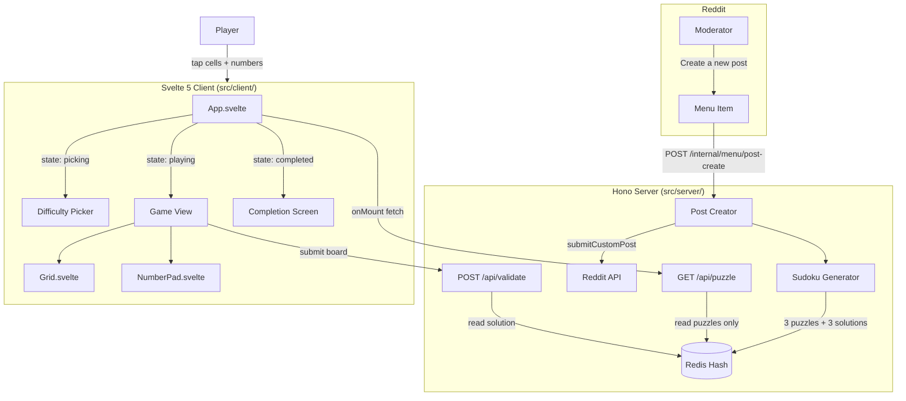

# Design Document: Sudoku Game

## Overview

This design describes a Sudoku puzzle game embedded in Reddit posts via the Devvit platform. Each post contains three independently generated puzzles (easy, medium, hard), each with a guaranteed unique solution. The architecture follows the existing Devvit webview pattern: a Svelte 5 client running in a sandboxed iframe communicates with a Hono server that manages puzzle generation, Redis storage, and server-side validation.

The core flow is:
1. A moderator creates a post, triggering server-side generation of three puzzles
2. Players open the post, pick a difficulty, and solve the grid via tap input
3. On completion, the client submits the board for server-side validation

Key design decisions:
- **Independent solutions per difficulty**: Prevents answer leakage across difficulty levels. A player who completes Easy cannot infer Hard answers.
- **Server-side validation**: The client never receives solutions. Validation happens via POST to `/api/validate`, comparing the submitted board against the stored solution string.
- **81-character board strings**: Compact, serializable representation. Each character maps to `row = floor(i/9)`, `col = i % 9`. Zero means blank.
- **Uniqueness guarantee via counting solver**: During hole-punching, a counting solver (capped at 2) ensures every puzzle has exactly one solution.

## Architecture



### Data Flow

1. **Post creation**: `Menu click → POST /internal/menu/post-create → generateSolution() ×3 → punchHoles() ×3 → redis.hSet() → reddit.submitCustomPost() → navigateTo URL`
2. **Puzzle loading**: `Client mount → GET /api/puzzle → redis.hMGet(puzzles only) → { easy, medium, hard } board strings`
3. **Gameplay**: Entirely client-side. Cell selection, number placement, conflict detection, and completion checks run in the Svelte app with no server calls.
4. **Validation**: `All cells filled + no conflicts → POST /api/validate { board, difficulty } → compare against stored solution → { valid: true/false }`

## Components and Interfaces

### Server Components

#### `src/server/lib/sudoku.ts` — Pure Generation Engine

All functions are pure (except `generateSolution` which uses `Math.random` for shuffling). No Devvit imports.

```typescript
// Types
type Board = number[][]  // 9×9 grid, 0 = empty

// Public API
const generateSolution = (): Board
const punchHoles = (solution: Board, cellsToRemove: number): Board
const boardToString = (board: Board): string
const stringToBoard = (str: string): Board

// Internal helpers
const isValid = (board: Board, row: number, col: number, num: number): boolean
const solve = (board: Board): boolean  // mutates board in place
const countSolutions = (board: Board, limit?: number): number
const fillDiagonalBoxes = (board: Board): void
const shuffled = (arr: number[]): number[]
```

#### `src/server/post.ts` — Post Creation

```typescript
import { context, redis, reddit } from '@devvit/web/server'
import { generateSolution, punchHoles, boardToString } from './lib/sudoku'

const CELLS_TO_REMOVE = { easy: 35, medium: 45, hard: 54 } as const

const createPost = async (): Promise<{ id: string }>
```

Generates three independent puzzles, stores all six board strings + timestamp in Redis, submits the custom post.

#### `src/server/index.ts` — Hono Routes

| Route | Method | Purpose |
|-------|--------|---------|
| `/internal/menu/post-create` | POST | Generate puzzles, store, create post |
| `/internal/on-app-install` | POST | Same as post-create (first post on install) |
| `/api/puzzle` | GET | Return three puzzle strings (no solutions) |
| `/api/validate` | POST | Compare submitted board against stored solution |

Request/response shapes:

```typescript
// GET /api/puzzle response
type PuzzleResponse = {
  status: 'success'
  data: { easy: string; medium: string; hard: string }
}

// POST /api/validate request
type ValidateRequest = {
  board: string        // 81-char string
  difficulty: 'easy' | 'medium' | 'hard'
}

// POST /api/validate response
type ValidateResponse = {
  status: 'success'
  data: { valid: boolean }
}
```

Input validation for `/api/validate`:
- Parse body with `.catch(() => null)`, reject if null
- `board` must be a string of exactly 81 characters, each matching `/^[0-9]$/`
- `difficulty` must be one of `['easy', 'medium', 'hard']`
- `postId` sourced from `context.postId`, never from request body

### Client Components

#### `src/client/lib/types.ts` — Shared Client Types

```typescript
type Difficulty = 'easy' | 'medium' | 'hard'
type GameScreen = 'picking' | 'playing' | 'completed'

type CellState = {
  value: number       // 0 = empty, 1-9 = digit
  isGiven: boolean    // true = original puzzle cell, not editable
  hasConflict: boolean // true = conflicts with row/col/box
}
```

#### `src/client/lib/sudoku-utils.ts` — Client Game Logic

```typescript
const parseBoard = (boardStr: string): CellState[][]
const boardToString = (board: CellState[][]): string
const hasConflict = (board: CellState[][], row: number, col: number): boolean
const isComplete = (board: CellState[][]): boolean
const updateConflicts = (board: CellState[][]): CellState[][]
```

- `parseBoard`: Converts 81-char string to 9×9 `CellState[][]`. Non-zero cells get `isGiven: true`.
- `hasConflict`: Checks row, column, and 3×3 box for duplicate non-zero values. Same logic as server-side `isValid` but adapted for `CellState`.
- `isComplete`: Returns true when all 81 cells are non-zero and no cell has `hasConflict: true`.
- `updateConflicts`: Recalculates `hasConflict` for every cell. Called after each number placement.

#### `src/client/App.svelte` — Root State Machine

```
States: 'picking' → 'playing' → 'completed'
                       ↑              │
                       └──────────────┘ (play again)
```

- On mount: fetches `/api/puzzle`, stores three board strings
- `picking`: Shows three difficulty buttons. On select → parse board → transition to `playing`
- `playing`: Renders Grid + NumberPad. Tracks selected cell, current board state. On completion → POST `/api/validate` → transition to `completed` or show error
- `completed`: Success message + "Try another difficulty" button → back to `picking`

#### `src/client/components/Grid.svelte`

Props:
```typescript
type GridProps = {
  board: CellState[][]
  selectedRow: number | null
  selectedCol: number | null
  onCellSelect: (row: number, col: number) => void
}
```

- 9×9 CSS grid with thicker borders at 3×3 box boundaries
- Cell styling: given cells get `font-semibold` + muted background, user cells are editable
- Selected cell gets highlight ring
- Conflict cells get red text/background
- Minimum 36×36px cells → ~324px grid width, fits within 512px height with room for NumberPad
- Light/dark mode via Tailwind `dark:` variants

#### `src/client/components/NumberPad.svelte`

Props:
```typescript
type NumberPadProps = {
  onNumber: (num: number) => void
  onErase: () => void
}
```

- Row of buttons: 1-9 + erase (✕)
- Minimum 44px touch targets
- Disabled state when no cell is selected

## Data Models

### Redis Schema

```
Key:    puzzle:{postId}
Type:   Hash

Fields:
  easy:solution      → "534678912672195348198342567..."   (81 chars)
  easy:puzzle        → "530070000600195000098000060..."   (81 chars)
  medium:solution    → "271459386845362179963817254..."   (81 chars)
  medium:puzzle      → "200050000800300100060000050..."   (81 chars)
  hard:solution      → "896215347312748965754963128..."   (81 chars)
  hard:puzzle        → "800000000000700900000060000..."   (81 chars)
  createdAt          → "1740902400000"                    (Date.now())
```

Storage: ~510 bytes per post. At Devvit's 500MB Redis cap: ~1M posts per subreddit.

### Board String Format

An 81-character string where:
- Each character is a digit `0`–`9`
- `0` represents an empty/blank cell
- Index `i` maps to row `Math.floor(i / 9)`, column `i % 9`
- Encoding: `board.flat().join("")`
- Decoding: split into chars, map to numbers, chunk into 9 rows of 9

### Difficulty Configuration

| Difficulty | Cells Removed | Givens Remaining |
|-----------|--------------|-----------------|
| Easy       | 35            | 46               |
| Medium     | 45            | 36               |
| Hard       | 54            | 27               |

### Client State Model

```typescript
// App-level state
{
  screen: GameScreen              // 'picking' | 'playing' | 'completed'
  puzzles: Record<Difficulty, string> | null  // raw board strings from API
  difficulty: Difficulty | null    // selected difficulty
  board: CellState[][] | null     // current game board (9×9)
  selectedRow: number | null
  selectedCol: number | null
  loading: boolean
  error: string | null
}
```


## Correctness Properties

*A property is a characteristic or behavior that should hold true across all valid executions of a system — essentially, a formal statement about what the system should do. Properties serve as the bridge between human-readable specifications and machine-verifiable correctness guarantees.*

### Property 1: Generated solutions are valid Sudoku boards

*For any* generated solution board, every row must contain the digits 1–9 exactly once, every column must contain the digits 1–9 exactly once, and every 3×3 box must contain the digits 1–9 exactly once.

**Validates: Requirements 1.1, 1.2, 1.3**

### Property 2: Three solutions per post are distinct

*For any* set of three solutions generated for a single post (one per difficulty), no two solutions shall be identical.

**Validates: Requirements 1.5**

### Property 3: Puzzle given counts match difficulty specification

*For any* generated puzzle at a given difficulty, the number of non-zero cells (givens) shall be at most the expected count for that difficulty (easy: 46, medium: 36, hard: 27), and the puzzle shall contain at least 17 givens (the minimum for a unique-solution Sudoku).

**Validates: Requirements 2.1, 2.2, 2.3**

### Property 4: Generated puzzles have exactly one solution

*For any* generated puzzle board, running a counting solver shall find exactly one solution.

**Validates: Requirements 2.4**

### Property 5: Validation returns true if and only if board matches solution

*For any* solution string and submitted board string, the validation endpoint shall return `{ valid: true }` when the board equals the solution, and `{ valid: false }` when the board differs from the solution in at least one cell.

**Validates: Requirements 5.1, 5.2, 5.3**

### Property 6: Board string serialization round-trip

*For any* valid 9×9 board (array of 9 rows of 9 digits 0–9), converting to an 81-character board string and back to a 9×9 board shall produce an equivalent board.

**Validates: Requirements 13.1, 13.2, 13.3**

### Property 7: Conflict detection correctness

*For any* board state and any cell at position (row, col) with a non-zero value, `hasConflict` shall return true if and only if another non-zero cell in the same row, column, or 3×3 box has the same value. When the conflicting value is removed or changed to eliminate the duplicate, `hasConflict` shall return false for the affected cells.

**Validates: Requirements 10.1, 10.2, 10.3, 10.4**

### Property 8: Given cells are immutable

*For any* board parsed from a puzzle string, and any input action (digit placement or erase) targeting a cell where `isGiven` is true, the cell's value shall remain unchanged after the action.

**Validates: Requirements 9.2, 9.3, 9.4**

### Property 9: Completion detection

*For any* board state, `isComplete` shall return true if and only if all 81 cells have a non-zero value and no cell has `hasConflict` set to true.

**Validates: Requirements 11.1**

## Error Handling

### Server-Side Errors

| Scenario | Handler | Response |
|----------|---------|----------|
| Puzzle generation fails | `POST /internal/menu/post-create` | `{ status: 'error', message: 'Failed to generate puzzle' }` with 400 |
| Redis read fails for puzzle | `GET /api/puzzle` | `{ status: 'error', message: 'Puzzle not found' }` with 400 |
| Missing `postId` in context | `GET /api/puzzle`, `POST /api/validate` | `{ status: 'error', message: 'Must be in a post context' }` with 400 |
| Invalid request body | `POST /api/validate` | `{ status: 'error', message: 'Invalid input' }` with 400 |
| Board string wrong length | `POST /api/validate` | `{ status: 'error', message: 'Invalid input' }` with 400 |
| Invalid difficulty value | `POST /api/validate` | `{ status: 'error', message: 'Invalid input' }` with 400 |
| Solution not found in Redis | `POST /api/validate` | `{ status: 'error', message: 'Solution not found' }` with 400 |
| `subredditName` missing | `createPost()` | Throws `Error('subredditName is required')` |

### Client-Side Errors

| Scenario | Handling |
|----------|----------|
| `/api/puzzle` fetch fails | Show error message on difficulty picker screen, allow retry |
| `/api/puzzle` returns error status | Display `json.message` in error UI |
| `/api/validate` fetch fails | Show error toast, remain in playing state |
| `/api/validate` returns `{ valid: false }` | Show "Not quite right" message, remain in playing state |
| No cell selected when number tapped | Ignore the input (no-op) |

### Error Design Principles

- Fail fast with descriptive messages — never silently swallow
- All server handlers wrapped in try/catch with `instanceof Error` narrowing
- Request body parsed with `.catch(() => null)` — malformed JSON returns 400
- Client always checks `res.ok` and `json.status` before accessing data
- Loading and error states handled in every data-fetching component

## Testing Strategy

### Test-Driven Development (TDD)

All implementation follows strict TDD: write a failing test first (Red), write minimal code to pass (Green), then refactor while keeping tests green. No implementation code is written without a corresponding failing test.

### Test Infrastructure

- **Runner**: Vitest (`bun run test` for single run, `bun run test:watch` for dev)
- **Server integration**: `@devvit/test` with `createDevvitTest()` — provides per-test isolated Devvit backend with in-memory Redis, Reddit API mocks, and context fixtures
- **Property-based testing**: `fast-check` for universal correctness properties
- **Test file pattern**: `src/**/__tests__/**/*.test.ts` (per `vitest.config.ts`)
- **Checkpoint gate**: `bun run test && bun run type-check` must pass before each checkpoint

### Testing Layers

| Layer | Test approach | Mocking |
|-------|--------------|---------|
| `src/server/lib/**/*.ts` | Unit tests + property tests | None (pure functions) |
| `src/server/**/*.ts` (routes) | Integration tests via `app.request()` | `createDevvitTest()` for Redis; `vi.spyOn` for `reddit.submitCustomPost` |
| `src/server/post.ts` | Integration test | `createDevvitTest()` for Redis; `vi.spyOn` for Reddit API |
| `src/client/lib/**/*.ts` | Unit tests + property tests | None (pure functions) |
| `src/client/**/*.svelte` | Svelte autofixer only | Skip test files |

### Property-Based Testing Configuration

- **Library**: `fast-check`
- **Minimum iterations**: 100 per property test
- **Each property test must reference its design property** with a tag comment:
  ```
  // Feature: sudoku-game, Property 1: Generated solutions are valid Sudoku boards
  ```
- **Each correctness property is implemented by a single property-based test**

### Property Test Plan

| Property | Module Under Test | Generator Strategy |
|----------|------------------|-------------------|
| P1: Valid solutions | `sudoku.ts` → `generateSolution` | Generate N solutions, verify row/col/box constraints |
| P2: Distinct solutions | `sudoku.ts` → `generateSolution` | Generate pairs of solutions, verify inequality |
| P3: Given counts | `sudoku.ts` → `punchHoles` | Generate solution + punch holes at each difficulty, count givens |
| P4: Unique solution | `sudoku.ts` → `punchHoles` | Generate puzzle, run `countSolutions`, verify == 1 |
| P5: Validation correctness | `/api/validate` logic | Generate random solution strings, test match/mismatch |
| P6: Board round-trip | `sudoku-utils.ts` / `sudoku.ts` | Generate random 9×9 boards of digits 0-9, round-trip through string conversion |
| P7: Conflict detection | `sudoku-utils.ts` → `hasConflict` | Generate random boards with known duplicates, verify detection |
| P8: Given immutability | `sudoku-utils.ts` → `parseBoard` + placement logic | Generate puzzle strings, attempt modifications on given cells |
| P9: Completion detection | `sudoku-utils.ts` → `isComplete` | Generate boards in various states (complete/incomplete/conflicting) |

### Unit Test Plan

| Area | Tests |
|------|-------|
| `isValid` | Specific board positions with known conflicts and valid placements |
| `solve` | Known solvable and unsolvable partial boards |
| `boardToString` / `stringToBoard` | Empty board, full board, specific index mapping |
| API `/api/puzzle` | Response shape, missing puzzle data error, missing postId |
| API `/api/validate` | Missing fields → 400, invalid difficulty → 400, correct/incorrect boards |
| `parseBoard` | 81-char string → correct `CellState[][]` with `isGiven` flags |
| Post creation | Integration: generates 3 puzzles, stores in Redis, returns URL (uses `createDevvitTest()`) |
| Client state transitions | picking → playing → completed flow |

### Test File Structure

```
src/
├── server/
│   ├── __tests__/
│   │   ├── api.test.ts              # Integration tests for API routes (createDevvitTest)
│   │   ├── api.property.test.ts     # Property test P5
│   │   └── post.test.ts             # Post creation integration test (createDevvitTest)
│   └── lib/
│       └── __tests__/
│           ├── sudoku.test.ts           # Unit tests for generation engine
│           └── sudoku.property.test.ts  # Property tests P1-P4
└── client/
    └── lib/
        └── __tests__/
            ├── sudoku-utils.test.ts          # Unit tests for client utils
            └── sudoku-utils.property.test.ts # Property tests P6-P9
```

### TDD Workflow Per Task

Each implementation task follows this order:
1. Create the `__tests__/*.test.ts` file with failing tests describing expected behavior
2. Write the minimal implementation code to make tests pass
3. Refactor while keeping tests green
4. Run `bun run test` to confirm zero failures before moving on
