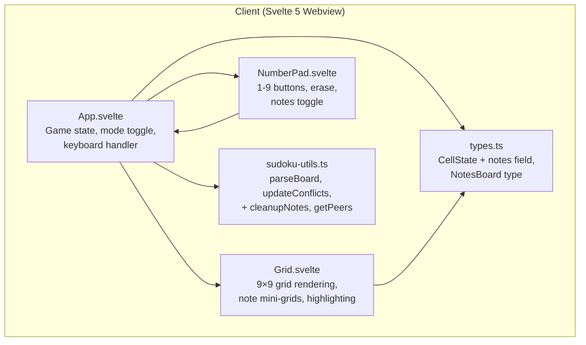
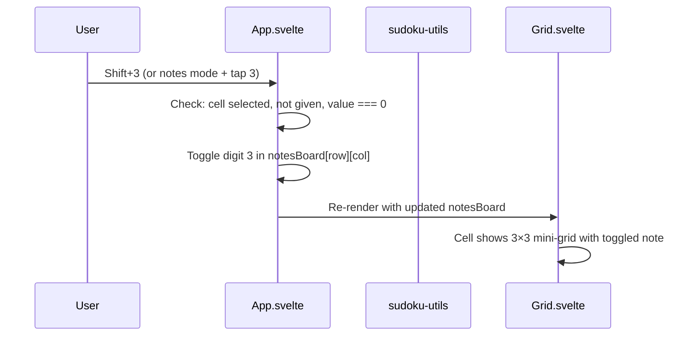
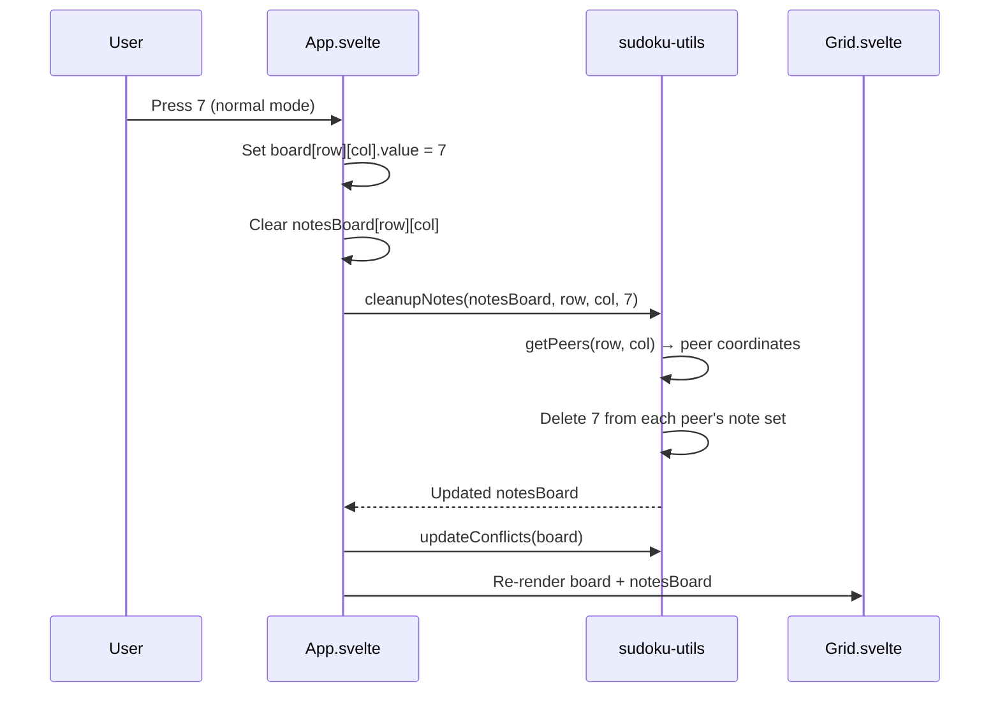
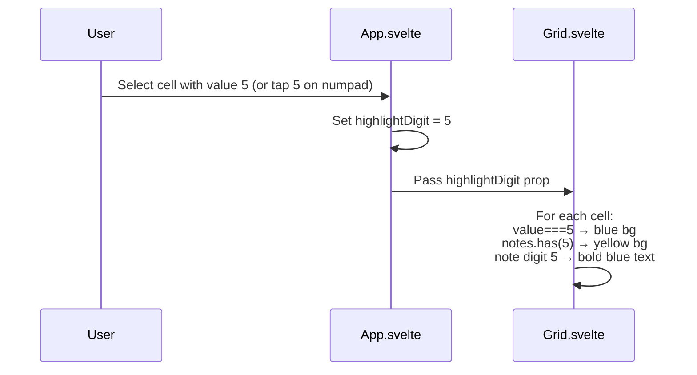

# Design Document: Sudoku Notes (Pencil Marks)

## Overview

This feature adds pencil mark (notes) support to the Sudoku puzzle app, allowing players to annotate empty cells with candidate digits. Notes are displayed as a 3×3 mini-grid inside each cell, toggled via a dedicated button or Shift+number keyboard shortcut. When a digit is placed as a value, auto-cleanup removes that digit from notes in all peer cells (same row, column, and 3×3 box). Highlighting is extended so selecting a digit shows value matches (blue) and note matches (yellow) across the board.

Notes are client-only — stored in Svelte 5 reactive state with `SvelteSet<number>`, requiring no server persistence or API changes. The implementation touches the type system, utility functions, Grid component, NumberPad component, and App-level state/keyboard handling.

## Architecture



## Sequence Diagrams

### Toggle Note on a Cell



### Place Digit with Auto-Cleanup



### Highlight Matching Notes



## Components and Interfaces

### Type Changes: `CellState` (unchanged) + `NotesBoard`

Notes are stored in a parallel data structure rather than modifying `CellState`. This avoids breaking existing serialization (`boardToString`/`parseBoard`) and keeps the board model clean.

```typescript
// src/client/lib/types.ts — existing, unchanged
type CellState = {
    value: number
    isGiven: boolean
    hasConflict: boolean
}

// New type for the notes layer
type NotesBoard = SvelteSet<number>[][]
```

**Rationale**: A separate `NotesBoard` keeps notes decoupled from the puzzle board. `SvelteSet<number>` provides Svelte 5 fine-grained reactivity — mutations to the set automatically trigger re-renders without needing to clone arrays.

### Component: Grid.svelte (modified)

**New props**:
```typescript
{
    board: CellState[][]
    notesBoard: NotesBoard
    selectedRow: number | null
    selectedCol: number | null
    highlightDigit: number | null
    onCellSelect: (row: number, col: number) => void
}
```

**Responsibilities**:
- Render cell value OR 3×3 note mini-grid (never both — value takes precedence)
- Apply highlight classes based on `highlightDigit`:
  - `bg-blue-100 dark:bg-blue-900/30` for cells whose value matches
  - `bg-yellow-100 dark:bg-yellow-900/30` for cells with the digit in notes
  - `text-blue-600 font-bold` for the specific note digit that matches
- Scale note font size responsively: `text-[0.5rem] sm:text-[0.6rem]`

### Component: NumberPad.svelte (modified)

**New props**:
```typescript
{
    onNumber: (num: number) => void
    onErase: () => void
    notesMode: boolean
    onToggleNotes: () => void
}
```

**Responsibilities**:
- Render notes toggle button (pencil icon ✏️) with active/inactive visual state
- Pass through number/erase events (App decides behavior based on mode)

### Component: App.svelte (modified)

**New state**:
```typescript
let notesMode: boolean = $state(false)
let notesBoard: NotesBoard = $state(createEmptyNotesBoard())
let highlightDigit: number | null = $state(null)
```

**Responsibilities**:
- Toggle `notesMode` on button press
- Route number input to either `handleNumber` (value) or `handleNote` (toggle note) based on mode
- Handle Shift+digit shortcut to toggle note regardless of mode
- Call `cleanupNotes` after placing a value
- Clear `notesBoard[row][col]` when placing a value in that cell
- Derive `highlightDigit` from selected cell's value (or null if empty/no selection)
- Reset `notesBoard` and `notesMode` when starting a new puzzle

## Data Models

### NotesBoard Initialization

```typescript
// src/client/lib/notes-utils.ts
const createEmptyNotesBoard = (): NotesBoard =>
    Array.from({ length: 9 }, () =>
        Array.from({ length: 9 }, () => new SvelteSet<number>())
    )
```

**Validation Rules**:
- Each set contains only digits 1–9
- Notes are only meaningful on cells where `board[r][c].value === 0` and `!board[r][c].isGiven`
- Placing a value clears that cell's notes and triggers peer cleanup

### Peer Calculation

```typescript
// src/client/lib/notes-utils.ts
type CellCoord = readonly [row: number, col: number]

const getPeers = (row: number, col: number): CellCoord[] => {
    // Returns all cells sharing row, column, or 3×3 box (excluding self)
}
```

## Algorithmic Pseudocode

### Toggle Note Algorithm

```typescript
// Toggle a digit in a cell's note set
// Precondition: cell is selected, not given, value === 0
// Postcondition: digit is added if absent, removed if present
const toggleNote = (notesBoard: NotesBoard, row: number, col: number, digit: number): void => {
    const notes = notesBoard[row]![col]!
    if (notes.has(digit)) {
        notes.delete(digit)
    } else {
        notes.add(digit)
    }
}
```

**Preconditions**:
- `0 ≤ row ≤ 8`, `0 ≤ col ≤ 8`, `1 ≤ digit ≤ 9`
- Cell at (row, col) is not a given and has value 0

**Postconditions**:
- `notes.has(digit)` is toggled (XOR semantics)
- No other cells' notes are modified

### Auto-Cleanup Algorithm

```typescript
// Remove a digit from notes of all peer cells after placing a value
// Precondition: digit was just placed at (row, col)
// Postcondition: no peer cell contains digit in its notes
const cleanupNotes = (notesBoard: NotesBoard, row: number, col: number, digit: number): void => {
    const peers = getPeers(row, col)
    for (const [r, c] of peers) {
        notesBoard[r]![c]!.delete(digit)
    }
}
```

**Preconditions**:
- `digit` is 1–9 and was just placed as a value at (row, col)
- `notesBoard` is a valid 9×9 grid of `SvelteSet<number>`

**Postconditions**:
- For every cell (r, c) that shares a row, column, or 3×3 box with (row, col): `notesBoard[r][c].has(digit) === false`
- Notes of non-peer cells are unchanged
- The placed cell's own notes should be cleared separately before calling this

**Loop Invariant**:
- After processing k peers, all k peers no longer contain `digit` in their notes

### Get Peers Algorithm

```typescript
const getPeers = (row: number, col: number): CellCoord[] => {
    const peers: CellCoord[] = []
    // Row peers
    for (let c = 0; c < 9; c++) {
        if (c !== col) peers.push([row, c])
    }
    // Column peers
    for (let r = 0; r < 9; r++) {
        if (r !== row) peers.push([r, col])
    }
    // Box peers (excluding already-added row/col peers)
    const boxRow = Math.floor(row / 3) * 3
    const boxCol = Math.floor(col / 3) * 3
    for (let r = boxRow; r < boxRow + 3; r++) {
        for (let c = boxCol; c < boxCol + 3; c++) {
            if (r !== row && c !== col) peers.push([r, c])
        }
    }
    return peers
}
```

**Preconditions**:
- `0 ≤ row ≤ 8`, `0 ≤ col ≤ 8`

**Postconditions**:
- Returns exactly 20 unique peer coordinates (8 row + 8 col + 4 box-only)
- Self (row, col) is never included
- No duplicates in the returned array


### Highlight Digit Derivation

```typescript
// Derived from selected cell — no function needed, use $derived
// In App.svelte:
const highlightDigit: number | null = $derived(
    selectedRow !== null && selectedCol !== null
        ? board[selectedRow]![selectedCol]!.value || null
        : null
)
```

**Postconditions**:
- Returns the value of the selected cell if non-zero, otherwise null
- Reactively updates when selection or board changes

## Key Functions with Formal Specifications

### `createEmptyNotesBoard(): NotesBoard`

**Preconditions**: None

**Postconditions**:
- Returns a 9×9 array of empty `SvelteSet<number>` instances
- Each set is a distinct object (no shared references)

### `getPeers(row: number, col: number): CellCoord[]`

**Preconditions**: `0 ≤ row ≤ 8`, `0 ≤ col ≤ 8`

**Postconditions**:
- Returns exactly 20 unique coordinates
- Every coordinate shares row, column, or box with (row, col)
- (row, col) is not in the result

### `toggleNote(notesBoard: NotesBoard, row: number, col: number, digit: number): void`

**Preconditions**: `1 ≤ digit ≤ 9`, cell is not given, cell value is 0

**Postconditions**: `notesBoard[row][col].has(digit)` is flipped

### `cleanupNotes(notesBoard: NotesBoard, row: number, col: number, digit: number): void`

**Preconditions**: `1 ≤ digit ≤ 9`, digit was just placed at (row, col)

**Postconditions**: No peer of (row, col) has `digit` in its notes. Non-peers unchanged.

### `clearCellNotes(notesBoard: NotesBoard, row: number, col: number): void`

**Preconditions**: Valid row/col

**Postconditions**: `notesBoard[row][col].size === 0`

## Example Usage

```typescript
import { SvelteSet } from 'svelte/reactivity'

// --- Creating notes board ---
const notesBoard = createEmptyNotesBoard()

// --- Toggling a note ---
// User is in notes mode, cell (2, 3) is empty, they press 5
toggleNote(notesBoard, 2, 3, 5)
// notesBoard[2][3] is now SvelteSet { 5 }

toggleNote(notesBoard, 2, 3, 7)
// notesBoard[2][3] is now SvelteSet { 5, 7 }

toggleNote(notesBoard, 2, 3, 5)
// notesBoard[2][3] is now SvelteSet { 7 }  (toggled off)

// --- Placing a value triggers cleanup ---
// User places 7 at cell (2, 0) in normal mode
board[2]![0] = { ...board[2]![0]!, value: 7 }
clearCellNotes(notesBoard, 2, 0)        // clear placed cell's notes
cleanupNotes(notesBoard, 2, 0, 7)       // remove 7 from all peers
// notesBoard[2][3] is now SvelteSet { }  (7 removed — same row)

// --- Shift+number shortcut ---
// User presses Shift+4 regardless of notes mode
// App calls toggleNote(notesBoard, selectedRow, selectedCol, 4)

// --- Erasing a value does NOT restore notes ---
// Notes removed by auto-cleanup are gone permanently
```

## Correctness Properties

*A property is a characteristic or behavior that should hold true across all valid executions of a system — essentially, a formal statement about what the system should do. Properties serve as the bridge between human-readable specifications and machine-verifiable correctness guarantees.*

### Property 1: createEmptyNotesBoard produces independent sets

*For any* two distinct cell positions (r1, c1) and (r2, c2) in a Notes_Board created by `createEmptyNotesBoard`, mutating the set at (r1, c1) should not change the set at (r2, c2).

**Validates: Requirement 1.2**

### Property 2: toggleNote is self-inverse

*For any* valid Notes_Board, cell position (row, col), and digit 1–9, calling `toggleNote` twice with the same arguments should restore the cell's note set to its original state.

**Validates: Requirement 3.1**

### Property 3: toggleNote only modifies the targeted cell

*For any* valid Notes_Board, cell position (row, col), and digit 1–9, calling `toggleNote` should leave all other cells' note sets unchanged.

**Validates: Requirements 3.2, 1.2**

### Property 4: clearCellNotes empties the note set

*For any* valid Notes_Board and cell position (row, col) with any number of notes, calling `clearCellNotes` should result in an empty note set for that cell.

**Validates: Requirements 5.1, 9.1**

### Property 5: cleanupNotes removes digit from exactly peer cells

*For any* valid Notes_Board, cell position (row, col), and digit 1–9, after calling `cleanupNotes`, every Peer of (row, col) should not contain that digit in its notes, and every non-Peer cell's notes should remain unchanged.

**Validates: Requirements 5.2, 5.3**

### Property 6: getPeers returns exactly 20 unique coordinates

*For any* valid cell position (row, col) where 0 ≤ row ≤ 8 and 0 ≤ col ≤ 8, `getPeers` should return exactly 20 coordinates with no duplicates.

**Validates: Requirements 6.1, 6.4**

### Property 7: getPeers returns correct peer membership

*For any* valid cell position (row, col), `getPeers` should not include (row, col) itself, and every returned coordinate should share the same row, column, or 3×3 box as (row, col). Conversely, every cell sharing a row, column, or 3×3 box with (row, col) — excluding itself — should appear in the result.

**Validates: Requirements 6.2, 6.3**

### Property 8: Highlight digit derivation

*For any* board state and selected cell position, the Highlight_Digit should equal the selected cell's value when that value is non-zero, and should be null when no cell is selected or the selected cell's value is zero.

**Validates: Requirements 8.1, 8.2**

## Error Handling

### Attempting to Note a Given Cell

**Condition**: User tries to toggle a note on a cell where `isGiven === true`
**Response**: No-op — the action is silently ignored
**Recovery**: N/A — user can select a different cell

### Attempting to Note a Filled Cell

**Condition**: User tries to toggle a note on a cell where `value !== 0`
**Response**: No-op — notes are only for empty cells
**Recovery**: User can erase the value first, then add notes

### Erase in Notes Mode

**Condition**: User presses erase while in notes mode
**Response**: Clear all notes from the selected cell (not the value)
**Recovery**: N/A

### Erase in Normal Mode on Cell with Notes

**Condition**: User erases a cell's value — the cell may have had notes before a value was placed
**Response**: Value is set to 0. Notes are NOT restored (they were cleared when the value was placed).
**Recovery**: User can re-add notes manually

## Testing Strategy

### Unit Testing Approach

Test pure functions in `notes-utils.ts` with Vitest:
- `getPeers`: verify count (20), no self, no duplicates, correct peer membership
- `toggleNote`: verify add/remove/toggle semantics
- `cleanupNotes`: verify peer notes are cleaned, non-peer notes preserved
- `createEmptyNotesBoard`: verify dimensions and independence

### Property-Based Testing Approach

**Property Test Library**: fast-check (already in use)

Key properties to test:
- `getPeers` returns 20 unique non-self peers for any valid coordinate
- `toggleNote` is idempotent when called twice (self-inverse)
- `cleanupNotes` removes the digit from exactly the peer cells
- `cleanupNotes` is idempotent (calling twice has same effect as once)
- Round-trip: toggle on then toggle off restores original state

### Integration Testing Approach

Component-level behavior tested via the TDD workflow:
- Placing a value in normal mode triggers auto-cleanup
- Shift+number toggles note regardless of mode
- Notes mode toggle changes input routing
- Highlight digit derivation from selected cell
- New puzzle resets notesBoard

## Performance Considerations

- `getPeers` computes 20 coordinates per call — trivially fast, but could be memoized if called in hot loops. For this feature it's called once per digit placement, so no memoization needed.
- `SvelteSet` mutations trigger fine-grained reactivity — only cells whose notes actually change will re-render.
- The 3×3 CSS grid inside each cell adds 9 DOM elements per empty cell (up to ~729 extra elements for a fully empty board). This is well within browser rendering budgets.
- Note font scaling uses Tailwind responsive classes — no JS layout calculations needed.

## Security Considerations

No security implications — notes are purely client-side UI state with no server communication, no user input validation beyond digit range (1–9), and no persistence.

## Dependencies

- `svelte/reactivity` — `SvelteSet` for reactive note sets (already available in Svelte 5)
- `fast-check` — property-based testing (already installed)
- No new packages required
