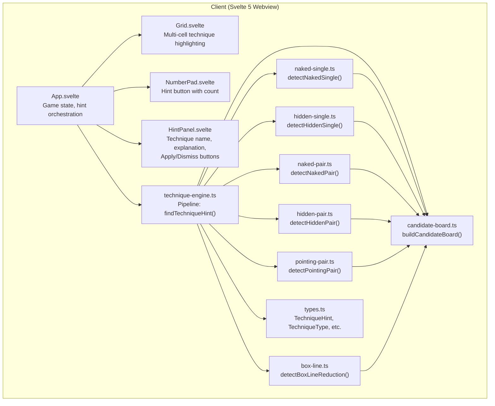
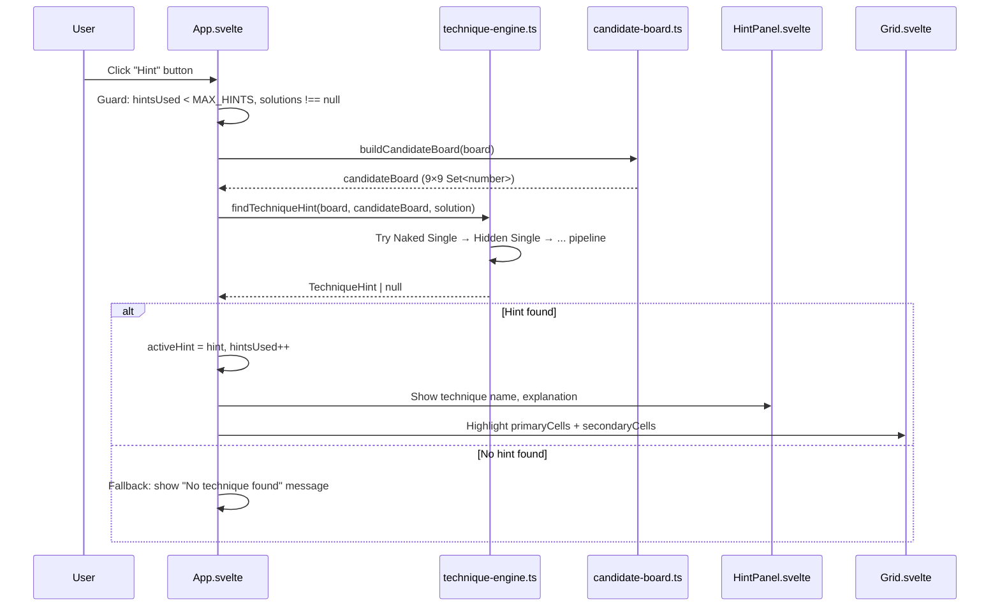
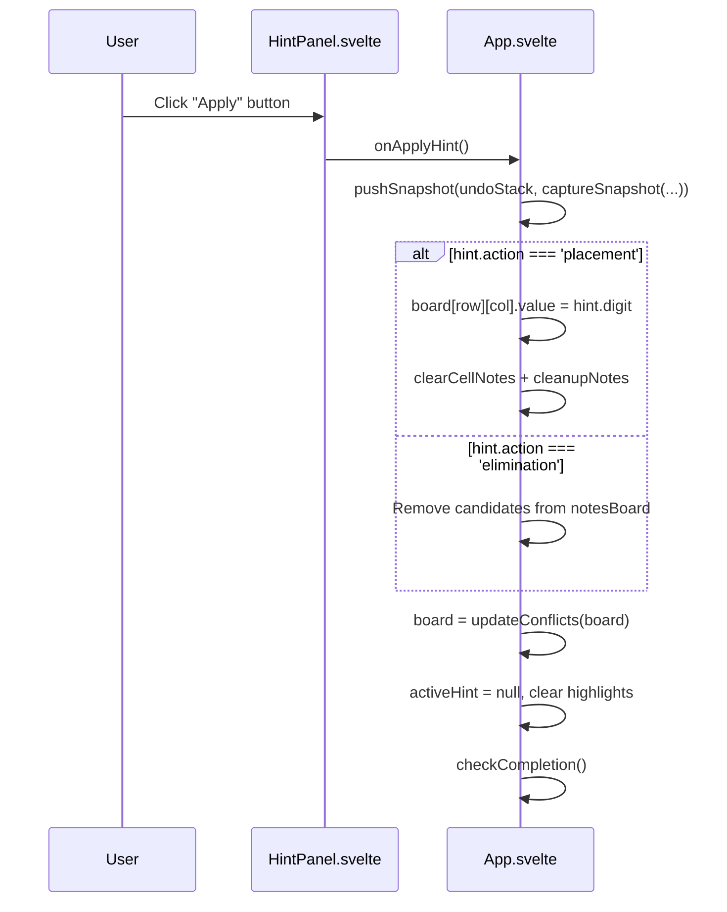
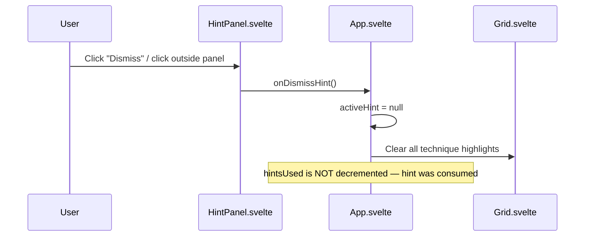

# Design Document: Technique-Based Hint System

## Overview

This feature replaces the current hint system — which auto-fills the correct value — with a technique-based hint system that teaches players Sudoku solving techniques. Instead of revealing an answer, a hint now identifies the easiest applicable technique on the current board, explains it, highlights the relevant cells, and lets the player optionally apply it.

The system implements a client-side technique detection engine as pure functions. Each technique detector scans the board and candidate state, returning a structured hint describing the technique name, an explanation, the affected cells, and the action to take (place a digit or eliminate candidates). A priority-ordered pipeline tries techniques from simplest to most advanced, returning the first match.

The UI changes from a brief amber flash on a single cell to a hint panel/modal that shows the technique name, a human-readable explanation, highlighted cells on the grid (primary and secondary highlights), and an "Apply" button. The existing hint count cap (MAX_HINTS = 3) is preserved. Undo integration is maintained — applying a hint pushes a snapshot.

## Architecture



### Key Design Decisions

- **Client-side technique detection.** Unlike the reference app (grantm/sudoku-web-app) which relies on a server-side solver, all technique detection runs as pure functions in the browser. This avoids network latency and keeps the architecture simple.
- **Candidate board as foundation.** A `CandidateBoard` (9×9 grid of `Set<number>`) is computed from the current board state. All technique detectors operate on this shared structure rather than recomputing candidates independently.
- **Priority pipeline.** Techniques are tried in order of difficulty: Naked Single → Hidden Single → Naked Pair → Hidden Pair → Pointing Pair → Box/Line Reduction. The first match wins. This ensures the player gets the simplest applicable hint.
- **Two action types.** A hint either places a digit (`placement`) or eliminates candidates (`elimination`). The UI and apply logic branch on this.
- **Notes required for advanced techniques.** Naked/Hidden Pairs and Pointing/Box-Line techniques only work when the player has notes filled in. If no notes exist, the system falls back to singles detection using the computed candidate board.
- **Hint panel replaces auto-fill.** Instead of immediately placing a value, the hint shows a panel with explanation. The player chooses to apply or dismiss. This is the core UX shift.
- **Multi-cell highlighting.** The grid now supports `primaryCells` (the cell(s) where the action happens) and `secondaryCells` (related cells that explain the technique) for richer visual feedback.
- **Backward-compatible undo.** Applying a technique hint pushes a snapshot to the undo stack, same as before. The snapshot now also captures the notes state.

## Sequence Diagrams

### Player Requests a Technique Hint



### Player Applies a Technique Hint



### Player Dismisses a Technique Hint



## Components and Interfaces

### New: `src/client/lib/technique-hints/candidate-board.ts`

**Purpose**: Build a candidate board from the current game state. Foundation for all technique detectors.

```typescript
type CandidateBoard = ReadonlyArray<ReadonlyArray<ReadonlySet<number>>>

const buildCandidateBoard = (board: CellState[][]): CandidateBoard
```

**Responsibilities**:
- For each empty cell, compute the set of digits 1–9 not present in its row, column, or box peers
- For filled/given cells, return an empty set
- Pure function, no mutations

### New: `src/client/lib/technique-hints/naked-single.ts`

**Purpose**: Detect cells where only one candidate remains.

```typescript
const detectNakedSingle = (
    board: CellState[][],
    candidates: CandidateBoard,
    solution: number[]
): TechniqueHint | null
```

**Responsibilities**:
- Scan for cells with exactly one candidate
- Return the first match (lowest cell index) as a placement hint
- Verify the candidate matches the solution value

### New: `src/client/lib/technique-hints/hidden-single.ts`

**Purpose**: Detect digits that can only go in one cell within a unit (row/col/box).

```typescript
const detectHiddenSingle = (
    board: CellState[][],
    candidates: CandidateBoard,
    solution: number[]
): TechniqueHint | null
```

**Responsibilities**:
- For each unit (row, col, box), for each digit 1–9, count cells where that digit is a candidate
- If exactly one cell in a unit can hold a digit, that's a hidden single
- Return as a placement hint with explanation naming the unit

### New: `src/client/lib/technique-hints/naked-pair.ts`

**Purpose**: Detect two cells in a unit sharing exactly the same two candidates.

```typescript
const detectNakedPair = (
    board: CellState[][],
    candidates: CandidateBoard
): TechniqueHint | null
```

**Responsibilities**:
- For each unit, find pairs of cells with identical 2-candidate sets
- The elimination action removes those two digits from all other cells in the unit
- Return as an elimination hint

### New: `src/client/lib/technique-hints/hidden-pair.ts`

**Purpose**: Detect two digits that can only go in the same two cells within a unit.

```typescript
const detectHiddenPair = (
    board: CellState[][],
    candidates: CandidateBoard
): TechniqueHint | null
```

**Responsibilities**:
- For each unit, for each pair of digits, check if they appear as candidates in exactly the same two cells
- The elimination action removes all other candidates from those two cells
- Return as an elimination hint

### New: `src/client/lib/technique-hints/pointing-pair.ts`

**Purpose**: Detect candidates in a box restricted to one row/column.

```typescript
const detectPointingPair = (
    board: CellState[][],
    candidates: CandidateBoard
): TechniqueHint | null
```

**Responsibilities**:
- For each box, for each digit, check if all candidate cells for that digit lie in a single row or column
- The elimination action removes that digit from other cells in that row/column outside the box
- Return as an elimination hint

### New: `src/client/lib/technique-hints/box-line-reduction.ts`

**Purpose**: Detect candidates in a row/column restricted to one box.

```typescript
const detectBoxLineReduction = (
    board: CellState[][],
    candidates: CandidateBoard
): TechniqueHint | null
```

**Responsibilities**:
- For each row/column, for each digit, check if all candidate cells for that digit lie in a single box
- The elimination action removes that digit from other cells in that box outside the row/column
- Return as an elimination hint

### New: `src/client/lib/technique-hints/technique-engine.ts`

**Purpose**: Orchestrate the technique detection pipeline.

```typescript
const findTechniqueHint = (
    board: CellState[][],
    candidates: CandidateBoard,
    solution: number[]
): TechniqueHint | null
```

**Responsibilities**:
- Build the candidate board from current state
- Try each detector in priority order: Naked Single → Hidden Single → Naked Pair → Hidden Pair → Pointing Pair → Box/Line Reduction
- Return the first non-null result
- Return null if no technique is applicable

### New: `src/client/components/HintPanel.svelte`

**Purpose**: Display the active technique hint with explanation and action buttons.

```typescript
{
    hint: TechniqueHint
    onApply: () => void
    onDismiss: () => void
}
```

**Responsibilities**:
- Show technique name and difficulty rating (e.g., "Naked Single — Easy")
- Show human-readable explanation text
- Render "Apply" button to execute the technique
- Render "Dismiss" (×) button to close without applying
- Accessible: proper ARIA roles, focus management

### Modified: `src/client/components/Grid.svelte`

**New props**:
```typescript
{
    // existing props unchanged...
    hintCell: { row: number; col: number } | null  // REMOVED — replaced by:
    techniqueHighlight: TechniqueHighlight | null   // NEW
}
```

```typescript
type TechniqueHighlight = {
    primaryCells: ReadonlyArray<readonly [number, number]>
    secondaryCells: ReadonlyArray<readonly [number, number]>
}
```

**Responsibilities**:
- Apply a green/teal highlight to `primaryCells` (where the action happens)
- Apply a lighter blue/cyan highlight to `secondaryCells` (related context cells)
- Technique highlights take precedence over selection highlight but not conflict highlight
- When `techniqueHighlight` is null, no technique highlighting is applied

### Modified: `src/client/App.svelte`

**State changes**:
```typescript
// REMOVED
let hintCell: { row: number; col: number } | null = $state(null)

// ADDED
let activeHint: TechniqueHint | null = $state(null)

const techniqueHighlight = $derived(
    activeHint
        ? { primaryCells: activeHint.primaryCells, secondaryCells: activeHint.secondaryCells }
        : null
)
```

**New handlers**:
```typescript
const handleHint = (): void => {
    // Guard, build candidates, findTechniqueHint, set activeHint, increment hintsUsed
}

const handleApplyHint = (): void => {
    // Push undo snapshot, apply placement or elimination, clear activeHint
}

const handleDismissHint = (): void => {
    // Clear activeHint (hint count already consumed)
}
```

### Modified: `src/client/lib/types.ts`

**New types added**:
```typescript
type TechniqueType =
    | 'naked-single'
    | 'hidden-single'
    | 'naked-pair'
    | 'hidden-pair'
    | 'pointing-pair'
    | 'box-line-reduction'

type TechniqueDifficulty = 'easy' | 'medium' | 'hard'

type TechniqueAction = 'placement' | 'elimination'

type TechniqueHint = {
    technique: TechniqueType
    difficulty: TechniqueDifficulty
    title: string
    description: string
    primaryCells: ReadonlyArray<readonly [number, number]>
    secondaryCells: ReadonlyArray<readonly [number, number]>
    action: TechniqueAction
    digit: number
    eliminations?: ReadonlyArray<{ row: number; col: number; digits: number[] }>
}

type CandidateBoard = ReadonlyArray<ReadonlyArray<ReadonlySet<number>>>
```

## Data Models

### `TechniqueHint`

| Field | Type | Description |
|-------|------|-------------|
| `technique` | `TechniqueType` | Identifier for the technique (e.g., `'naked-single'`) |
| `difficulty` | `TechniqueDifficulty` | `'easy'` / `'medium'` / `'hard'` |
| `title` | `string` | Human-readable title (e.g., "Naked Single in R3C5") |
| `description` | `string` | Explanation of why the technique works |
| `primaryCells` | `[number, number][]` | Cells where the action is applied |
| `secondaryCells` | `[number, number][]` | Related cells that explain the logic |
| `action` | `TechniqueAction` | `'placement'` or `'elimination'` |
| `digit` | `number` | The digit being placed or involved in elimination |
| `eliminations` | `{ row, col, digits }[]` | Optional: specific candidates to remove (for elimination actions) |

**Validation rules**:
- `primaryCells` is never empty
- `digit` is in range [1, 9]
- For `'placement'` action: `primaryCells` has exactly one entry, `eliminations` is undefined
- For `'elimination'` action: `eliminations` is non-empty, each entry has at least one digit

### `CandidateBoard`

A 9×9 grid where each cell contains a `ReadonlySet<number>` of valid candidates (digits 1–9 not conflicting with peers). Filled/given cells have an empty set.

**Validation rules**:
- Exactly 9 rows, each with exactly 9 columns
- Each set contains only digits in range [1, 9]
- Given/filled cells always have an empty set

### Technique Difficulty Mapping

| Technique | Difficulty | Priority |
|-----------|-----------|----------|
| Naked Single | easy | 1 (first) |
| Hidden Single | easy | 2 |
| Naked Pair | medium | 3 |
| Hidden Pair | medium | 4 |
| Pointing Pair | hard | 5 |
| Box/Line Reduction | hard | 6 (last) |

## Algorithmic Pseudocode

### buildCandidateBoard Algorithm

```typescript
const buildCandidateBoard = (board: CellState[][]): CandidateBoard => {
    // For each cell:
    //   if cell.value !== 0 → empty set
    //   else → digits 1–9 minus values in row, column, and box peers
    return board.map((row, r) =>
        row.map((cell, c) => {
            if (cell.value !== 0) return new Set<number>()
            const used = collectPeerValues(board, r, c)
            return new Set(
                [1, 2, 3, 4, 5, 6, 7, 8, 9].filter(d => !used.has(d))
            )
        })
    )
}
```

**Preconditions**:
- `board` is a valid 9×9 `CellState` grid

**Postconditions**:
- Returns a 9×9 grid of `Set<number>`
- Filled cells have empty sets
- Empty cells have sets containing only valid candidates
- Pure function — no mutations

### findTechniqueHint Pipeline Algorithm

```typescript
const findTechniqueHint = (
    board: CellState[][],
    candidates: CandidateBoard,
    solution: number[]
): TechniqueHint | null => {
    // Try detectors in priority order
    const detectors = [
        () => detectNakedSingle(board, candidates, solution),
        () => detectHiddenSingle(board, candidates, solution),
        () => detectNakedPair(board, candidates),
        () => detectHiddenPair(board, candidates),
        () => detectPointingPair(board, candidates),
        () => detectBoxLineReduction(board, candidates),
    ]
    for (const detect of detectors) {
        const hint = detect()
        if (hint !== null) return hint
    }
    return null
}
```

**Preconditions**:
- `board` is a valid 9×9 grid
- `candidates` matches the current board state
- `solution` is a flat 81-element array with values 1–9

**Postconditions**:
- Returns the first applicable technique hint, or null if none found
- The returned hint's `primaryCells` all reference valid board positions
- Pure function — no mutations

**Loop Invariant**:
- After checking detector k, no detector with index < k returned a non-null result

### detectNakedSingle Algorithm

```typescript
const detectNakedSingle = (
    board: CellState[][],
    candidates: CandidateBoard,
    solution: number[]
): TechniqueHint | null => {
    // Scan cells in row-major order
    // Find first cell where candidates.size === 1
    // Verify the single candidate matches solution[row * 9 + col]
    // Return placement hint with:
    //   primaryCells: [[row, col]]
    //   secondaryCells: all peers that eliminate other digits
    //   description: "R{r+1}C{c+1} can only be {digit} — all other digits
    //                 are eliminated by cells in its row, column, and box."
}
```

**Preconditions**:
- `candidates` is consistent with `board`

**Postconditions**:
- Returns null if no cell has exactly one candidate
- If non-null: `hint.digit` equals the sole candidate and matches `solution[row * 9 + col]`
- `hint.action === 'placement'`

### detectHiddenSingle Algorithm

```typescript
const detectHiddenSingle = (
    board: CellState[][],
    candidates: CandidateBoard,
    solution: number[]
): TechniqueHint | null => {
    // For each unit (rows 0–8, cols 0–8, boxes 0–8):
    //   For each digit 1–9:
    //     Collect cells in the unit where digit is a candidate
    //     If exactly one cell → hidden single found
    //     Verify digit matches solution
    //     Return placement hint with:
    //       primaryCells: [[row, col]]
    //       secondaryCells: other cells in the unit (showing digit is excluded)
    //       description: "{digit} can only go in R{r+1}C{c+1} within {unitName}"
    // Try rows first, then columns, then boxes (deterministic order)
}
```

**Preconditions**:
- `candidates` is consistent with `board`

**Postconditions**:
- Returns null if no digit is restricted to a single cell in any unit
- If non-null: `hint.digit` matches `solution[row * 9 + col]`
- `hint.action === 'placement'`

### detectNakedPair Algorithm

```typescript
const detectNakedPair = (
    board: CellState[][],
    candidates: CandidateBoard
): TechniqueHint | null => {
    // For each unit (row, col, box):
    //   Collect cells with exactly 2 candidates
    //   For each pair of such cells:
    //     If they share the exact same 2-candidate set:
    //       Find other cells in the unit that contain either candidate
    //       If any such cells exist → elimination is possible
    //       Return elimination hint with:
    //         primaryCells: the two naked-pair cells
    //         secondaryCells: cells losing candidates
    //         eliminations: [{row, col, digits: [d1, d2]}] for affected cells
    //         description: "R{r1}C{c1} and R{r2}C{c2} form a naked pair {d1,d2}
    //                       in {unitName}. Remove {d1,d2} from other cells."
}
```

**Preconditions**:
- `candidates` is consistent with `board`

**Postconditions**:
- Returns null if no naked pair with useful eliminations exists
- If non-null: `hint.action === 'elimination'`, `hint.eliminations` is non-empty
- `primaryCells` contains exactly 2 entries

### detectHiddenPair Algorithm

```typescript
const detectHiddenPair = (
    board: CellState[][],
    candidates: CandidateBoard
): TechniqueHint | null => {
    // For each unit:
    //   For each pair of digits (d1, d2) where both appear as candidates:
    //     Collect cells where d1 or d2 is a candidate
    //     If exactly 2 cells contain both d1 and d2, and no other cells do:
    //       Check if those 2 cells have additional candidates beyond d1, d2
    //       If yes → elimination is possible (remove extra candidates)
    //       Return elimination hint with:
    //         primaryCells: the two hidden-pair cells
    //         secondaryCells: [] (no external cells affected)
    //         eliminations: remove non-{d1,d2} candidates from the pair cells
    //         description: "{d1} and {d2} can only go in R{r1}C{c1} and R{r2}C{c2}
    //                       within {unitName}. Remove other candidates from these cells."
}
```

**Preconditions**:
- `candidates` is consistent with `board`

**Postconditions**:
- Returns null if no hidden pair with useful eliminations exists
- If non-null: `hint.action === 'elimination'`, `hint.eliminations` is non-empty
- `primaryCells` contains exactly 2 entries

### detectPointingPair Algorithm

```typescript
const detectPointingPair = (
    board: CellState[][],
    candidates: CandidateBoard
): TechniqueHint | null => {
    // For each box (0–8):
    //   For each digit 1–9:
    //     Collect cells in the box where digit is a candidate
    //     If all such cells lie in the same row:
    //       Check if digit appears as candidate in other cells of that row outside the box
    //       If yes → elimination possible
    //     If all such cells lie in the same column:
    //       Same check for column
    //     Return elimination hint with:
    //       primaryCells: the pointing cells in the box
    //       secondaryCells: cells in the row/col losing the candidate
    //       eliminations: remove digit from secondaryCells
}
```

**Preconditions**:
- `candidates` is consistent with `board`

**Postconditions**:
- Returns null if no pointing pair/triple with useful eliminations exists
- If non-null: `hint.action === 'elimination'`
- All `primaryCells` are within the same box and same row or column

### detectBoxLineReduction Algorithm

```typescript
const detectBoxLineReduction = (
    board: CellState[][],
    candidates: CandidateBoard
): TechniqueHint | null => {
    // For each row (then each column):
    //   For each digit 1–9:
    //     Collect cells in the row/col where digit is a candidate
    //     If all such cells lie in the same box:
    //       Check if digit appears as candidate in other cells of that box outside the row/col
    //       If yes → elimination possible
    //     Return elimination hint with:
    //       primaryCells: the cells in the row/col within the box
    //       secondaryCells: cells in the box losing the candidate
    //       eliminations: remove digit from secondaryCells
}
```

**Preconditions**:
- `candidates` is consistent with `board`

**Postconditions**:
- Returns null if no box/line reduction with useful eliminations exists
- If non-null: `hint.action === 'elimination'`
- All `primaryCells` are within the same row or column and same box

### handleHint Algorithm (App.svelte)

```typescript
const handleHint = (): void => {
    if (solutions === null || hintsUsed >= MAX_HINTS || activeHint !== null) return
    const solutionStr = solutions[difficulty]
    if (!solutionStr) return
    const solutionFlat = Array.from(solutionStr).map(Number)
    const candidates = buildCandidateBoard(board)
    const hint = findTechniqueHint(board, candidates, solutionFlat)
    if (hint === null) return
    activeHint = hint
    hintsUsed++
}
```

**Preconditions**:
- `hintsUsed < MAX_HINTS`, `screen === 'playing'`, `solutions !== null`

**Postconditions**:
- `activeHint` is set to the found technique hint
- `hintsUsed` incremented by 1
- No board mutations yet — player must click "Apply"

### handleApplyHint Algorithm (App.svelte)

```typescript
const handleApplyHint = (): void => {
    if (activeHint === null) return
    undoStack = pushSnapshot(undoStack, captureSnapshot(board, notesBoard, hintsUsed))

    if (activeHint.action === 'placement') {
        const [row, col] = activeHint.primaryCells[0]!
        board[row]![col] = { ...board[row]![col]!, value: activeHint.digit }
        clearCellNotes(notesBoard, row, col)
        cleanupNotes(notesBoard, row, col, activeHint.digit)
    } else {
        // elimination: remove specified candidates from notes
        for (const elim of activeHint.eliminations ?? []) {
            for (const digit of elim.digits) {
                notesBoard[elim.row]![elim.col]!.delete(digit)
            }
        }
    }

    board = updateConflicts(board)
    activeHint = null
    checkCompletion()
}
```

**Preconditions**:
- `activeHint` is non-null

**Postconditions**:
- Undo snapshot pushed before mutation
- For placement: cell value set, notes cleaned up
- For elimination: specified candidates removed from notes
- `activeHint` cleared
- Conflicts recalculated

## Key Functions with Formal Specifications

### `buildCandidateBoard(board): CandidateBoard`

**Preconditions**:
- `board` is a 9×9 array of `CellState` (no null/undefined cells)

**Postconditions**:
- Returns a 9×9 array of `ReadonlySet<number>`
- For cells where `value !== 0`: returned set is empty
- For cells where `value === 0`: returned set contains exactly the digits 1–9 not present in any peer
- Pure function — no mutations to input

**Loop Invariants**:
- After processing cell (r, c): the set at (r, c) contains only digits not conflicting with any peer in row r, column c, or box containing (r, c)

### `findTechniqueHint(board, candidates, solution): TechniqueHint | null`

**Preconditions**:
- `board` is a valid 9×9 grid
- `candidates` is consistent with `board` (i.e., `buildCandidateBoard(board)` would produce the same result)
- `solution` has length 81, all values in [1, 9]

**Postconditions**:
- Returns null iff no technique detector finds a match
- If non-null: the returned hint is the result of the highest-priority (lowest index) detector that matched
- For placement hints: `hint.digit === solution[row * 9 + col]` for the primary cell
- Pure function — no mutations

### `detectNakedSingle(board, candidates, solution): TechniqueHint | null`

**Preconditions**:
- `candidates[r][c].size === 1` for the returned cell (if non-null)

**Postconditions**:
- Returns null if no cell has exactly one candidate
- If non-null: `hint.action === 'placement'`, `hint.primaryCells.length === 1`
- The single candidate equals `solution[row * 9 + col]`
- Returns the first match in row-major order (lowest cell index)

### `detectHiddenSingle(board, candidates, solution): TechniqueHint | null`

**Preconditions**:
- For the returned cell: the digit appears as a candidate in exactly one cell within some unit

**Postconditions**:
- Returns null if no digit is restricted to one cell in any unit
- If non-null: `hint.action === 'placement'`, `hint.primaryCells.length === 1`
- The digit matches `solution[row * 9 + col]`
- Units are checked in order: rows (0–8), columns (0–8), boxes (0–8)

### `detectNakedPair(board, candidates): TechniqueHint | null`

**Preconditions**:
- `candidates` is consistent with `board`

**Postconditions**:
- Returns null if no naked pair with useful eliminations exists in any unit
- If non-null: `hint.action === 'elimination'`, `hint.primaryCells.length === 2`
- Both primary cells have identical 2-element candidate sets
- `hint.eliminations` lists cells where those digits should be removed

### `detectHiddenPair(board, candidates): TechniqueHint | null`

**Preconditions**:
- `candidates` is consistent with `board`

**Postconditions**:
- Returns null if no hidden pair with useful eliminations exists
- If non-null: `hint.action === 'elimination'`, `hint.primaryCells.length === 2`
- The two digits appear as candidates in exactly those two cells within the unit
- `hint.eliminations` removes non-pair candidates from the pair cells

### `detectPointingPair(board, candidates): TechniqueHint | null`

**Preconditions**:
- `candidates` is consistent with `board`

**Postconditions**:
- Returns null if no pointing pair/triple with useful eliminations exists
- If non-null: `hint.action === 'elimination'`
- All primary cells are in the same box and aligned on one row or column
- `hint.eliminations` removes the digit from cells in the aligned line outside the box

### `detectBoxLineReduction(board, candidates): TechniqueHint | null`

**Preconditions**:
- `candidates` is consistent with `board`

**Postconditions**:
- Returns null if no box/line reduction with useful eliminations exists
- If non-null: `hint.action === 'elimination'`
- All primary cells are in the same row/column and same box
- `hint.eliminations` removes the digit from cells in the box outside the row/column

## Example Usage

```typescript
// --- Building candidates and finding a technique hint ---
import { buildCandidateBoard } from './lib/technique-hints/candidate-board'
import { findTechniqueHint } from './lib/technique-hints/technique-engine'

const candidates = buildCandidateBoard(board)
const solution = Array.from(solutionStr).map(Number)
const hint = findTechniqueHint(board, candidates, solution)

if (hint) {
    // hint.technique === 'naked-single'
    // hint.title === 'Naked Single in R3C5'
    // hint.description === 'R3C5 can only be 7 — all other digits are eliminated...'
    // hint.primaryCells === [[2, 4]]
    // hint.secondaryCells === [[2, 0], [2, 1], ...] (peers that eliminate digits)
    // hint.action === 'placement'
    // hint.digit === 7
}

// --- Applying a placement hint ---
if (hint?.action === 'placement') {
    const [row, col] = hint.primaryCells[0]!
    board[row]![col] = { ...board[row]![col]!, value: hint.digit }
    clearCellNotes(notesBoard, row, col)
    cleanupNotes(notesBoard, row, col, hint.digit)
}

// --- Applying an elimination hint ---
if (hint?.action === 'elimination') {
    for (const elim of hint.eliminations ?? []) {
        for (const digit of elim.digits) {
            notesBoard[elim.row]![elim.col]!.delete(digit)
        }
    }
}

// --- Grid highlighting ---
// Grid receives techniqueHighlight prop:
// { primaryCells: [[2, 4]], secondaryCells: [[2, 0], [2, 1], ...] }
// Primary cells get green/teal highlight, secondary get light blue/cyan
```

## Correctness Properties

### Property 1: Candidate board is consistent with board state

*For any* valid 9×9 board, `buildCandidateBoard(board)` produces a candidate board where every candidate digit for cell (r, c) does not appear in any peer of (r, c). Filled cells always have empty candidate sets.

**Validates**: Foundation for all technique detectors

### Property 2: Naked single detection returns cells with exactly one candidate

*For any* board and candidate board, if `detectNakedSingle` returns a non-null hint, then `candidates[row][col].size === 1` for the primary cell, and `hint.digit` equals the sole element of that set.

**Validates**: Naked Single correctness

### Property 3: Placement hints always match the solution

*For any* board and solution, if `findTechniqueHint` returns a hint with `action === 'placement'`, then `hint.digit === solution[row * 9 + col]` for the primary cell.

**Validates**: Solution consistency for all placement techniques

### Property 4: Hidden single digit is unique in its unit

*For any* board and candidate board, if `detectHiddenSingle` returns a non-null hint for digit d in unit U, then d appears as a candidate in exactly one cell within U.

**Validates**: Hidden Single correctness

### Property 5: Naked pair cells share identical 2-candidate sets

*For any* board and candidate board, if `detectNakedPair` returns a non-null hint, then both primary cells have candidate sets of size 2 and those sets are identical.

**Validates**: Naked Pair correctness

### Property 6: Elimination hints only remove valid candidates

*For any* elimination hint, every entry in `hint.eliminations` references a cell that currently contains the specified digit(s) as candidates. No elimination targets a digit that isn't actually a candidate.

**Validates**: Elimination safety — no invalid removals

### Property 7: Pipeline returns highest-priority technique

*For any* board where multiple techniques are applicable, `findTechniqueHint` returns the result of the lowest-index detector that matches. If a Naked Single exists, it is always returned before a Hidden Single.

**Validates**: Priority ordering

### Property 8: Hint count is bounded and monotonically non-decreasing

*For any* sequence of hint requests, `hintsUsed` only increases and never exceeds `MAX_HINTS`. After `MAX_HINTS` hints, `handleHint` is a no-op.

**Validates**: Hint cap enforcement

### Property 9: Applying a placement hint produces a valid board transition

*For any* placement hint applied to a board, the resulting board has the hint digit placed at the primary cell, notes cleared for that cell, the digit removed from peer notes, and conflicts recalculated. The board before and after differ in exactly one cell value.

**Validates**: Placement application correctness

### Property 10: Applying an elimination hint only modifies notes, not cell values

*For any* elimination hint applied to a board, no cell values change. Only the notes board is modified, and only the specific candidates listed in `hint.eliminations` are removed.

**Validates**: Elimination application correctness

### Property 11: findTechniqueHint returns null on a complete board

*For any* board where every cell has a non-zero value, `findTechniqueHint` returns null (no empty cells means no candidates, so no techniques apply).

**Validates**: Edge case — complete board

### Property 12: Undo after hint application restores exact prior state

*For any* hint application (placement or elimination), undoing restores the board, notes, and hintsUsed to their exact pre-hint values.

**Validates**: Undo integration

## Error Handling

### No technique found

**Condition**: All detectors return null (board state doesn't match any known technique pattern)
**Response**: `handleHint` returns without setting `activeHint`. A brief toast/message could inform the player: "No technique found — try filling in more notes."
**Recovery**: Player can add notes manually and try again

### No solution available

**Condition**: `solutions` is `null` when hint is requested
**Response**: `handleHint` returns early — no-op. Hint button is disabled.
**Recovery**: Hint button stays disabled until solutions load

### Hint cap reached

**Condition**: `hintsUsed >= MAX_HINTS`
**Response**: Hint button is disabled. `handleHint` guard prevents execution.
**Recovery**: Player must solve remaining cells without hints

### Candidate board inconsistency

**Condition**: Player's notes don't match computed candidates (player may have manually edited notes incorrectly)
**Response**: Technique detection uses the computed `CandidateBoard` (from `buildCandidateBoard`), not the player's notes. This ensures correctness regardless of note state.
**Recovery**: N/A — the system is self-correcting by design

### Hint applied to already-modified cell

**Condition**: Player modifies the board between requesting and applying a hint (e.g., fills in the hinted cell)
**Response**: `handleApplyHint` should validate that the primary cell is still empty before applying a placement. If stale, dismiss the hint silently.
**Recovery**: Player can request a new hint

### Solution value conflicts with current board

**Condition**: Placement hint digit conflicts with existing peer values
**Response**: Hint is still applied — `updateConflicts` highlights the conflict. This indicates a corrupted puzzle or player error.
**Recovery**: Player can undo the hint

## Testing Strategy

### Unit Testing Approach

Test all pure functions in `src/client/lib/technique-hints/` with Vitest:

- `buildCandidateBoard`: empty board → all cells have 9 candidates; filled board → all empty sets; partial board → correct candidate computation
- `detectNakedSingle`: board with a naked single → correct hint; board without → null; multiple naked singles → returns lowest index
- `detectHiddenSingle`: digit restricted to one cell in row/col/box → correct hint; no hidden singles → null
- `detectNakedPair`: two cells with same 2-candidate set → correct elimination hint; no pairs → null
- `detectHiddenPair`: two digits restricted to same two cells → correct elimination hint
- `detectPointingPair`: candidates in box aligned to row/col → correct elimination
- `detectBoxLineReduction`: candidates in row/col restricted to one box → correct elimination
- `findTechniqueHint`: returns highest-priority technique; returns null on complete board

### Property-Based Testing Approach

**Property Test Library**: fast-check (already installed)

Key properties to test with fast-check:
- `buildCandidateBoard` output: every candidate digit for cell (r,c) does not appear in any peer value
- `buildCandidateBoard` output: filled cells always have empty candidate sets
- Placement hints: `hint.digit === solution[row * 9 + col]` for any generated board/solution pair
- Naked single: returned cell always has `candidates.size === 1`
- Pipeline priority: if naked single exists, it's always returned before hidden single
- Elimination hints: every eliminated digit is actually a candidate in the target cell
- Hint count: never exceeds MAX_HINTS after any number of handleHint calls

### Integration Testing Approach

- Full hint flow: request hint → panel shows → apply → board updated → panel dismissed
- Elimination flow: request hint → panel shows elimination → apply → notes updated, no cell values changed
- Dismiss flow: request hint → dismiss → hint consumed, board unchanged
- Undo after hint: apply hint → undo → board and notes restored
- Hint button disabled after MAX_HINTS used
- Hint button disabled when solutions not loaded

## Performance Considerations

- `buildCandidateBoard` scans 81 cells × 20 peers each = ~1620 operations. Trivially fast.
- Each technique detector scans at most 81 cells × 9 units. Worst case for the full pipeline: ~6 detectors × 81 cells × 9 = ~4374 operations. Sub-millisecond on any modern device.
- The candidate board is built once per hint request, not per detector. Detectors share the precomputed structure.
- No memoization or caching needed — the computation is fast enough to run on every hint request.

## Security Considerations

Same as the existing hint system: the solution is already exposed to the client via the `/api/puzzle` response. Technique hints don't introduce any new attack surface. The technique detection engine is pure client-side logic with no network calls.

## Dependencies

- No new packages required
- `fast-check` — property-based testing (already installed)
- All technique detection logic is pure TypeScript with no external dependencies
- `HintPanel.svelte` uses Tailwind CSS for styling (already configured)
- Existing `notes-utils.ts` functions (`clearCellNotes`, `cleanupNotes`) are reused for hint application
