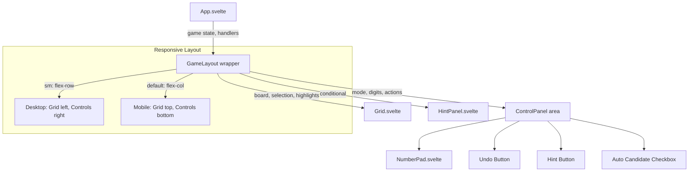
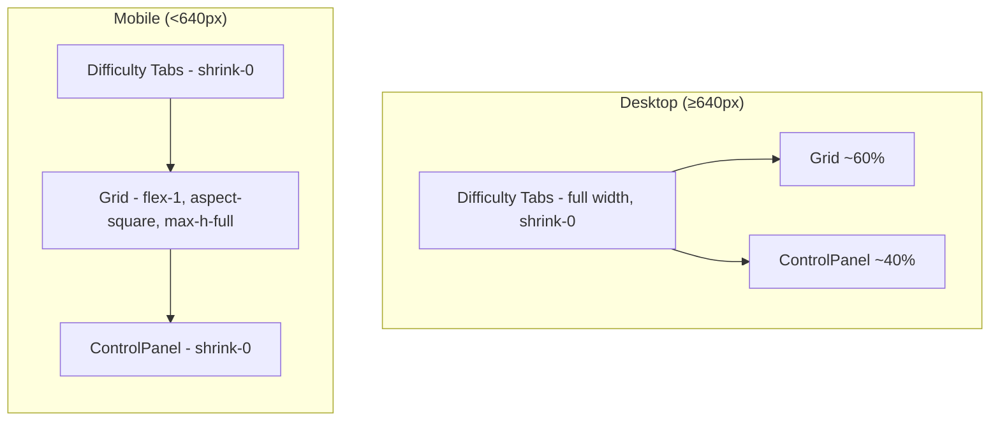
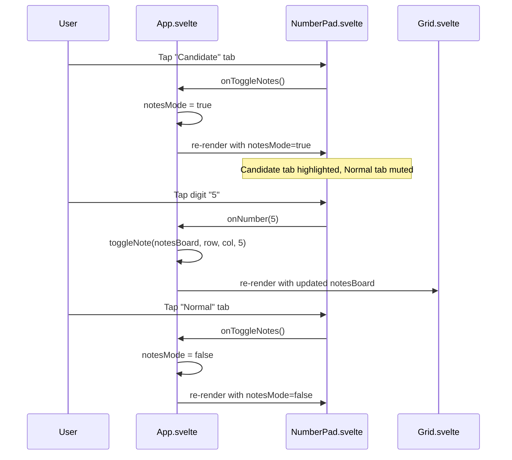

# Design Document: UI Redesign & Refactor

## Overview

This feature is a comprehensive UI redesign of the Sudoku game targeting two goals: (1) a responsive two-layout system (side-by-side on desktop, stacked on mobile) and (2) a visual refresh with clearer grid hierarchy, redesigned NumberPad with tab-style mode toggle, and improved code structure.

The current layout is a single-column `max-w-md` stack that works on mobile but wastes space on desktop. The redesign introduces a `GameLayout` wrapper that uses Tailwind's `sm:` breakpoint (640px) to switch between a horizontal flex layout (grid left ~60%, controls right ~40%) and a vertical stack (grid top, controls bottom). The grid gets alternating 3×3 box tints, amber/orange selection highlights, and clearer border hierarchy. The NumberPad is restructured with Normal/Candidate tab toggle, a 5-column digit grid (1–5 / 6–9 + erase), a separate Undo button, and an Auto Candidate Mode checkbox.

All changes are client-side Svelte components and CSS. No server, API, or data model changes are needed.

## Architecture



### Layout Structure



### Component Interaction Flow



## Components and Interfaces

### Component 1: App.svelte (Modified)

**Purpose**: Root game component. Manages game state, screen transitions, and user interactions. The layout structure changes from a single `flex-col max-w-md` to a responsive wrapper.

**Key Changes**:
- Replace the inner layout `div` with responsive flex that switches between `flex-col` (mobile) and `sm:flex-row` (desktop)
- Pass `autoCandidateActive` state to NumberPad for checkbox binding
- Remove `max-w-md` constraint on desktop to allow side-by-side layout
- Keep existing handler signatures unchanged

**Interface** (props unchanged):
```typescript
let { difficulty: initialDifficulty }: { difficulty: Difficulty } = $props();
```

**New derived state**:
```typescript
// Track whether auto-candidates are currently active for checkbox state
const autoCandidateActive: boolean = $derived(
    board.length > 0 && hasAutoCandidates(board, notesBoard)
);
```

### Component 2: Grid.svelte (Modified)

**Purpose**: Renders the 9×9 Sudoku grid. Visual changes only — no interface changes.

**Visual Changes**:
- Alternating 3×3 box background tints (boxes at positions where `(Math.floor(r/3) + Math.floor(c/3)) % 2 === 0` get one tint, others get another)
- Selection highlight changes from blue (`bg-blue-300`) to amber/orange (`bg-amber-200` light, `bg-amber-500/40` dark)
- Given digits: `font-bold text-neutral-900` (dark, heavy)
- User digits: `font-normal text-blue-600` (blue, regular weight)
- Box borders remain 2px, cell borders remain 1px (already implemented)

**Interface** (unchanged):
```typescript
let {
    board, notesBoard, selection, highlightDigit,
    techniqueHighlight, hintDigit,
    onCellSelect, onCellExtend, onCellToggle,
}: { /* existing types */ } = $props();
```

**Extracted pure function** — `getCellClasses`:
```typescript
// Extracted to a separate utility or kept inline but refactored
// Accepts all state needed to compute classes for a single cell
type CellClassParams = {
    r: number;
    c: number;
    cell: CellState;
    selected: boolean;
    focused: boolean;
    highlightDigit: number | null;
    isNoteHighlight: boolean;
    isPrimary: boolean;
    isSecondary: boolean;
};

const getCellClasses = (params: CellClassParams): string => {
    // Returns computed class string
};
```

### Component 3: NumberPad.svelte (Redesigned)

**Purpose**: Digit entry and game action controls. Complete visual redesign.

**New Layout Structure**:
```
┌─────────────────────────────────────┐
│ [  Normal  ] [ Candidate ]  [ Undo ]│  ← Mode tabs + Undo button
├─────────────────────────────────────┤
│  [ 1 ] [ 2 ] [ 3 ] [ 4 ] [ 5 ]    │  ← 5-column digit grid row 1
│  [ 6 ] [ 7 ] [ 8 ] [ 9 ] [ ✕ ]    │  ← 5-column digit grid row 2
├─────────────────────────────────────┤
│  ☐ Auto Candidate Mode             │  ← Checkbox
└─────────────────────────────────────┘
```

**Interface**:
```typescript
type NumberPadProps = {
    onNumber: (num: number) => void;
    onErase: () => void;
    notesMode: boolean;
    onToggleNotes: () => void;
    onHint: () => void;
    hintsDisabled: boolean;
    onUndo: () => void;
    undoDisabled: boolean;
    onAutoCandidate: () => void;
    autoCandidateActive: boolean;
    digitCounts: ReadonlyMap<number, number>;
};
```

**Changes from current**:
- Remove `autoCandidateDisabled` prop, replace with `autoCandidateActive` (checkbox is always enabled during play)
- Remove the 3-column action button grid (Undo, Notes, Hint, Auto, Erase)
- Add Normal/Candidate tab toggle row with Undo button at top-right
- Digit grid changes from 5-column (1-9) to 5-column (1-5 / 6-9-✕)
- Hint button moves to top area alongside Undo
- Auto Candidate becomes a checkbox below the digit grid

### Component 4: HintPanel.svelte (Unchanged)

No changes needed. Continues to render between grid and controls when a hint is active.

### Component 5: IconButton.svelte (Unchanged)

No changes needed. Used by Undo and Hint buttons in the new layout.

## Data Models

### No New Data Types

All existing types (`CellState`, `NotesBoard`, `Selection`, `TechniqueHighlight`, etc.) remain unchanged. The redesign is purely visual/layout — no new data structures are introduced.

### State Changes in App.svelte

```typescript
// Existing state — no changes to types
let notesMode = $state(false);           // drives Normal/Candidate tab
let undoStack: UndoStack = $state([]);   // drives Undo button disabled state
let highlightDigit: number | null = $state(null);  // already exists

// New derived state
const autoCandidateActive: boolean = $derived(
    board.length > 0 && hasAutoCandidates(board, notesBoard)
);
```

### Box Tint Computation (Pure Function)

```typescript
// Determines which background tint a cell gets based on its 3×3 box position
// Boxes are indexed by (Math.floor(r/3), Math.floor(c/3))
// Alternating pattern: (boxRow + boxCol) % 2
const getBoxTint = (r: number, c: number): 'light' | 'dark' => {
    const boxRow = Math.floor(r / 3);
    const boxCol = Math.floor(c / 3);
    return (boxRow + boxCol) % 2 === 0 ? 'light' : 'dark';
};
// 'light' → bg-white / dark:bg-neutral-800
// 'dark'  → bg-neutral-50 / dark:bg-neutral-800/80 (subtle tint)
```

### Pixel Budget Analysis (343×512px Mobile)

```
Total height:                    512px
─ Vertical padding (py-2 × 2):  -16px
─ Difficulty tabs row:           -36px
─ Gap (gap-2):                    -8px
─ Mode tabs + Undo row:         -36px
─ Digit grid (2 rows × 40px):   -84px  (including gap)
─ Auto Candidate checkbox:       -28px
─ Gap between sections:          -16px  (gaps between grid/controls)
─ Validation message (if any):  -20px
                                ──────
Available for grid:             ~268px
Grid at 268px height → cells ~29px each (acceptable, min 32px target)
```

On mobile, the grid needs to shrink to fit. Using `aspect-square max-h-full` on the grid container ensures it scales down. At 343px width with `px-2` padding, the grid gets ~327px width → cells ~36px. Height constraint at ~268px → cells ~29px. This is tight but workable — the `flex-1 min-h-0` on the grid area allows it to take remaining space.

On desktop (≥640px), the grid takes ~60% of width. At 640px that's ~384px for the grid, giving cells ~42px — comfortable.

### Desktop Pixel Budget (640×512px)

```
Total height:                    512px
─ Vertical padding (py-2 × 2):  -16px
─ Difficulty tabs row:           -36px
─ Gap (gap-2):                    -8px
                                ──────
Available for content row:      ~452px

Content row: Grid (60%) + Controls (40%)
Grid: ~384px wide, constrained by height → ~384px × 384px (aspect-square)
      Fits within 452px vertical budget ✓
Controls: ~240px wide, stacked vertically
```


## Correctness Properties

*A property is a characteristic or behavior that should hold true across all valid executions of a system — essentially, a formal statement about what the system should do. Properties serve as the bridge between human-readable specifications and machine-verifiable correctness guarantees.*

### Property 1: Selected cells receive amber highlight

*For any* cell position (r, c) on the grid and any cell state, if the cell is in the selection set, the computed cell classes should include the amber/orange background class (`bg-amber-200` or `bg-amber-500/40`) rather than the blue selection class.

**Validates: Requirements 2.4, 7.1, 7.2**

### Property 2: Box tint alternation consistency

*For any* two cells (r1, c1) and (r2, c2) on the grid, if they belong to the same 3×3 box (i.e., `Math.floor(r1/3) === Math.floor(r2/3)` and `Math.floor(c1/3) === Math.floor(c2/3)`), they should receive the same background tint. If they belong to horizontally or vertically adjacent boxes, they should receive different tints.

**Validates: Requirement 2.5**

### Property 3: Mode tab mutual exclusivity

*For any* boolean value of `notesMode`, exactly one of the two mode tabs (Normal, Candidate) should have the active/highlighted appearance. When `notesMode` is false, Normal is active; when true, Candidate is active.

**Validates: Requirements 3.2, 3.3**

### Property 4: Completed digits are faded but remain interactive

*For any* digit 1–9 and any board state, if `digitCounts.get(digit) >= 9`, the digit button should have reduced opacity styling (`opacity-40`) but should NOT have the `disabled` attribute set.

**Validates: Requirements 3.6, 3.7**

### Property 5: Selection highlight takes precedence over digit/note highlights

*For any* cell that is both selected and matches the current `highlightDigit`, the computed cell classes should include the amber/orange selection background and should NOT include the blue digit-matching background (`bg-blue-200`).

**Validates: Requirement 7.3**

### Property 6: Conflict highlight takes precedence over selection

*For any* cell with `hasConflict === true`, regardless of whether it is selected or matches `highlightDigit`, the computed cell classes should include the conflict text color (`text-red-600`).

**Validates: Requirement 7.4**

### Property 7: Auto-candidate checkbox reflects computed state

*For any* board and notesBoard state, the auto-candidate checkbox `checked` value should equal the result of `hasAutoCandidates(board, notesBoard)`.

**Validates: Requirement 5.4**

## Error Handling

### Error Scenario 1: Grid Overflow on Small Viewports

**Condition**: The grid's aspect-square constraint causes it to exceed available vertical space on very small viewports.
**Response**: The grid container uses `max-h-full` combined with `aspect-square`, allowing it to shrink below its natural width-based size. The `flex-1 min-h-0` on the content area ensures the grid never pushes controls off-screen.
**Recovery**: Content remains visible and interactive, though cells may be smaller than the 32px target on extremely constrained viewports.

### Error Scenario 2: HintPanel Displaces Controls

**Condition**: When a HintPanel is visible, it consumes vertical space that may push the NumberPad partially off-screen on mobile.
**Response**: The HintPanel renders within the flex-1 content area (not as a fixed element), so the grid shrinks to accommodate it. The controls area uses `shrink-0` to maintain its size.
**Recovery**: Grid cells become smaller when a hint is active, but all controls remain accessible.

### Error Scenario 3: Auto-Candidate State Desync

**Condition**: The `autoCandidateActive` derived state could briefly be stale if the board and notesBoard are updated in separate ticks.
**Response**: Both `board` and `notesBoard` are updated synchronously within the same handler call, so the derived state recomputes correctly after each handler completes.
**Recovery**: If desync occurs, the checkbox visual state self-corrects on the next render cycle since it's derived from the source of truth.

## Testing Strategy

### Unit Testing Approach

Tests for extracted pure functions:

**getCellClasses / cell class computation** (new extracted function):
- Selected cell → returns string containing `bg-amber-200`
- Unselected given cell → returns string containing `font-bold`
- Unselected user cell → returns string containing `text-blue-600`
- Cell with conflict → returns string containing `text-red-600`
- Cell in alternating box → returns appropriate tint class

**getBoxTint** (new pure function):
- Cell (0,0) → 'light' (box 0,0: (0+0)%2=0)
- Cell (0,3) → 'dark' (box 0,1: (0+1)%2=1)
- Cell (3,0) → 'dark' (box 1,0: (1+0)%2=1)
- Cell (3,3) → 'light' (box 1,1: (1+1)%2=0)

### Property-Based Testing Approach

**Property Test Library**: fast-check (already used in the project)

Each property test should run a minimum of 100 iterations.

**Property 1 test**: Generate random (r, c) pairs and cell states with selection containing those cells. Assert the class string includes `bg-amber`.
- Tag: `Feature: ui-redesign-refactor, Property 1: Selected cells receive amber highlight`

**Property 2 test**: Generate random (r, c) pairs. For pairs in the same box, assert same tint. For pairs in adjacent boxes, assert different tint.
- Tag: `Feature: ui-redesign-refactor, Property 2: Box tint alternation consistency`

**Property 3 test**: Generate random boolean for notesMode. Assert exactly one tab has active styling.
- Tag: `Feature: ui-redesign-refactor, Property 3: Mode tab mutual exclusivity`

**Property 4 test**: Generate random digit (1-9) and random digitCounts map. When count ≥ 9, assert opacity-40 class present and disabled attribute absent.
- Tag: `Feature: ui-redesign-refactor, Property 4: Completed digits are faded but remain interactive`

**Property 5 test**: Generate random cell state that is both selected and matches highlightDigit. Assert class includes amber, not blue highlight.
- Tag: `Feature: ui-redesign-refactor, Property 5: Selection highlight takes precedence over digit/note highlights`

**Property 6 test**: Generate random cell state with hasConflict=true and various selection/highlight states. Assert conflict text color is always present.
- Tag: `Feature: ui-redesign-refactor, Property 6: Conflict highlight takes precedence over selection`

**Property 7 test**: Generate random board and notesBoard states. Assert checkbox checked value equals `hasAutoCandidates(board, notesBoard)`.
- Tag: `Feature: ui-redesign-refactor, Property 7: Auto-candidate checkbox reflects computed state`

### Integration Testing

Svelte component integration tests are skipped per project rules. Behavioral correctness is verified through:
1. Unit tests on extracted pure functions (getCellClasses, getBoxTint)
2. Property tests on the class computation and state derivation logic
3. Manual testing of responsive layout at 343×512 and 640×512
4. Visual verification of light/dark theme support
