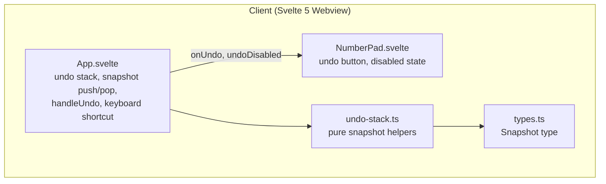
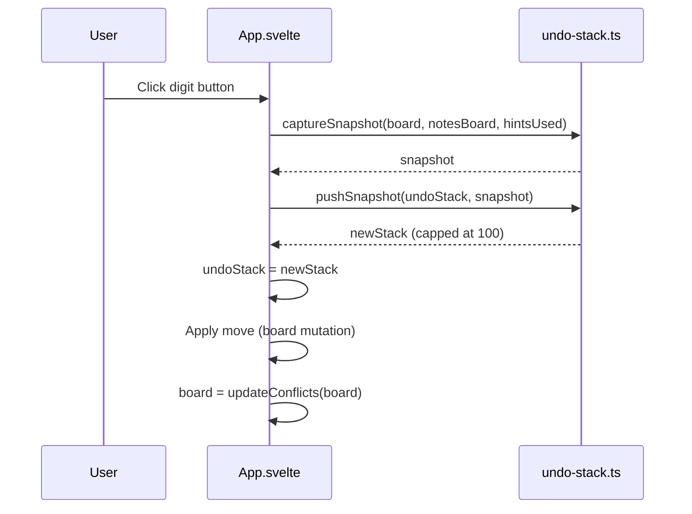
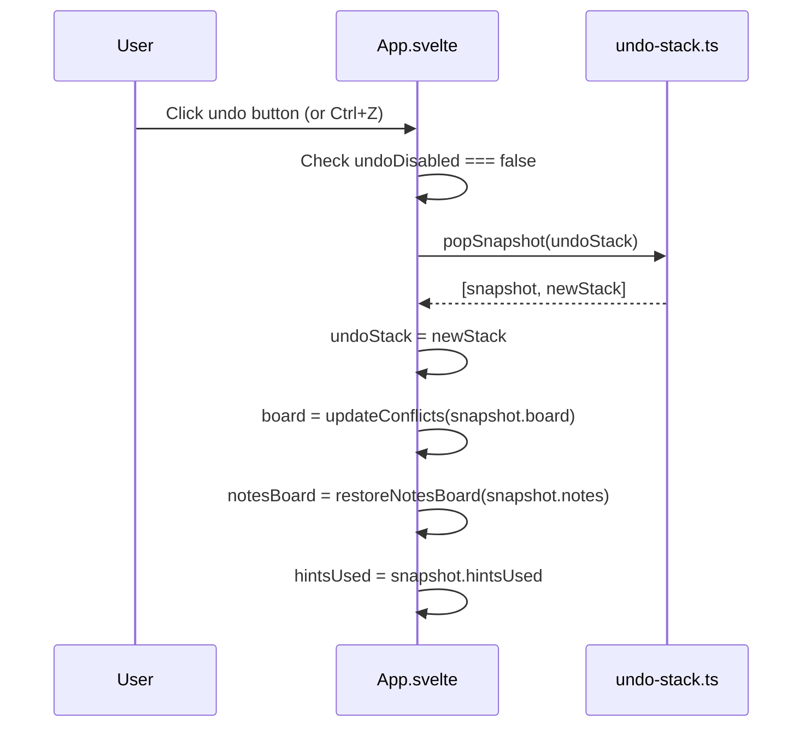
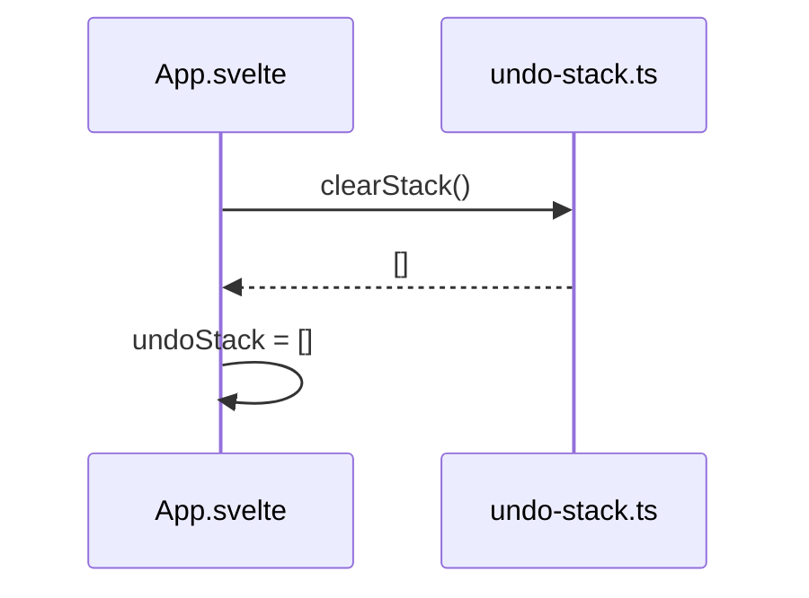

# Design Document: Undo Button

## Overview

This feature adds an undo stack to the Sudoku client that lets players reverse any move — digit placement, erase, note toggle, or hint — one step at a time. The undo stack lives entirely in client memory for the duration of a puzzle session and is cleared when a new puzzle or difficulty is loaded.

No server changes are required. The undo stack is a pure client-side concern: it captures snapshots of `board` and `notesBoard` before each move and restores them on demand. The feature also tracks `hintsUsed` in snapshots so that undoing a hint correctly decrements the hint counter.

The undo button is added to `NumberPad.svelte` alongside the existing Notes and Hint controls, using the existing `IconButton` component. A keyboard shortcut (Ctrl/Cmd+Z) triggers the same handler.

## Architecture



### Key decisions

- **Snapshot = board + notesBoard + hintsUsed.** Capturing `hintsUsed` alongside board state means undoing a hint automatically restores the correct hint count without special-casing.
- **Deep copy on push, not on pop.** Snapshots are immutable copies taken before each move. Restoring a snapshot replaces the live state references — no mutation of the snapshot itself.
- **Notes deep copy uses plain `Set`.** `SvelteSet` is a reactive wrapper; snapshots store plain `Set<number>[][]` to avoid reactivity entanglement. On restore, a new `NotesBoard` is constructed from the plain sets.
- **Stack cap of 100.** Implemented by slicing the oldest entry when the limit is exceeded. 100 moves × (81 CellState objects + 81 plain Sets) is negligible memory.
- **No redo.** Making a new move after undos simply pushes a fresh snapshot. The "future" is discarded. This matches standard Sudoku UX expectations.
- **Pure helper module.** `undo-stack.ts` contains only pure functions (push, pop, clear, isCapped) with no Svelte imports, making them trivially testable.

## Components and Interfaces

### New file: `src/client/lib/undo-stack.ts`

Pure functions for undo stack management. No side effects, no Svelte imports.

```typescript
import type { CellState } from './types'

export type Snapshot = {
    board: CellState[][]          // deep copy of board
    notes: Set<number>[][]        // deep copy of notesBoard (plain Set, not SvelteSet)
    hintsUsed: number
}

export type UndoStack = Snapshot[]

export const MAX_UNDO = 100

// Returns a new stack with the snapshot pushed, capped at MAX_UNDO
export const pushSnapshot = (stack: UndoStack, snapshot: Snapshot): UndoStack

// Returns [poppedSnapshot, newStack], or [null, stack] if empty
export const popSnapshot = (stack: UndoStack): [Snapshot | null, UndoStack]

// Returns an empty stack
export const clearStack = (): UndoStack

// Creates a deep-copy Snapshot from live state
export const captureSnapshot = (
    board: CellState[][],
    notesBoard: NotesBoard,
    hintsUsed: number
): Snapshot

// Reconstructs a NotesBoard (SvelteSet[][]) from a plain-Set snapshot
export const restoreNotesBoard = (notes: Set<number>[][]): NotesBoard
```

### Modified: `src/client/components/NumberPad.svelte`

New props added:

```typescript
{
    // ... existing props ...
    onUndo: () => void
    undoDisabled: boolean
}
```

Renders a third `IconButton` in the controls row (grid becomes 3 columns), using `variant="default"` and `disabled={undoDisabled}`, with `aria-label="Undo last move"` and an ↩ icon.

### Modified: `src/client/App.svelte`

New state:

```typescript
let undoStack: UndoStack = $state([])

const undoDisabled = $derived(undoStack.length === 0 || screen !== 'playing')
```

New handler:

```typescript
const handleUndo = (): void => {
    if (undoDisabled) return
    const [snapshot, next] = popSnapshot(undoStack)
    if (snapshot === null) return
    undoStack = next
    board = updateConflicts(snapshot.board)
    notesBoard = restoreNotesBoard(snapshot.notes)
    hintsUsed = snapshot.hintsUsed
}
```

Snapshot push added before every mutating handler (`handleNumber`, `handleErase`, `handleHint`, and the notes path in `handleKeyDown`). Stack cleared in `fetchPuzzles` and `changeDifficulty`.

Keyboard shortcut added to `handleKeyDown`:

```typescript
if ((e.ctrlKey || e.metaKey) && key === 'z') {
    e.preventDefault()
    handleUndo()
    return
}
```

## Data Models

### `Snapshot`

| Field | Type | Description |
|-------|------|-------------|
| `board` | `CellState[][]` | Deep copy of the 9×9 board before the move |
| `notes` | `Set<number>[][]` | Deep copy of notesBoard as plain Sets |
| `hintsUsed` | `number` | Hint count before the move |

### `UndoStack`

`Snapshot[]` — index 0 is the oldest entry, last index is the most recent. `pop` removes from the end.

**Invariants**:
- `undoStack.length <= MAX_UNDO` at all times
- All snapshots are immutable after creation
- Stack is empty (`[]`) at puzzle load and difficulty change

### `CellState` (existing, unchanged)

```typescript
type CellState = { value: number; isGiven: boolean; hasConflict: boolean }
```

Snapshots store `hasConflict` as captured, but on restore `updateConflicts` recomputes it, so the stored value is irrelevant.

## Sequence Diagrams

### Player Makes a Move (digit placement)



### Player Presses Undo



### Puzzle Load / Difficulty Change



## Correctness Properties

*A property is a characteristic or behavior that should hold true across all valid executions of a system — essentially, a formal statement about what the system should do. Properties serve as the bridge between human-readable specifications and machine-verifiable correctness guarantees.*

### Property 1: Any move pushes a snapshot

*For any* board and notes state, performing any move (digit placement, erase, note toggle, or hint) should result in the undo stack growing by exactly one entry, and the top snapshot should equal the pre-move board and notes state.

**Validates: Requirements 1.1, 1.2, 1.3, 1.4**

### Property 2: Stack is cleared on puzzle load or difficulty change

*For any* undo stack with N entries, loading a new puzzle or changing difficulty should result in an empty undo stack regardless of N.

**Validates: Requirement 1.5**

### Property 3: Stack length is bounded at MAX_UNDO

*For any* sequence of moves of length > MAX_UNDO, the undo stack length should never exceed MAX_UNDO, and the oldest snapshots should be discarded first.

**Validates: Requirement 1.6**

### Property 4: Undo round-trip restores state

*For any* board and notes state, performing N moves followed by N undo activations should restore the board and notes to the exact state that existed before the first move.

**Validates: Requirements 2.1, 4.1, 4.2**

### Property 5: Conflicts are consistent after undo

*For any* board state restored by undo, the conflict flags on every cell should equal the result of calling `updateConflicts` on that board — i.e. no stale conflict state is carried over from the undone move.

**Validates: Requirement 2.2**

### Property 6: Undo is a no-op when screen is not "playing"

*For any* app state where `screen !== "playing"`, calling `handleUndo` should leave `board`, `notesBoard`, `hintsUsed`, and `undoStack` unchanged.

**Validates: Requirement 2.4**

### Property 7: Undo button disabled state matches stack and screen

*For any* combination of undo stack length and game screen, the `undoDisabled` prop passed to `NumberPad` should be `true` if and only if the stack is empty or `screen !== "playing"`.

**Validates: Requirements 3.2, 3.3**

### Property 8: No redo — new move after undo discards future

*For any* sequence of moves M1…Mn, after undoing k moves (k ≤ n), making a new move Mnew should result in a stack of depth (n - k + 1) with Mnew's pre-state on top, and no snapshots from the undone moves M(n-k+1)…Mn should be present.

**Validates: Requirement 4.3**

### Property 9: Undoing a hint decrements hintsUsed

*For any* board state where a hint has been applied (hintsUsed = h), undoing that hint should restore hintsUsed to h - 1.

**Validates: Requirement 4.4**

## Error Handling

### Undo on empty stack

**Condition**: `handleUndo` called when `undoStack.length === 0`
**Response**: `undoDisabled` is `true`; handler returns early — no-op
**Recovery**: N/A — button is visually disabled

### Undo when screen is not "playing"

**Condition**: `handleUndo` called (e.g. via keyboard) when `screen === "completed"`
**Response**: `undoDisabled` is `true`; handler returns early — no-op
**Recovery**: N/A — button is visually disabled

### Stack cap exceeded

**Condition**: More than MAX_UNDO moves made in a session
**Response**: `pushSnapshot` slices the oldest entry, keeping the stack at exactly MAX_UNDO
**Recovery**: Oldest history is silently dropped — player can still undo the most recent 100 moves

### Deep copy failure (defensive)

**Condition**: `captureSnapshot` called with a malformed board (null row/cell)
**Response**: TypeScript strict mode and `noUncheckedIndexedAccess` prevent this at compile time; runtime guards in `captureSnapshot` skip null cells
**Recovery**: Snapshot may be incomplete but will not throw

## Testing Strategy

### Unit Testing

Test pure functions in `undo-stack.ts` with Vitest:

- `pushSnapshot`: stack grows by 1, top entry matches snapshot, cap enforced at MAX_UNDO
- `popSnapshot`: returns correct snapshot and shorter stack, returns `[null, stack]` on empty
- `clearStack`: always returns `[]`
- `captureSnapshot`: returned snapshot is a deep copy (mutating original does not affect snapshot)
- `restoreNotesBoard`: reconstructed `NotesBoard` has same digit sets as the plain-Set snapshot

### Property-Based Testing

**Library**: fast-check (already installed)

Each property test runs a minimum of 100 iterations. Each test is tagged with a comment referencing the design property.

| Test | Property | Tag |
|------|----------|-----|
| Any move type pushes a snapshot | Property 1 | `Feature: undo-button, Property 1` |
| Stack cleared on load/difficulty change | Property 2 | `Feature: undo-button, Property 2` |
| Stack never exceeds MAX_UNDO | Property 3 | `Feature: undo-button, Property 3` |
| N moves + N undos = original state | Property 4 | `Feature: undo-button, Property 4` |
| Conflicts consistent after undo | Property 5 | `Feature: undo-button, Property 5` |
| Undo no-op when not playing | Property 6 | `Feature: undo-button, Property 6` |
| undoDisabled matches stack+screen | Property 7 | `Feature: undo-button, Property 7` |
| New move after undo discards future | Property 8 | `Feature: undo-button, Property 8` |
| Undoing hint decrements hintsUsed | Property 9 | `Feature: undo-button, Property 9` |

**Generator strategy**:
- Generate random `CellState[][]` boards (81 cells, random values 0–9, random isGiven/hasConflict)
- Generate random `NotesBoard` (each cell: random subset of 1–9)
- Generate random move sequences (type: digit | erase | note | hint; parameters: random row/col/digit)
- Generate random N in [1, 20] for round-trip tests

### Integration Testing

- Undo button appears in `NumberPad` and is disabled on initial load (empty stack)
- After one digit placement, undo button becomes enabled
- After undo, board matches pre-placement state
- After MAX_HINTS hints and undo of each, `hintsUsed` returns to 0
- Ctrl+Z triggers undo in the same way as clicking the button
- Changing difficulty clears the stack and disables the undo button
